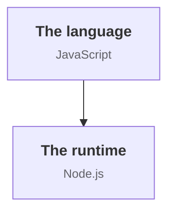
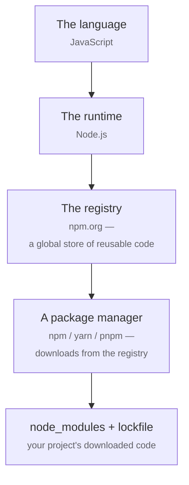
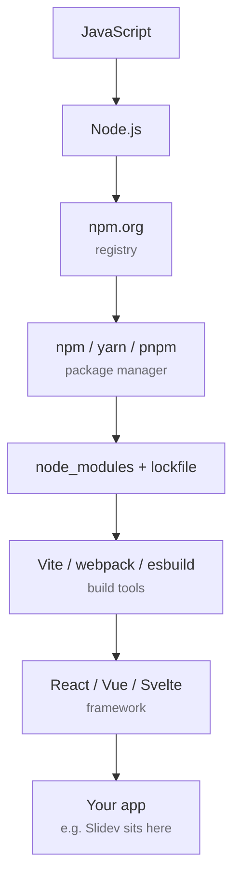

# The Node.js Ecosystem

A guided tour — from the language and the runtime to package managers, tooling, frameworks, and how every piece connects

  Press <KeyCap>Space</KeyCap> to begin &nbsp;·&nbsp; <KeyCap>o</KeyCap> for the slide overview

<!--
This deck uses a portable component toolkit (Callout, FeatureCard, Chips, KeyCap)
and the section / multicolumns layouts, auto-imported at the project level from
components/, layouts/, and styles/.
-->

---
layout: default
---

# What you'll learn

The Node.js ecosystem is a tower of layers — a language, a runtime, a registry, the tools that talk to it, and the frameworks built on top. This tour climbs that tower in four tracks.

<FeatureCard title="1 · Foundations" icon="i-carbon-application" row>
JavaScript, ECMAScript, V8, Node.js, TypeScript, and the CommonJS-vs-ESM split.
</FeatureCard>

<FeatureCard title="2 · Packages & Managers" icon="i-carbon-box" row>
The npm registry, npm / yarn / pnpm, Corepack, lockfiles, semver, and workspaces.
</FeatureCard>

<FeatureCard title="3 · Tooling & Frameworks" icon="i-carbon-tools" row>
Bundlers, transpilers, linters, test runners, and the frontend / backend frameworks.
</FeatureCard>

<FeatureCard title="4 · Runtime & Deep Dives" icon="i-carbon-flow" row>
The event loop, env & config, plus deep dives on ESM-vs-CJS and the event loop.
</FeatureCard>

<Callout type="tip">
Every layer rests on the one above it. The next three slides sketch the whole map in plain terms — so every piece you meet afterward already has a place to land.
</Callout>

---

# Start with two ideas

Before everything else, the ecosystem rests on **two pieces**: a *language* to write in, and a *runtime* to execute it.

You write **JavaScript** — a set of rules for writing programs. **Node.js** is a program that reads JavaScript and runs it.

Every other tool in this tour exists to make that pairing more productive.

---

# Add where the code comes from

Real projects build on the work of others. The **registry** is the warehouse. A **package manager** is the truck that brings what you asked for into your project's `node_modules/` folder.

The **lockfile** is the receipt — it records exactly which versions arrived, so the same install gives the same result on every machine.

<Callout type="note">
This is where most of <em>your</em> code lives too — published as a package, or sitting next to your <code>package.json</code>.
</Callout>

---

# Add what turns source into an app

That's the full tower.

**Build tools** combine your code with its dependencies into something a browser can load.

A **framework** is the largest of those dependencies — the skeleton your app hangs on.

**Your app** is the last layer. Slidev (this deck) sits exactly there.

<Callout type="tip">
The remaining slides zoom in on each box and name the trade-offs. You'll see this map again at the end as a single picture.
</Callout>

---
src: ./pages/nodejs/01-foundations.md
---

---
src: ./pages/nodejs/02-packages.md
---

---
src: ./pages/nodejs/03-tooling.md
---

---
src: ./pages/nodejs/04-runtime.md
---
