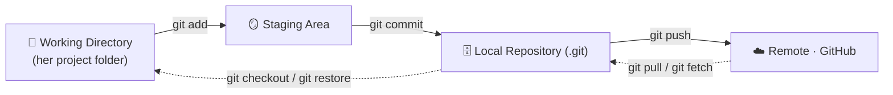
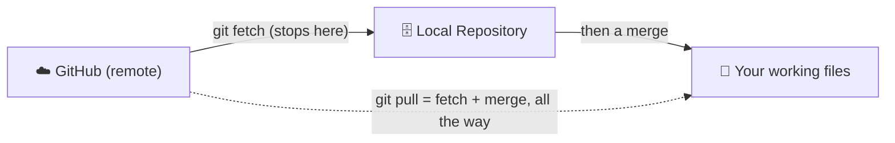
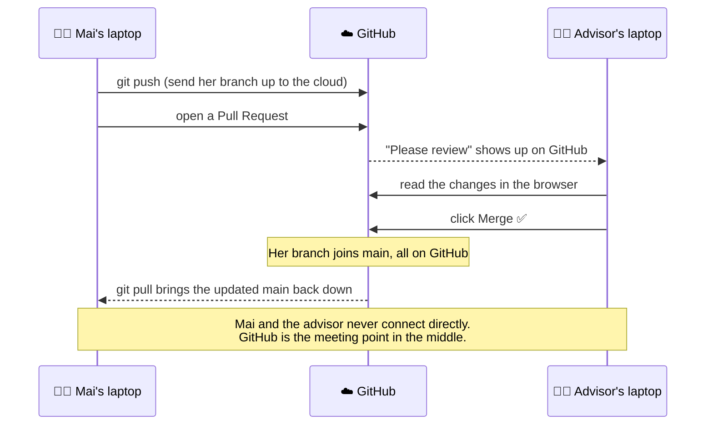
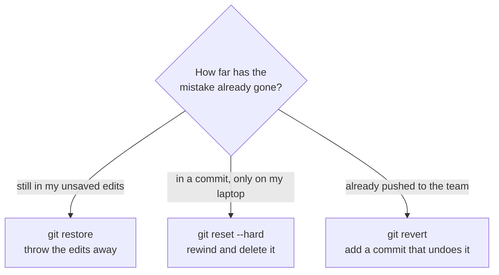

# 🎬 The Git Story: Mai's Midnight Analysis

*A companion story to the "Git & GitHub for Beginners" deck. The same eight stops, told as one continuous tale. Meet Mai, a college student working on her first real data project, and watch every command earn its place.*

---

## The night it almost went wrong

It's 11 p.m. Mai, a second-year student, is three weeks into her first real coding project: a statistics analysis asking whether a new study method actually improves exam scores. Her folder is now full of copies with confusing names. `analysis.py`, `analysis_final.py`, `analysis_REALLY_final_v2.py`. She is one careless save away from losing a whole evening's work.

Then her friend says four words that change her semester. **"Just use Git."**

Mai had always thought Git and GitHub were the same thing. They are not.

- **Git** is the engine on her laptop, a version control system that quietly records the history of her project. Think of it as a **camera**. Every time she saves a snapshot (a `commit`), it photographs her *entire* project, a version she can return to anytime.
- **GitHub** is the photo-sharing site in the cloud, where she posts the album so her labmate and advisor can see it, comment, and build on it.

Git is also **distributed**, which means her laptop holds the *complete* history, not just the latest file. No more folders full of backup zip files. And in an age where her AI coding assistant can rewrite twenty files in ten seconds, those save points become her safety net. One bad prompt, and she can rewind as if nothing happened.

## Four rooms, one project

Before she types anything, her friend sketches the four "rooms" Mai's code will move through, and the commands that carry it between them.

The **Working Directory** is her live project folder, where she actually types. The **Staging Area** is a little waiting room where she lines up exactly the changes she wants to save. The **Local Repository** is the hidden `.git` folder, the **brain** that keeps every snapshot she has ever taken (delete it, and Git forgets the whole project). And the **Remote** is her backup in the cloud on GitHub. Once she can picture the rooms, the commands stop feeling random. Each one simply carries her work from one room to the next.

## Her first real save

Mai starts by telling Git who she is, just once (`git config` with her name and email), so every snapshot is stamped with her name. Then she turns her folder into a tracked project (`git init`), which creates that hidden `.git` brain. Her professor also shared a starter template on GitHub, so she grabs her own copy of that too, with `git clone`.

But first, a safety move. She writes a tiny `.gitignore` file so Git never tracks her secret API key file (`.env`) or any other junk she does not want online.

Now comes the rhythm she will repeat a hundred times. She checks what changed (`git status`), lines up the pieces she wants (`git add`), saves the snapshot with a short note describing the change (`git commit -m "Add t-test for exam scores"`), and skims her history whenever she likes (`git log --oneline`). Her first clean commit feels like a big relief. The project remembers everything now, so she does not have to.

What is that memory, exactly? Her commits are not a loose pile of saves. Each one is linked to the one before it, and that ordered chain, from her very first commit to her latest, is what everyone calls her project's **history**. `git log` simply walks back along it. Here is the part that trips up almost everyone: the files she sees in her folder are only the *latest* link in the chain, while the history is every link behind it. So deleting a file today does not remove it from yesterday's snapshot. Git's history keeps the old version regardless. That is wonderful for undo, and, as she will see when she locks down her secrets later, it is also why some things must never be committed even once.

## Sharing it with the lab

Mai makes a GitHub account and pushes her snapshots up to the cloud (`git push origin main`). Now her work survives even if her laptop dies in a coffee accident. Two new words start showing up everywhere: **`origin`** is just the nickname for her copy on GitHub, and **`main`** is her primary, trustworthy branch (the one that used to be called `master` before the industry switched over in 2020).

The next morning she works from the lab desktop and needs the latest version. Here she learns the difference that trips up almost everyone:

- `git fetch` quietly downloads news from GitHub into her **Local Repository** (the hidden `.git` brain), but leaves her own working files exactly as they are, so she can *look* at what arrived before she uses any of it.
- `git pull` downloads *and* merges those changes straight into her files. It is really `fetch` plus `merge` in one move.

The difference is easiest to see by where each one stops:

Her labmate had pushed an edit overnight, so Mai learns the golden rule the easy way: **pull before you push.**

## Experiment safely, then share it

Mai wants to try something risky, a regression analysis instead of a plain t-test, but she is terrified of breaking the version that already works. The answer is a **branch** (`git checkout -b try-regression`): a separate copy of her project where she can experiment without touching `main`. She can try anything she wants on this copy. If it goes wrong, she simply deletes the branch and the original `main` is untouched. If it works well, she combines it back into `main` (`git merge`).

Once, Git stops her with a **merge conflict**, because she and her labmate changed the same line. It looks alarming, but it is not an error. It is Git politely asking a human to decide which version wins. She picks the right one and moves on.

When she is finally ready to merge her work into the team's shared project, she **opens a Pull Request**. This is not a command she types but a button she clicks on the GitHub website, one that says "please review my changes and add them in." It opens a quality gate where her advisor checks every added and removed line before any of it lands in `main`. The word "open" works just like opening a support ticket: the request stays open until someone either merges it or turns it down.

The name itself puzzles her at first. *Why a "pull" request, when she is the one offering up the work?* Because she is not shoving her code onto anyone. She is asking the project's owner to **pull** her finished work in, and only after a good look. Some tools, like GitLab, rename the very same button a "Merge Request" to say it more plainly.

The part that surprises her most is that her advisor never has to touch her laptop. By the time the Pull Request is open, her branch is already **pushed up to GitHub**, so the work sits in the cloud, not trapped on her PC. Her advisor just views the request on GitHub, reads the changes, and clicks **Merge**, and the branch joins `main` right there in the cloud. GitHub is the shared meeting point in the middle: everyone pushes their work up to it and pulls updates down from it, and nobody ever reaches into anyone else's computer.

Here is that whole round trip, from her laptop and back:

That review step is perfect for the code her AI assistant wrote, a real human check on the AI before anything reaches `main`. The same logic explains **forking**. When she wants to improve a classmate's open-source toolkit, she has no permission to push into a project she does not own, so she copies it into her own account (a fork), pushes her changes there, and opens a Pull Request asking the original owner to pull them across. Finally, she hears about `rebase`, a more advanced way to tidy her project's history so the list of commits reads as one clean, straight line instead of a tangle. That one, she decides, can wait until the basics feel solid.

## When the AI breaks everything

A week later, her AI assistant "helpfully" rewrites her whole script, and it stops running. Mai does not panic, because she has a different net for each situation. The trick is to ask how far the mistake has already traveled.

- **It is still in her unsaved edits** (she has not committed yet). She throws the mess away and snaps back to her last save with `git restore`.
- **It is in a commit, but only on her own laptop** (she has not pushed it). She rewinds her branch to the last good snapshot with `git reset --hard`, which deletes the bad commit for good. She only ever does this to her own local work, never to commits the team already has.
- **It already went out to the team** (she pushed it). Erasing shared history would wreck everyone else's copy, so instead she cancels the bad commit with `git revert`, which adds a *new* commit that undoes the old one. The history stays honest, and the mistake's effect is gone.

One question picks the right tool every time:

And when her advisor messages "can you fix this *right now*" while her current edit is half-finished, she sets the unfinished work aside (`git stash`), fixes the urgent thing, and brings it back afterward (`git stash pop`). Nothing is lost.

## Locking the doors

Tired of typing her password on every push, Mai sets up an **SSH key** once (`ssh-keygen`), and now her laptop and GitHub simply recognize each other. No more passwords. She also double-checks that her `.gitignore` is hiding her `.env` API key, because a secret pushed to a public repo can be scraped by bots within seconds, and Git's history never forgets. Deleting the file later is not enough, so the only safe move is to never commit it in the first place. While she is at it, she sets new projects to start on `main` by default.

## When the files get big

Her analysis is not just code. It also produces a large dataset, a folder of exported chart images, and a final PDF report. She commits them, and Git saves every version of these too. But she notices two things. Git cannot show her what changed *inside* a PDF the way it shows line-by-line changes in her code, and her repo starts getting heavy, because each time she re-exports the report, Git keeps a whole new copy.

She also learns GitHub has limits. It refuses any single file larger than 100 MB, and it nudges you to keep a whole repo under about 1 GB.

The fix is to ask one question: can I make this file again? Her chart images and report PDF are built from her code, so she **gitignores them and just rebuilds them** whenever she needs them, and they never weigh down the repo. But her big raw dataset is the one thing she cannot regenerate, so she puts it in **Git LFS** (Large File Storage), which keeps a tiny pointer in Git and stores the real file in a separate place, free up to 1 GB. Big files handled, repo still light.

## The habits that stuck

By the end of the semester, Mai has a rhythm. Commit small and often. Write messages her future self will thank her for. Keep `main` clean and working. Always pull before she pushes. Her whole project lives in one repository (a **monorepo**, which is plenty simple for a team of one), though she now knows that bigger labs sometimes split their work across many repositories (a **polyrepo**).

She drives Git from wherever feels comfortable: the **Terminal**, the Git panel inside **VS Code**, or the friendly buttons of **GitHub Desktop**. She tells her **AI assistant** to commit after every finished task, so she can always roll back. She even puts a small results page online with **Vercel** (push to `main`, and it goes live by itself), and versions her thesis notes in **Obsidian** so her writing has a history too.

## Mai's whole semester, on one sticky note

If she had to fit everything she learned onto a single sticky note above her desk, it would read like this:

| The moment | Her move |
| --- | --- |
| Set up and start tracking | `git config` · `git init` (or `git clone`) · write a `.gitignore` |
| The daily save loop | `git status` → `git add` → `git commit -m "…"` → `git log` |
| Back it up to the cloud | `git push origin main` |
| Get everyone's latest | `git fetch` / `git pull` (and **pull before you push**) |
| Experiment without fear | `git checkout -b` → work → `git merge` → open a **Pull Request** |
| Undo almost anything | `git restore` · `git reset --hard` · `git revert` · `git stash` |
| Lock the doors | `ssh-keygen` for SSH · `.gitignore` for secrets |
| Handle big files | Git LFS to keep them, or gitignore and rebuild |

Eight short lines. That is the whole map she once found so intimidating.

## Why she tells every classmate to start now

By spring, Mai is the friend everyone messages the night before a deadline, and her advice never changes: this is worth it for far more than one stats class. A few of the reasons she gives.

- **Group projects stop being a nightmare.** No more emailing `report_final_v3.docx` around and hoping nobody overwrote your part. Each person works on their own branch and merges through a Pull Request, so several people can build the same project at once without overwriting each other's work.
- **Your work survives the worst week.** Laptop stolen, drive dead, coffee across the keyboard an hour before the deadline. If it is pushed to GitHub, it is safe, and you pull it back onto any computer in minutes.
- **It becomes a portfolio that gets you hired.** Recruiters really do open your GitHub profile. A clean public repo, a small app, a tidy analysis, all of it is proof you can do the work, and it counts for more than one more line on a resume.
- **Students get paid tools for free.** The GitHub Student Developer Pack hands enrolled students free Copilot, cloud credits, and a pile of other developer tools that normally cost money.
- **You can put things online for free.** A project write-up, a personal page, a live demo of an analysis. Push it, and GitHub Pages or Vercel serves it on the real internet at a link you can drop into an application.
- **It is not only for code.** Lab notes, a thesis draft, LaTeX write-ups, even reading notes. Anything made of text gets the same time machine.

## Defense day

Mai presents her analysis. When a professor asks, "what if you had tried a different test?", she smiles, checks out an old branch, and shows them. Every version is still there. Nothing was ever lost.

Git did not just save her files. It made coding feel safe instead of scary, because any mistake is one command away from undo. By the time she walks out, Mai realizes she does not just *write* code anymore.

She **manages** it.
