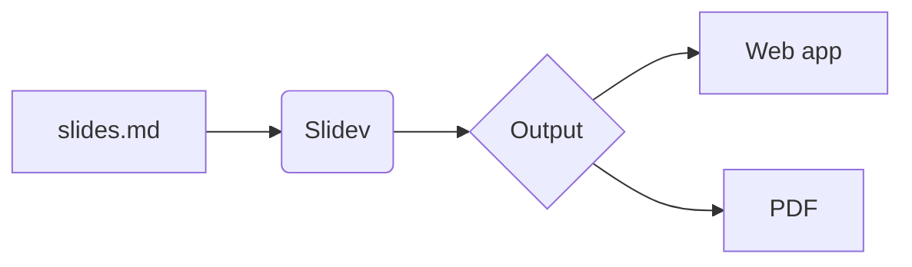

<Eyebrow>Part 2</Eyebrow>

# Intermediate

Bring slides to life — click animations, live code, diagrams, math, and media.

<!-- Content slides for the intermediate track. -->

---

# Code blocks

Fence your code with a language, and Slidev highlights it with **Shiki** — the same engine that powers VS Code.

```ts
interface Slide {
  title: string
  layout?: string
}

const intro: Slide = { title: 'Hello', layout: 'cover' }
```

You write it exactly like a fenced block anywhere in Markdown:

````md
```ts
const x = 1
```
````

---

# Highlight what matters

Turn on line numbers with `{lines:true}`, and spotlight specific lines by number:

```ts {2,4}{lines:true}
function build() {
  const deck = loadSlides()
  render(deck)
  return deck
}
```

`{2,4}` highlights lines 2 and 4. Ranges such as `{2-5}` work too.

---

# Highlight on click

The very same block can walk through itself. Press <KeyCap>Space</KeyCap> to step the highlight:

```ts {1|2-3|all}
const deck = loadSlides()
render(deck)
present(deck)
```

Separate line groups with `|` — each group is revealed by one click.

---

# Editable code

Add `{monaco}` after the language and the block becomes a real editor. Type into it live during your talk:

```ts {monaco}
const greet = (name: string): string => `Hello, ${name}!`

greet('Slidev')
```

<Callout type="tip">
Great for "what if we change this?" moments — no switching to an editor.
</Callout>

---

# Run code on the slide

`{monaco-run}` adds a **run** button — execute the code and show its output, right here:

```js {monaco-run}
function fib(n) {
  return n <= 1 ? n : fib(n - 1) + fib(n - 2)
}

console.log([0, 1, 2, 3, 4, 5, 6, 7, 8, 9].map(fib))
```

---

# Reveal content on click

Wrap any list in `<v-clicks>` and each item appears on its own click:

<v-clicks>

- First, frame the problem
- Then, show the approach
- Finally, reveal the result

</v-clicks>

<div v-click class="pt-4">

<Callout type="tip">
For a single element, add the <code>v-click</code> directive directly to it.
</Callout>

</div>

---

# Control the clicks

<div class="flex flex-col gap-2 pt-2 text-lg">
  <div><code>v-click</code> &nbsp;—&nbsp; appear on the next click</div>
  <div><code>v-after</code> &nbsp;—&nbsp; appear together with the previous <code>v-click</code></div>
  <div><code>v-click.hide</code> &nbsp;—&nbsp; start visible, then disappear on click</div>
  <div><code>v-click="3"</code> &nbsp;—&nbsp; appear at an exact click number</div>
</div>

<div class="pt-6 text-xl">
  <span v-click>This… </span>
  <span v-after>…and this arrive together. </span>
  <span v-click.hide>This one leaves.</span>
</div>

---

# Move things with motion

The `v-motion` directive animates position, scale, and opacity as a slide opens:

<div
  v-motion
  :initial="{ x: -130, opacity: 0 }"
  :enter="{ x: 0, opacity: 1, transition: { delay: 200 } }"
  class="text-2xl font-bold pt-6"
  style="color: var(--deck-accent)">
  → I slide in from the left
</div>

```md
<div v-motion :initial="{ x: -130 }" :enter="{ x: 0 }">
  Hello
</div>
```

---
transition: fade
---

# Slide transitions

This slide **fades** in — set per slide with the `transition:` key:

```md
---
transition: fade
---
```

Built-in options include `fade`, `slide-left`, `slide-up`, and `view-transition`. Put one in the **headmatter** to make it the deck-wide default.

---

# Math with LaTeX

Inline math like $E = mc^2$ flows inside a sentence. Block math stands on its own:

$$
\frac{\partial f}{\partial x} = 2x
\qquad
\int_0^1 x^2 \, dx = \frac{1}{3}
$$

Wrap inline math in single `$`, and block math in double `$$`. Slidev renders it with KaTeX.

---

# Diagrams from text

A fenced `mermaid` block becomes a diagram — no drawing tools required:



<Callout type="note">
`plantuml` blocks work the same way, rendered through a PlantUML server.
</Callout>

---

# Icons

Thousands of icons are available as components. Install an icon set, then drop them in inline:

<div class="flex gap-8 text-6xl py-6" style="color: var(--deck-accent)">
  <carbon-rocket />
  <carbon-code />
  <carbon-idea />
  <carbon-tools />
  <carbon-edit />
</div>

```md
<carbon-rocket /> &nbsp; <mdi-heart /> &nbsp; <logos-vue />
```

The component name is the icon set plus the icon, like `carbon-rocket`.

---
layout: image-right
image: /layout-demo.svg
---

# Images and media

Keep image files in the `public/` folder and reference them from `/`. 

Do not include "/public" in the reference although `public` is its parent folder.

```md

```

For a full-slide backdrop, set the `background:` key in a slide's frontmatter.

The picture on the right is this very slide using `image-right` — the image *is* the demo.

---

# Reuse slides with `src:`

Split a large deck across several files, then import each one:

```md
---
src: ./pages/01-beginner.md
---
```

<Callout type="tip">
This tutorial does exactly that — three files (beginner, intermediate, advanced) stitched together into one <code>slides.md</code>.
</Callout>

---
layout: center
class: text-center
---

# Your slides are interactive now

Animations, live code, diagrams, math, and icons.

Next: make Slidev truly **your own**.
