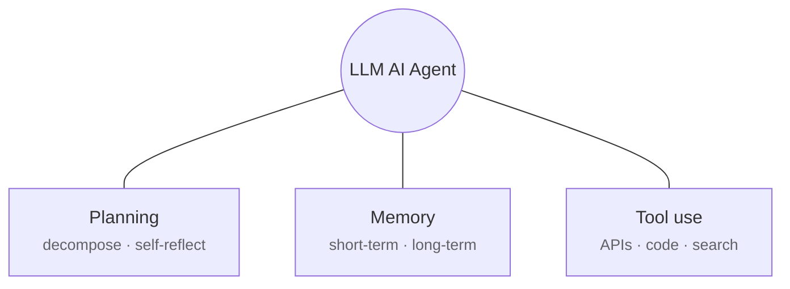
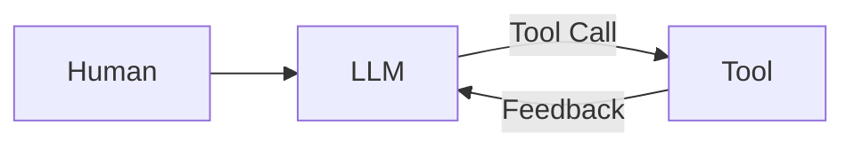
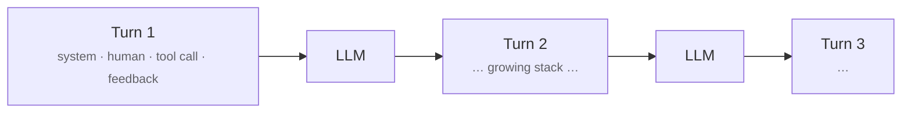
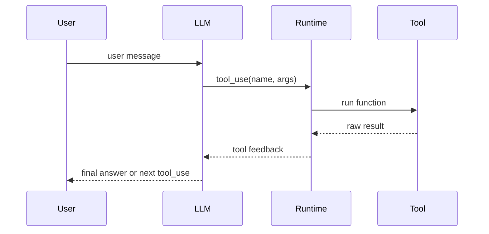
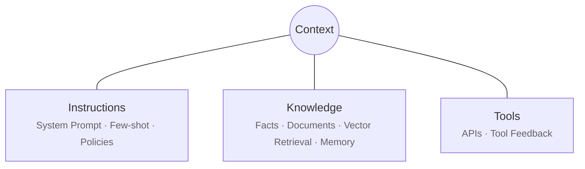

<Eyebrow>Part 3</Eyebrow>

# Foundations

Agents, the tool-use loop, the runtime that drives it, and the context the model actually sees.

---
zoom: 0.9
---

# What are AI agents?

**Agentic AI** — systems that go beyond answering, and can autonomously act.

<FeatureCard title="Reason" icon="i-carbon-thinking" compact>
Work through a problem step by step.
</FeatureCard>

<FeatureCard title="Plan" icon="i-carbon-flow" compact>
Decompose and sequence the steps needed.
</FeatureCard>

<FeatureCard title="Manage memory" icon="i-carbon-data-base" compact>
Hold short- and long-term state across turns.
</FeatureCard>

<FeatureCard title="Integrate tools" icon="i-carbon-tool-kit" compact>
Reach out — APIs, code, and search — to act on the world.
</FeatureCard>

---

# Tool-use loop

A **tool** is an executable function or external capability the agent can request. Every example maps to one of three tool-use types — <Chips>APIs, code, search</Chips>

| Example         | What the agent does                              | Tool-use type    |
| --------------- | ------------------------------------------------ | :--------------: |
| **Database**    | Query records (shipments, orders, inventory)     | search + code    |
| **ERP access**  | Look up or update enterprise records             | search + code    |
| **Web search**  | Retrieve public information (news, regulations)  | search           |
| **Weather API** | Call a live service for real-time conditions     | APIs             |

<Callout type="note">
Every agent runs the same loop: <strong>LLM → tool call → feedback → LLM → …</strong> until it reaches a final answer.
</Callout>

---

# Tool-use loop: context accumulation

Each turn's tool call and its feedback **accumulate into the running context** — one turn's output becomes the next turn's history.

<Callout type="warning" title="The stack grows every turn">
The context window is finite. What we keep, drop, or summarize is the central design problem — picked up on the next slide.
</Callout>

---

# Runtime architecture

Three distinct roles — **who actually does what.**

| Component   | What it is                                  | What it does                                                                       |
| ----------- | ------------------------------------------- | ---------------------------------------------------------------------------------- |
| **Runtime** | The host program (script, CLI, web server) | Owns the loop, prompts the LLM, **executes** tools, returns results                |
| **LLM**     | A function the runtime calls               | Reads context and **emits a request** — `tool_use(name, args)`; decides *what*     |
| **Tool**    | An external function / API                 | Runs **only** when the runtime invokes it; returns a raw result                    |

<Callout type="tip" title="A tool call is just a request">
The LLM never touches the tool. The <strong>runtime is the broker</strong> that performs the real call and hands the result back.
</Callout>

---

# From agents to context: why context engineering?

Two facts from the last slides combine into a single design problem.

<FeatureCard title="The loop accumulates" icon="i-carbon-stacked-scrolling-1">
Every turn adds to the context stack — system prompt, prior tool calls, feedback, intermediate reasoning.
</FeatureCard>

<FeatureCard title="The runtime curates" icon="i-carbon-filter">
The runtime decides <strong>what the LLM sees</strong> on each call — what to include, summarize, or drop.
</FeatureCard>

<Callout type="note">
An agent is only as good as <strong>what's in its context</strong> — and the window is finite. <em>What we include and what we leave out</em> becomes the central design problem.
</Callout>

---

# Context engineering

**What is context?** Everything the LLM sees on a given turn.

<FeatureCard title="Instructions" icon="i-carbon-document" compact>
System prompt · few-shot examples · policies.
</FeatureCard>

<FeatureCard title="Knowledge" icon="i-carbon-data-base" compact>
Facts · retrieved documents · vector memory.
</FeatureCard>

<FeatureCard title="Tools" icon="i-carbon-api" compact>
Available tool definitions · tool feedback so far.
</FeatureCard>

<Callout type="tip">
Context is the model's <strong>working memory</strong> — everything inside the window, nothing outside.
</Callout>

---

# Why context engineering matters

**Context Engineering** — the art and science of filling the context window with *just the right* information for the next step.

<FeatureCard title="The window is finite" icon="i-carbon-cut" tone="warning">
Cost and latency cap what fits. Curation isn't optional — it's the design constraint.
</FeatureCard>

<FeatureCard title="Tools pull in fresh data" icon="i-carbon-renew" tone="tip">
APIs, search, and code let the agent act on <strong>the right information</strong> on demand — instead of stale or missing data.
</FeatureCard>

<Callout type="note">
Context engineering is what makes the agent's reasoning <em>relevant</em>. Architecture choices in later sections all bend toward serving this single constraint.
</Callout>

