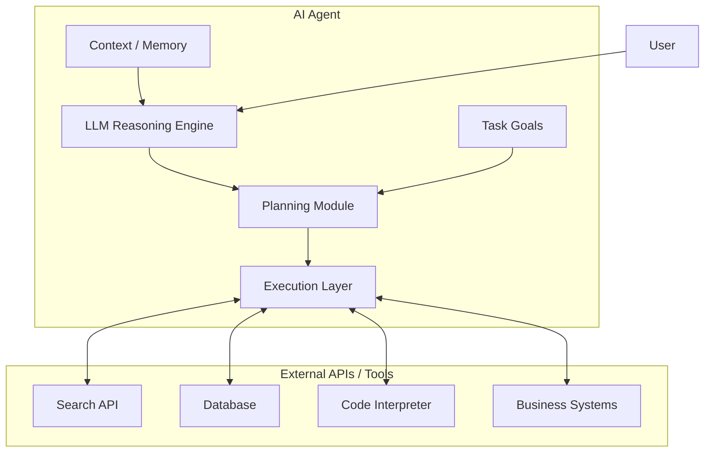
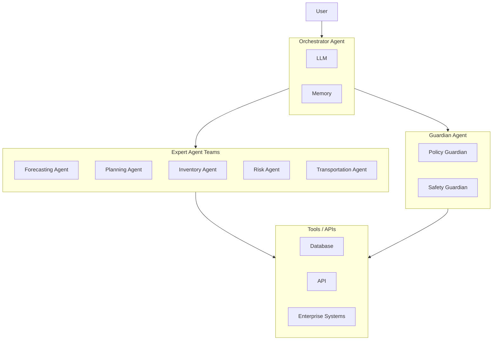

<Eyebrow>Part 4</Eyebrow>

# From One Agent to Many

Single- vs. multi-agent — and why a layered structure follows.

---

# Single-agent architecture

A single agent works — but hits limits as tasks grow.

<FeatureCard title="Specialization" icon="i-carbon-user-profile" tone="warning" compact>
One agent can't be expert at everything.
</FeatureCard>

<FeatureCard title="Coordination" icon="i-carbon-collaborate" tone="warning" compact>
No way to divide and sequence parallel work.
</FeatureCard>

<FeatureCard title="Orchestration" icon="i-carbon-flow-modeler" tone="warning" compact>
No higher-level control of the whole job.
</FeatureCard>

---

# Multi-agent architecture

Specialized agents collaborating — power and friction in equal measure.

| Multi-agent gives us       | But introduces challenges     |
| -------------------------- | ----------------------------- |
| Better scalability         | Context synchronization       |
| Parallel processing        | Coordination overhead         |
| Specialized reasoning      | Shared-state conflicts        |
| Flexible orchestration     | —                             |

<Callout type="warning">
The challenges column is exactly what the next slide's <strong>layered architecture</strong> — and the bridge protocols later — are designed to absorb.
</Callout>

---
zoom: 0.98
---

# From multi-agent to multi-layer

Multi-agent and multi-layer answer **different, complementary** questions.

<FeatureCard title="Multi-agent → who does the work" icon="i-carbon-group">
Specialized agents collaborating across tasks.
</FeatureCard>

<FeatureCard title="Layering → how the system is organized" icon="i-carbon-stack">
Separating <strong>people</strong>, <strong>agent brains</strong>, and the <strong>enterprise systems</strong> they act on.
</FeatureCard>

A multi-agent system still needs layers to:

- keep agents **decoupled** from the systems they touch,
- **integrate** with existing logistics systems (WMS / TMS / ERP),
- give the bridge protocols (**MCP**, **A2A**) a clear place to live.

<Callout type="tip">
The proposed design is therefore <strong>multi-agent <em>within</em> a layered structure.</strong>
</Callout>

