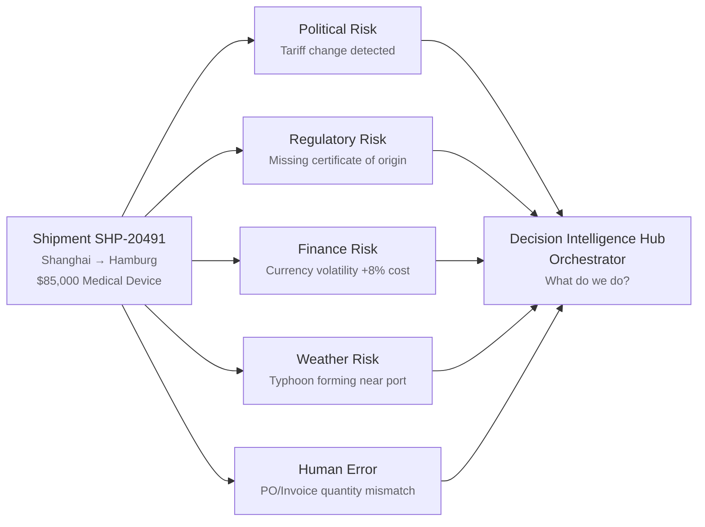
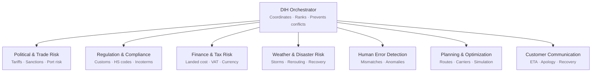
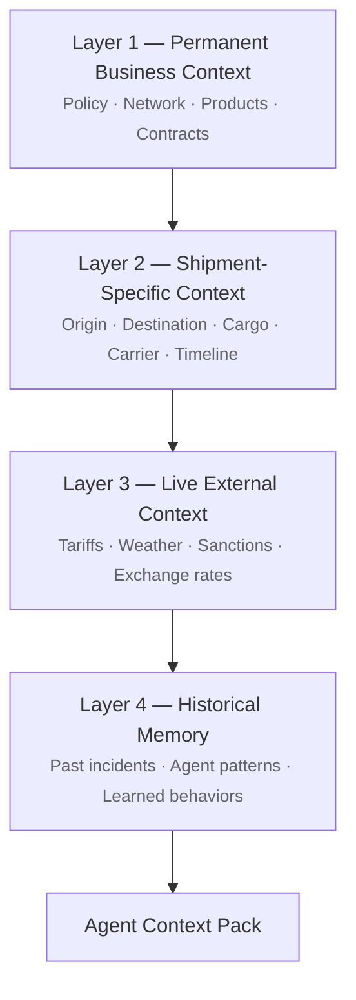

<Eyebrow>Part 6</Eyebrow>

# Case Scenario

The architecture, in practice — a Risk Decision Intelligence Hub for a freight forwarder.

---

# Illustrating with a case scenario

To show the architecture in practice, we walk through a **virtual case scenario** — illustrative, not a deployed system — modeled on a realistic logistics operation.

<FeatureCard title="What the case demonstrates" icon="i-carbon-flow-data" row>
How the three layers, the agents, and the bridge protocols <strong>come together to support real decisions</strong>.
</FeatureCard>

<Callout type="tip">
Next: the setting — a <strong>Multi-Agent Risk Decision Intelligence Hub (DIH).</strong>
</Callout>

---

# Risk Decision Intelligence Hub

The setting for the case scenario.

| | |
| --- | --- |
| **Domain**       | Mid-to-large third-party logistics / freight forwarder |
| **Challenge**    | Thousands of active shipments; hundreds of risk events daily; complex task planning |
| **Limit today**  | Traditional DSS can't autonomously coordinate responses across operational domains |
| **Goal**         | One unified risk picture, with the right level of automation per decision type |
| **System**       | Multi-Agent Risk Decision Intelligence Hub (**DIH**) |

---

# Risk detection process

In this scenario, the multi-agent system can:

<FeatureCard title="Detect risks" icon="i-carbon-warning-square" compact>
Tariff, regulatory, financial, weather, human operational errors.
</FeatureCard>

<FeatureCard title="Prioritize actions" icon="i-carbon-chart-bar" compact>
Rank by <strong>severity</strong> and <strong>business impact</strong>, not arrival time.
</FeatureCard>

<FeatureCard title="Support decisions" icon="i-carbon-decision-tree" compact>
Surface to the right human — or act within policy, autonomously.
</FeatureCard>

---

# Scope: why focus on risk detection?

Agents in logistics can do far more — route optimization, carrier selection, customer communication, demand forecasting, and more.

<FeatureCard title="Each task could have its own architecture" icon="i-carbon-template">
Built the same way, with the same three layers and bridge protocols.
</FeatureCard>

<FeatureCard title="Multiple architectures can run together" icon="i-carbon-collaborate">
Across one operation — composed, not collapsed into a single agent.
</FeatureCard>

<Callout type="note">
This research demonstrates <strong>one</strong> — Risk Detection — end to end. The same approach generalizes to the others.
</Callout>

---
zoom: 0.98
---

# DIH — the 8 agent teams

The DIH partitions the work into eight specialized teams, each owning a slice of the risk surface.

<Callout type="tip">
Seven specialist teams under the <strong>Orchestrator</strong> — eight roles in total, one per risk surface from the DIH background slide.
</Callout>

---
layout: multicolumns
---

# DIH — the 4-layer context architecture

Four context layers feed each agent's <strong>Context Pack</strong>.

<template #col1>

<ColHead tone="accent">Layer 1 — Permanent</ColHead>

Business context that rarely changes.

- Policy
- Network
- Products
- Contracts

</template>

<template #col2>

<ColHead tone="tip">Layer 2 — Shipment</ColHead>

Specific to the shipment in flight.

- Origin · destination
- Cargo
- Carrier
- Timeline

</template>

<template #col3>

<ColHead tone="note">Layer 3 — Live external</ColHead>

The world, right now.

- Tariffs
- Weather
- Sanctions
- Exchange rates

</template>

<template #col4>

<ColHead tone="try">Layer 4 — Memory</ColHead>

Past lessons the agent can apply.

- Past incidents
- Agent patterns
- Learned behaviors

→ **Agent Context Pack**

</template>

---

# DIH — context layers feeding the pack

The four layers stack into a single **Agent Context Pack** that the agent reasons over.

