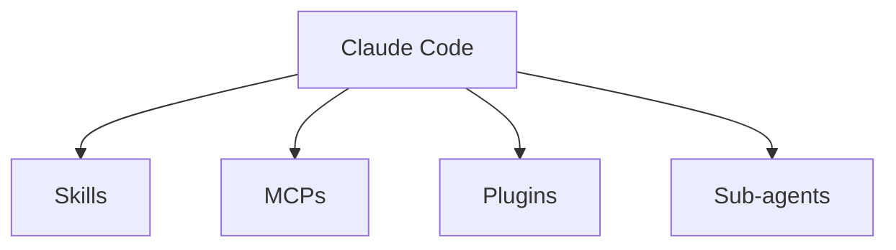
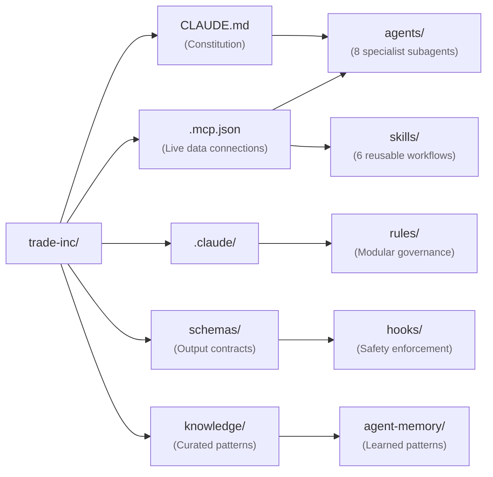

<Eyebrow>Part 7</Eyebrow>

# Outcomes & PoC

What the research delivers — and how the blueprint becomes a working stack in Claude Code.

---

# Expected outcomes

<FeatureCard title="1 · Conceptual framework" icon="i-carbon-blockchain">
A framework for <strong>Agentic DSS in logistics</strong>.
</FeatureCard>

<FeatureCard title="2 · Architecture & PoC" icon="i-carbon-rocket">
An <strong>architecture blueprint</strong> and a <strong>PoC prototype</strong>.
</FeatureCard>

<FeatureCard title="3 · Strategic insights" icon="i-carbon-idea">
For logistics decision systems and the SMEs that adopt them.
</FeatureCard>

---

# From blueprint to prototype

How do we show the blueprint is **buildable**, not just conceptual?

<FeatureCard title="Realize the blueprint in a real stack" icon="i-carbon-build-tool" row>
The next slides realize the proposed architecture in <strong>Claude Code</strong> — delivering on the second expected outcome:
</FeatureCard>

<Callout type="tip">
<em>"An architecture blueprint and PoC prototype."</em> Each part of the DIH architecture maps onto a real Claude Code primitive.
</Callout>

---
zoom: 0.95
---

# PoC implementation — Claude Code stack

Claude Code's primitives map directly onto the DIH architecture.

| Primitive       | Role in the DIH                                                                |
| --------------- | ------------------------------------------------------------------------------ |
| **Sub-agents** | One Claude Code sub-agent per DIH team                                          |
| **Skills**     | Reusable workflows — e.g. `classify-tariff-event`, `draft-customer-apology`     |
| **MCPs**       | Live connections to external systems — WMS, TMS, Weather API, Currency Feed    |
| **Plugins**    | Optional capability extensions                                                  |
| **Hooks**      | Safety enforcement before any autonomous action                                 |

<Callout type="note">
The mapping is one-to-one on purpose — each abstract role in the architecture has a concrete file or feature that implements it.
</Callout>

---
layout: multicolumns
---

# Claude Code file structure

The blueprint as actual files — each folder corresponds to a primitive on the previous slide.

<template #col1>

<ColHead tone="accent">`.claude/agents/`</ColHead>

One file per DIH team — the **Sub-agents**.

`tariff.md`, `weather.md`, `finance.md`, …

<ColHead class="pt-4" tone="tip">`.claude/skills/`</ColHead>

Reusable workflows — the **Skills**.

`classify-tariff-event/`, `draft-customer-apology/`

</template>

<template #col2>

<ColHead tone="note">`.mcp.json`</ColHead>

External system connections — the **MCPs**.

WMS · TMS · weather · currency feeds

<ColHead class="pt-4" tone="try">`.claude/plugins/`</ColHead>

Optional extensions — the **Plugins**.

</template>

<template #col3>

<ColHead tone="warning">`.claude/hooks/`</ColHead>

Safety enforcement — the **Hooks**.

Pre-tool checks · approval gates · audit trails

<ColHead class="pt-4">`CLAUDE.md`</ColHead>

Top-level policy, conventions, and the system prompt for the whole DIH.

</template>

---

# Claude Code file structure — the tree

The blueprint as actual files — each box is a real path in the PoC repo.

