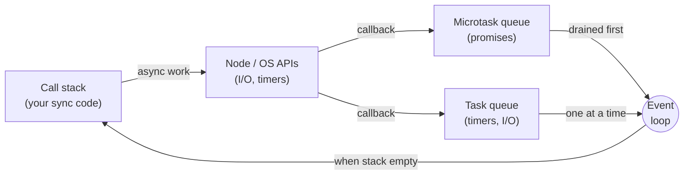
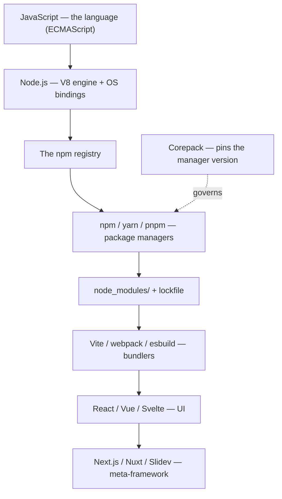

<Eyebrow>Part 4</Eyebrow>

# Runtime & Deep Dives

The ideas worth understanding the day something surprises you — and the map that ties it all together.

---

# Runtime concepts worth knowing

<div class="grid grid-cols-3 gap-4 pt-4">

<FeatureCard title="The event loop" icon="i-carbon-flow">
Node is single-threaded and asynchronous. That's why everything is callbacks / promises / <code>async-await</code> instead of blocking calls. Its own deep dive is two slides away.
</FeatureCard>

<FeatureCard title="env & config" icon="i-carbon-password">
<code>process.env</code> and <code>.env</code> files are how config and secrets reach a Node process. The <strong>dotenv</strong> package loads <code>.env</code> at startup.
</FeatureCard>

<FeatureCard title="nvm" icon="i-carbon-version">
<strong>Node Version Manager</strong> installs and switches between Node <em>versions</em> per project.
</FeatureCard>

</div>

<Callout type="tip" title="nvm vs Corepack — not competitors">
<strong>nvm</strong> manages Node itself; <strong>Corepack</strong> (Part 2) manages the package manager. Different layers of the same stack — you often use both.
</Callout>

---

# Deep dive ① — ESM vs CommonJS

The two module systems coexist, and the seams between them are the single most common thing that trips up newcomers.

<div class="grid grid-cols-2 gap-6 pt-2">

<div>

<ColHead>Why it bites</ColHead>

- ESM is **asynchronous**; CommonJS is **synchronous**. You can't always `require()` an ESM-only package from CommonJS.
- `import` and `require` resolve files differently (extensions, `package.json` `"exports"`).
- A library shipping both ("dual package") can be loaded twice, creating two copies of its state.

</div>

<div>

<ColHead>How to stay sane</ColHead>

- Decide per project: `"type": "module"` (ESM) or not (CommonJS). This deck chose ESM.
- Use the `node:` prefix for built-ins — `import fs from 'node:fs'`.
- New code: prefer ESM. It's the standard the whole ecosystem is moving to.
- When a tool says "cannot use import statement outside a module", it's this mismatch — check `"type"` and the file extension.

</div>

</div>

<!--
This is the first of the two topics the source draft explicitly flagged as the
hardest for newcomers. Keep the framing practical: rules of thumb, not spec lawyering.
-->

---

# What the interop pain looks like

A CommonJS file trying to `require()` an ESM-only package — the canonical error every newcomer hits eventually.

<div class="grid grid-cols-2 gap-6 pt-2">

<div>

<ColHead>The code</ColHead>

```js
// index.cjs  (CommonJS)
const chalk = require('chalk')
// chalk v5+ is ESM-only ↑

console.log(chalk.green('hi'))
```

</div>

<div>

<ColHead>The error</ColHead>

```
Error [ERR_REQUIRE_ESM]: require() of
ES Module .../chalk/source/index.js from
.../index.cjs not supported.

Instead change the require() of index.js
to a dynamic import() which is available
in all CommonJS modules.
```

</div>

</div>

<div class="pt-2">

<Callout type="tip" title="Three ways out">
Rename to <code>.mjs</code> and switch to <code>import</code> · add <code>"type": "module"</code> to <code>package.json</code> · or use a dynamic <code>import('chalk')</code> from CommonJS (returns a promise). The third is the only path that keeps the file CommonJS.
</Callout>

</div>

---

# Deep dive ② — the event loop

Node runs your JavaScript on **one thread**. Long work doesn't block it because slow operations are handed off, and their callbacks run later — orchestrated by the event loop.



<Callout type="note">
Key rule: the loop empties the <strong>microtask</strong> queue (resolved promises) completely before taking the next <strong>task</strong> (timers, I/O). This ordering explains most "why did this log before that?" surprises.
</Callout>

---

# The event loop, in code

What does this program print? Most people guess wrong on their first read.

<div class="grid grid-cols-2 gap-6 pt-2">

<div>

```js
console.log('1 — sync')

setTimeout(() => {
  console.log('2 — task')
}, 0)

Promise.resolve().then(() => {
  console.log('3 — microtask')
})

console.log('4 — sync')
```

</div>

<div>

<ColHead>The output</ColHead>

```
1 — sync
4 — sync
3 — microtask
2 — task
```

<div class="pt-3 text-sm opacity-85">

All **sync** code runs first (the call stack drains). Then the loop drains the **microtask** queue completely — that's the promise. Only then does it pick up the **task** queue — that's `setTimeout(…, 0)`.

</div>

</div>

</div>

<div class="pt-2">

<Callout type="tip" title="The takeaway">
<code>setTimeout(fn, 0)</code> does not mean "run now" — it means "queue this as a task". A resolved promise's <code>.then</code> always runs before that timer fires.
</Callout>

</div>

---

# The mental map

Every layer in this deck rests on the one above it. Here is the whole tower at once.



---

# Where this Slidev deck sits

**Node.js → Corepack → pnpm → Vite → Vue → Slidev.** When you run `pnpm dev` in this repo:

<div class="pt-2">

1. **pnpm** (possibly via Corepack) reads `package.json` and ensures `node_modules/` matches `pnpm-lock.yaml`.
2. It runs the `dev` script, which invokes the **Slidev** CLI.
3. Slidev spins up a **Vite** dev server.
4. Vite serves `nodejs.md` plus any **Vue** components, with hot reload.

</div>

<div v-click class="pt-4">

<Callout type="tip">
If something surprises you in Slidev, the cause is usually inherited from Vite or Vue, not Slidev itself. You now know every layer under your slides.
</Callout>

</div>

---
layout: multicolumns
---

# Cheat sheet

The whole ecosystem on one slide, for when you come back later.

<template #col1>

<ColHead>Language &amp; runtime</ColHead>

- **JS / ECMAScript** — the language + its standard
- **V8** — the engine that runs it
- **Node.js** — V8 + OS bindings
- **TypeScript** — typed JS, compiled away
- **ESM vs CJS** — `import` vs `require`

</template>

<template #col2>

<ColHead>Packages</ColHead>

- **registry** — where packages live
- **npm / yarn / pnpm** — the managers
- **Corepack** — pins the manager version
- **lockfile** — exact, reproducible installs
- **semver** — `^` minor, `~` patch, none = exact

</template>

<template #col3>

<ColHead>Tooling &amp; frameworks</ColHead>

- **Vite / webpack / esbuild** — bundlers
- **Babel / swc** — transpilers
- **ESLint / Prettier** — lint / format
- **Vitest / Jest** — test runners
- **React / Vue / Svelte** + meta-frameworks

</template>

---
layout: center
class: text-center
---

# You've got the map

A language, an engine, a runtime, a registry, the managers that talk to it, and the tools and frameworks on top — each layer resting on the last.

The two ideas that reward a second look: **ESM vs CommonJS** and **the event loop**.

<div class="pt-6 opacity-70">

Built with Slidev — itself a Vite + Vue meta-framework, sitting right at the top of this map.

</div>
