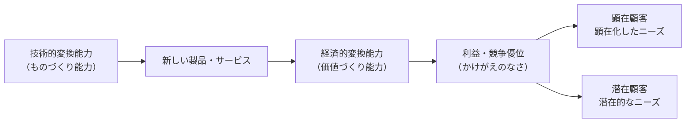

## 授業の予定

|  | 担当者 | 連絡先 |
|---|--------|-------|
| 第一回 & 第二回 | グエン | phuc@yamaguchi-u.ac.jp |
| 第三回 | 髙橋先生 | masakazu@yamaguchi-u.ac.jp |
| 第四回 | 石野先生 | ishino.y@yamaguchi-u.ac.jp |
| 第五回（広島教室） | 石野先生 | |
| 第五回（福岡教室） | 髙橋先生 | |

---

## 本日の全体像

| ブロック | テーマ | 中心的問い |
|--------|-------|----------|
| **第１部** | イノベーションとは何か | 「発明」と何が違うか？ |
| **第２部** | イノベーションの種類と特質 | どう分類し、戦略に活かすか？ |
| **第３部** | イノベーションを起こす力 | 誰が・なぜ・どう起こすか？ |
| **第４部** | 普及・市場ダイナミクス | 技術はどう市場に受け入れられるか？ |
| **第５部** | 価値獲得の戦略 | 生み出した価値をどう自社の利益にするか？ |

> 技術を生み出す（価値創造）だけでは不十分。それを利益に変える仕組み（価値獲得）が経営の本質課題

---

## 「イノベーション」　対　「発明」

  

発熱電球 💡 は、　　　**イノベーション**？　　それとも　**発明**？

---

### 「イノベーション」　対　「発明」

**イノベーション　＝　新規性（例：発明）　＋　経済的価値（例：商業化・普及）**

<v-clicks>

- 電球 💡 は素晴らしい発明です。しかし、それが大量に生産され、顧客に提供した後に初めて、**イノベーション**と言える。

- イノベーションとは、大小を問わず、何か**新しい**ものを取り入れて、それを**経済的な価値**に変えること。

- イノベーションは製品や技術だけに**とどまらない**。マーケティングイノベーション、組織イノベーションなどもある。

</v-clicks>

---
layout: two-cols
class: text-sm
---

### 経済的価値の中身：社会的余剰とは

> 経済的な価値の中身は、**社会的余剰**

<v-clicks>

- **消費者余剰：** 消費者の支払意志額と実際の価格の差
  → 「もっと高くても買ったのに」という得
- **生産者余剰：** 実際の価格と生産コストの差
  → 企業の利益の源泉
- イノベーションとは、この**両方を増やす**新しいモノゴト

</v-clicks>

| 余剰の種類 | 定義 | 誰が得をするか |
|-----------|------|-------------|
| **消費者余剰** | 支払意志額 − 価格 | 顧客・社会 |
| **生産者余剰** | 価格 − 生産コスト | 企業・イノベーター |

::right::

---
layout: two-cols
class: text-sm
---

### イノベーション = 新しさ × 経済的価値

**イノベーションの２つのルート（清水, 2022）：**

<v-clicks>

- **製品イノベーション**：需要曲線を上方シフト（D → D'）→ 消費者余剰↑
- **プロセスイノベーション**：供給曲線を下方シフト（S → S'）→ 生産者余剰↑

</v-clicks>

::right::

---

**よくある誤解：**

| 誤解 | 正しい理解 |
|------|-----------|
| 特許取得 ＝ イノベーション | 経済的価値を生まなければ「タネ」にすぎない |
| 科学的発見 ＝ イノベーション | 価値に転換されるまではイノベーションではない |
| 新製品発売 ＝ イノベーション | 社会的受容と普及が問われる |

---

### 競争とイノベーション：赤の女王のレース

*「同じ場所にとどまるためだけに全力で走り続けなければならない」— ルイス・キャロル*

**競争状況とイノベーション・インセンティブの３経路：**

<v-clicks>

- **経路①**　競争が激化 → イノベーション圧力が高まる
  *ただし：同質競争が激しすぎると生産者余剰がゼロに近づき、インセンティブが消滅*

- **経路②**　自社イノベーションで独占的利潤が期待できる → 積極投資
  *参入障壁を高く設定できる見込みがあれば、競争下でも挑戦する価値がある*

- **経路③**　独占を獲得した後 → イノベーション・インセンティブが低下

</v-clicks>
「現状維持が最適」になる。変化は競合からの脅威があって初めて起きる

---

### 赤の女王のレース：何を意味するか

**比喩の意味：** ルイス・キャロル『鏡の国のアリス』に由来。競合他社が絶えずイノベーションを続ける市場では、自社も同じペースで革新しないと**相対的に後退**してしまう。現状維持のために全力を尽くさなければならない状態

| 状況 | 動き | 経営への含意 |
|------|------|------------|
| **経路①** 競争が激しい | イノベーション圧力は上がる | 激しすぎると利益ゼロ → インセンティブが消える |
| **経路②** 独占利潤が見込める | 競争下でも積極投資する動機が生まれる | 挑戦が報われる市場構造を設計することが重要 |
| **経路③** 独占を獲得した後 | 変化の必要がなくなる | イノベーションへの意欲が低下する罠 |

---

**自組織への診断問い：**

> なぜウチの会社はイノベーションを生み出していないのか？

<v-clicks>

- 「頑張っているのに儲からない」→ 経路①の過剰競争状態
- 「別に今は問題ない」→ 経路③の独占的安定状態
- 「挑戦しても模倣される」→ 生産者余剰の見込みがない

</v-clicks>

---

## イノベーションマネジメント

現在、技術的に優れた製品を開発しても、持続的な経済価値に結びつかない企業が多数存在する中、イノベーションマネジメントは以下の目標を追求するものとなります。

 

1. イノベーションの**価値創造**

2. イノベーションの**価値獲得**

---

### 価値創造と価値獲得：イノベーション戦略の２大目標

**図の読み方（左から右へ）：**

<v-clicks>

- **技術的変換能力** — 技術・R&Dで新製品を生み出す力（ものづくり）
- **経済的変換能力** — それを利益に変える戦略・仕組み（価値づくり）
- 矢印が示すのは「**作る能力**」と「**稼ぐ能力**」は**別物**だということ

</v-clicks>

---

**顕在顧客 vs. 潜在顧客：**

| | 定義 | 例 |
|--|------|-----|
| **顕在化したニーズ** | 顧客がすでに「欲しい」と自覚している需要 | 「バッテリーをもっと長持ちさせたい」 |
| **潜在的なニーズ** | 顧客自身もまだ気づいていない、言語化されていない需要 | iPhoneが登場する前、誰もタッチスクリーン式スマートフォンを求めていなかった |

> 「もし顧客に何が欲しいか聞いていたら、『もっと速い馬』と答えただろう」— Henry Ford

顕在ニーズに応えると**改良**になり、潜在ニーズを掘り起こすと**破壊的イノベーション**になる

---

### 価値創造と価値獲得：なぜ両方が必要か

**ホテルのマットレス事例：**

<v-clicks>

- 高品質マットレスを導入 → 顧客満足度↑（**消費者余剰↑**）
- 翌年、競合が全員真似をする → 差別化消滅
- コストだけ増えて利益は出ない（**生産者余剰ゼロ**）
- 「価値を**創った**」のに「価値を**獲得**できなかった」状態

</v-clicks>

| 思考パターン | 結果 |
|------------|------|
| 「他がやっているから、うちも」 | 赤の女王のレース。消耗するだけ |
| 「他がやっているなら、うちは……」 | 差別化・模倣されない仕組みを設計する |

> 価値創造（技術）と価値獲得（戦略）の**両方を同時に設計する**ことがイノベーションマネジメントの本質
