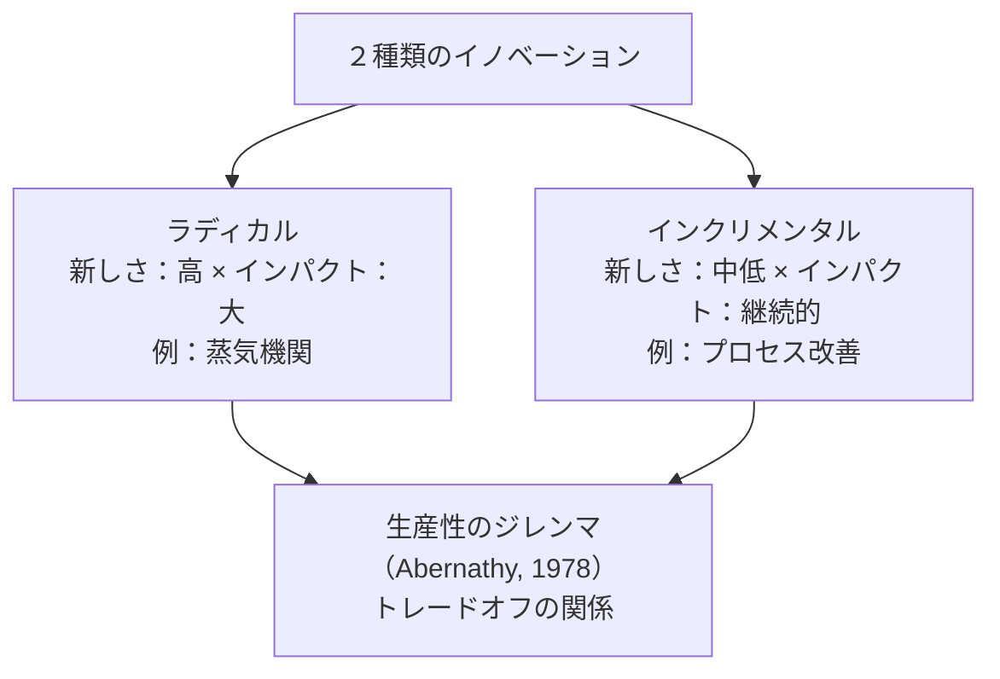
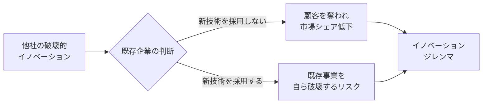
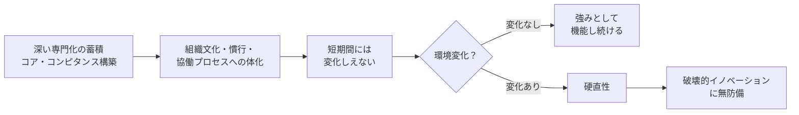

<Eyebrow>第２部</Eyebrow>

# イノベーションの種類と特質

---

## インクリメンタル **VS.** ラディカルイノベーション
### イノベーションの影響の度合いによる分類

**インクリメンタル・イノベーション（漸進的イノベーション）：**

<v-clicks>

- 既存の製品・サービスに細かな改良を積み重ねていく。マイナーチェンジ。（例：iPhone XからiPhone 13に）
- 目的は顧客サービスの最適化、コスト削減、新しい市場への対応、または新しい法律や規格などへの適応。
- 目立たないが、競合他社との競争により市場シェアや収益性が失われていくのを防ぐために、非常に有用・不可欠なイノベーション。

</v-clicks>

**ラディカル・イノベーション（急進的イノベーション）：**
<v-clicks>

- 新しい製品・サービスを新しい方法で提供する。（例：第3世代移動通信システム3Gの誕生とその影響）
- 従来と全く異なる価値観を市場にもたらして、業界における競争のルールが根本から覆される。
- 影響が大きい。結果として新しい市場を生み出すことになることがある。

</v-clicks>

---
layout: two-cols
class: text-sm
---

### 生産性のジレンマ：ラディカルとインクリメンタルはトレードオフ

**Abernathy（1978）の発見：**
ラディカルとインクリメンタル・イノベーションは**構造的トレードオフ**の関係にある

<v-clicks>

- 既存製品の効率的生産に最適化した組織は、新しい設計を追求できなくなる
- **自動車産業の証拠**：T型フォードのライン最適化がラディカル転換を阻害
- どちらが「優れている」かではなく、**自組織の状況に合わせて選択する**

</v-clicks>

> 「いかに巧みに帆船を改良しても、蒸気船は得られない」

::right::

---
layout: two-cols
class: text-sm
---

### 電気自動車（EV）はラディカルイノベーション

**EVがラディカルである4つの理由：**

<v-clicks>

- **技術基盤の変化** — 内燃機関・燃料供給・排気系を根本から不要化
- **エネルギー供給の変革** — 石油インフラから電力インフラへの転換を要求
- **CO₂排出の削減** — 排気ゼロで社会・規制環境を変える
- **新市場の創出** — 充電インフラ・バッテリー・電力管理システムが新産業に

</v-clicks>

::right::
> EVの普及は単なる製品改善ではなく、技術・市場・社会構造の**根本的な再設計**

**インパクトの波及：**

<v-clicks>

- 自動車部品メーカー（エンジン系）→ 能力破壊型
- エネルギー産業（石油 → 電力）→ 市場破壊型
- 金融・保険・サービス → ビジネスモデル変革

</v-clicks>

---
layout: two-cols
class: text-sm
---

### 能力増加型イノベーション・能力破壊型イノベーション

**能力増加型イノベーション**
過去に蓄積した能力・知識が活用できる

::right::
**能力破壊型イノベーション**
過去の能力・知識が全く役に立たなくなってしまう

---

### 変革力の4類型（Abernathy & Clark）

*横軸：技術知識（温存←→破壊）　縦軸：市場知識（温存←→破壊）*

|  | **技術知識：温存** | **技術知識：破壊** |
|---|---|---|
| **市場知識：温存** | **漸進改善型** 既存企業が最強（知識を最大活用） | **革新型** 既存技術知識が陳腐化 → 新参者有利 |
| **市場知識：破壊** | **ニッチ創造型** 既存企業の技術を新市場へ → 選択次第 | **アーキテクチュラル型** 技術・市場ともに破壊 → 新参者に最も有利 |

---

### 変革力の4類型：各類型の意味

<v-clicks>

- **① 漸進改善型**（技術：温存 × 市場：温存）

</v-clicks>
技術も顧客も変わらない。今の強みをそのまま活かせる。例：T型フォードの生産ラインのコスト削減
<v-clicks>

- → **既存企業が最も有利**。新参者が入り込む余地がない

- **② 革新型**（技術：破壊 × 市場：温存）

</v-clicks>
技術は大きく変わるが、顧客・市場は同じ。例：木製ボディから密閉型鋼板ボディへの転換
<v-clicks>

- → 技術的知識は陳腐化するが**顧客関係は生き残る**。既存企業が素早く対応できれば踏みとどまれる

- **③ ニッチ創造型**（技術：温存 × 市場：破壊）

</v-clicks>
技術はそのままで、今まで関わっていなかった新市場へ持ち込む。例：フォード モデルA（スポーツ市場）
<v-clicks>

- → 既存企業が自社技術を新しい文脈に**転用**できるかどうかが勝敗を分ける

- **④ アーキテクチュラル型**（技術：破壊 × 市場：破壊）

</v-clicks>
技術も市場も根本から変わる。既存企業の知識資産がすべて陳腐化する。例：T型フォードが大衆市場を創造
<v-clicks>

- → **新参者が最も有利**。既存企業は過去の成功が重荷になる

</v-clicks>

---

### なぜT型フォードは「大衆市場を創造した」のか

T型フォード（1908年）登場以前、自動車は富裕層向けの手工芸品だった。フォードは「より良い車」を作っただけでなく、**2つの次元を同時に根本から変えた**。

---

### 技術の破壊
<v-clicks>

- **流れ作業（移動式組み立てライン**を導入し、熟練職人による手作業を標準化・反復可能な工程に置き換えた
- 部品の徹底的な規格化により、すべての部品が互換性を持つようになった
- 革新の核心は「単一部品の改良」ではなく、**生産システム全体の再設計**にある

</v-clicks>

### 市場の破壊
<v-clicks>

- 価格が約850ドル（1908年）から約260ドル（1925年）まで下落し、工場労働者にも手が届くようになった
- フォードが労働者に日給5ドルを払ったのは、**自分たちが作った車を自分たちが買えるようにする**ためでもあった
- ターゲット顧客が富裕層から働く中産階級へと移行した
- 「個人による大衆的な移動手段」という、それまで存在しなかった新しい市場カテゴリーが生まれた

</v-clicks>

---

### なぜ既存企業の知識資産が陳腐化したのか

ここが「アーキテクチュラル型」と呼ばれる所以だ。既存の自動車メーカーが持っていた強みは：

<v-clicks>

- 熟練した馬車・車体製造の職人技
- 富裕層顧客との関係性やオーダーメイドのサービス
- 少量・高利益率のビジネスモデル

</v-clicks>

これらが**すべて一気に無価値になった**。新たな競争優位の源泉は、工業的なプロセス設計・サプライチェーンの規模・コスト管理能力であり、まったく異なる種類の知識だ。

---

フォードは、既存の自動車市場に参入して勝ったのではない。**旧来の競争ルールそのものを無意味にするような生産の仕組みを作り上げることで、新しい市場を定義した**のだ。

---

### 変革力の4類型：戦略的含意

**競合のイノベーションがどの類型かを診断する：**

| 競合のイノベーションが... | 自社への脅威度 | 戦略的示唆 |
|------|------------|---------|
| **漸進改善型** | 低 | 自社の強みで対抗できる。慌てなくてよい |
| **革新型** | 中 | 技術投資が必要。顧客は失わずに済む可能性がある |
| **ニッチ創造型** | 中 | 自社も同じ技術で別市場を狙えないか検討する |
| **アーキテクチュラル型** | 最高 | 最も危険。既存の強みが逆に変化を妨げる罠になる |

> **核心的な洞察：** 怖いのは「技術も市場も両方変わる」④のケース。インクリメンタルな改善を積み重ねてきた組織ほど、アーキテクチュラルな変化に無防備になりやすい

---

### アーキテクチャル・イノベーション

<v-clicks>

- **モジュール**（車輪・ペダル・ハンドル）は変わっていない
- **アーキテクチャ**（部品の繋ぎ方・全体構成）が根本から変わった
- → これが**アーキテクチャル・イノベーション**

</v-clicks>

---

### モジューラ・イノベーション　vs.　アーキテクチャル・イノベーション

**モジューラ（部品レベル）：** システムの構成を変えずに部品を変えること

**アーキテクチャ（システム全体）：** 製品を構成する部品間の繋ぎ方・全体構成を変えること

<v-clicks>

- アーキテクチャル・イノベーションは起こりにくいが、起こった時にはより大きなインパクトを与える
- **既存企業が最も気づきにくい**：部品レベルでは変化がなくても、「繋ぎ方」の変化が競争優位を無効化する

</v-clicks>

---

### アーキテクチャル・イノベーションの事例

| 種別 | 事例 | 変わったこと（アーキテクチャ） |
|------|------|--------------------------|
| **プロダクト** | LEGO Mindstorms | おもちゃ → 教育ツール。ブロックはそのまま、用途の構成が変わった |
| **プロダクト** | スマートフォン | 通話端末 → 統合情報端末。同じ部品群の「繋ぎ方」が根本から変わった |
| **サービス** | Amazon Web Services (AWS) | 単一サーバー → 分散クラウドインフラ。スケールオンデマンドを実現 |
| **サービス** | Spotify | アルバム販売/DL → 定額ストリーミング。音楽の消費構造を再設計 |

**共通パターン：** 個々の部品・要素は既存のまま、それらの**組み合わせ方・提供構造**を変えることで全く新しい価値を生み出した

---

### 技術基準と顧客の要求水準

<v-clicks>

- **技術基準**（最上線）：市場のあらゆるセグメントより急速に進歩する
- ハイエンド市場の水準 / ミドルレンジ市場の水準 / ローエンド市場の水準（下3線）
- 技術はいずれ顧客の要求を大きく超過する → **破壊的イノベーションの機会を生む**

</v-clicks>

---

### 新しいローエンド技術の向上による破壊的イノベーション

<v-clicks>

- **ハイエンド技術**（上線）が従来の主流技術
- **ローエンド技術**（2番目の線）が時間とともに向上し、各市場の水準を次々と超える
- 最終的にハイエンド市場に侵入し、従来技術を**破壊**する

</v-clicks>

---

### 持続的イノベーション・破壊的イノベーション

**持続的イノベーション：**
<v-clicks>

- **従来の技術進歩の軌道上**を速やかに進むイノベーション。
- **既存市場で求められている価値**を製品ライフサイクルの中で、更なる付加価値をつけることで、他社製品・サービスと差別化を可能とする。
- これまでになかった製品・サービスを高いレベルで顧客の要求に応える日本のメーカーが得意としてきたイノベーション。

</v-clicks>

**破壊的イノベーション：**
<v-clicks>

- 従来の技術進歩の軌道に沿ったイノベーションにとどまらず、**新たな軌道へ転換**することで、従来の市場秩序を破壊するイノベーションとなります。
- 新しい技術が最初に**既存技術に劣る**場合がありますが、**使い勝手が高く、しかも価格が安くなる**ことで、**既存顧客を奪う**ことができます。その後、**新しい技術の進歩**により品質が改善され、従来技術の**主要な顧客を奪い取る**ようになります。
- 破壊的イノベーションは、既存企業が**今まで関わりの少なかった顧客層をターゲットにする**。このタイプのイノベーションは、見過ごされやすいため、既存企業にとって予期せぬものとなる。

</v-clicks>

---

### 破壊的イノベーション　→　イノベーションジレンマ

<v-clicks>

- 他社の破壊的イノベーションが進展し、既存企業が顧客を奪われ、競合他社との価格競争に陥ると、業績の悪化を招きかねない。
- 一方で、画期的な新技術を開発・採用することで他社に対抗でき、将来の成功につながる可能性があるが、新技術を展開することで現在成功している製品、プロセス、またはサービスを破壊することになる。

</v-clicks>

→ **イノベーションジレンマ**に陥る。

---

### イノベーションジレンマの例

| 企業 | 既存強み | 破壊的脅威 | なぜ対応できなかったか |
|------|---------|----------|-------------------|
| **Kodak** | フィルムカメラ市場の独占 | デジタルカメラ | デジタル技術を自社開発済み。フィルム事業への影響を懸念し本格参入を先送り |
| **IBM** | メインフレームの市場支配 | パーソナルコンピュータ | PC事業参入も、メインフレームへの資源配分が優先されPCへの投資が不十分 |
| **Nokia** | 携帯電話の世界シェア1位 | スマートフォン（iOS/Android） | スマートフォン開発に着手も、既存携帯事業保護が優先され参入が遅延 |

**3社に共通するパターン：**
1. 破壊的技術を**認識**していた
2. しかし既存事業への影響を**合理的に**懸念した
3. 結果として「正しい判断の積み重ね」が敗北を招いた

> 克服のカギ：既存事業と新事業を**別軸**で評価し、長期的視点で資源配分を行う

---

## 中核能力の罠

> **「中核能力」は「中核硬直性」に転じる**
> レオナード＝バートン（1992）

<v-clicks>

- コダック・ノキア・IBMの敗北は「無能」ではなく、**成功の論理の帰結**
- 組織文化・評価基準が新しいアイデアを「**合理的に**」否定する逆説
- 「既存のルールや行動規範は、新たな機会を過小評価するための合理的な根拠として利用されるかもしれない」

</v-clicks>

---

### なぜ既存企業は対応できないのか

**組織的慣性の3つの源泉：**

| 源泉 | メカニズム |
|------|-----------|
| **経済的** | 新技術が既存事業を侵食 → 既存企業の期待収益がスタートアップより**構造的に低くなる** |
| **政治的** | 既存事業部門の幹部が地位・予算を失う → 組織内抵抗が生じる |
| **文化的** | 既存ルーティン・規範・評価基準が組織に埋め込まれ、見えない制約になる |

**逆説：** 既存企業の「合理的な判断」の積み重ねが敗北を招く（クリステンセン）

---

### 組織的慣性の経済的源泉：なぜ既存企業は投資できないのか

**スタートアップと既存企業の期待収益の非対称性：**

| | スタートアップ | 既存企業 |
|--|-------------|---------|
| 新技術で**得るもの** | 新市場の売上 | 新市場の売上 |
| 新技術で**失うもの** | なし | **既存事業の売上（自己侵食）** |
| 純粋な期待収益 | 高い | **低い（場合によってはマイナス）** |

**具体例：デジタルカメラとKodak**
<v-clicks>

- Kodakがデジタルカメラを本格展開すれば、自分でフィルム事業（年数千億円）を殺すことになる
- スタートアップにはその制約がない → 同じ技術でもKodakより高い期待収益で投資できる
- だからKodakは「**合理的に**」投資できなかった

</v-clicks>

<v-clicks>

**「構造的」の意味：**
これは経営者の判断ミスや怠慢ではなく、ビジネス構造から**必然的に生まれる**利益計算の歪み

> 成功している企業ほど、自分を破壊するイノベーションに投資できない。これがイノベーションジレンマの経済的根拠

</v-clicks>

---

### 破壊的イノベーションの発生の背景

<v-clicks>

1. **企業が主要顧客に過度に依存している。**
   既存顧客や短期的な利益を求める株主の意向が優先される。

2. **小規模な市場では、企業の成長ニーズを満たすことができない。**
   イノベーションの初期では、市場規模が小さく、企業にとっては参入の価値がないように見える。

3. **存在しない市場は分析できない。**
   初期段階では、不確実性も高く、現存する市場と比較すると、参入の価値がないように見える。

4. **組織の既存能力は新しい事業に対抗勢力になってしまう。**
   既存事業を営むための能力が高まることで、異なる事業が行えなくなる。

5. **既存技術の供給の増加分が、既存市場の需要の増加分と一致するとは限らない。**
   既存技術を改善しても新たな需要がうまれる限らない。

</v-clicks>

---

### 破壊的イノベーションへの対応

<v-clicks>

1. 破壊的技術を開発するプロジェクトは、**小規模で前向きな組織**に任せます。小さな機会や成功にも積極的に取り組んでもらうためです。

2. 破壊的技術の市場を探る過程では、**早い段階で失敗を最小限に抑える**ための計画を立てる必要があります。市場は試行錯誤の中で形成されていくものであるため、失敗から学ぶことが重要です。

3. 破壊的技術に取り組む際には、**既存組織の一部のリソースを活用**しながらも、**既存のプロセスや価値基準には囚われず**、新しい技術に適したコスト構造や価値基準を持つ方法を創出する必要があります。

4. 破壊的技術を商品化する際には、既存市場の持続のために破壊的製品を売り出すのではなく、**破壊的製品の特徴が評価される新しい市場を開拓する**ことが重要です。

</v-clicks>
