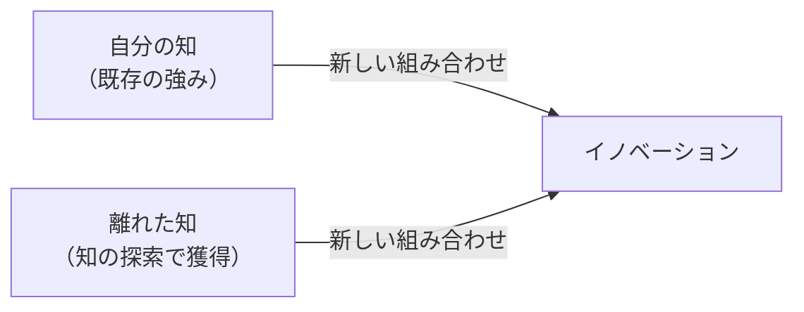
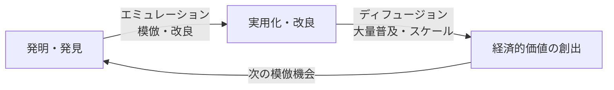
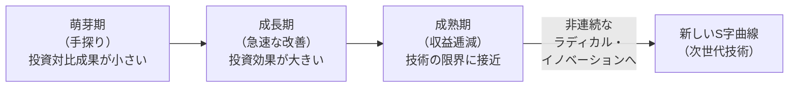

<Eyebrow>第３部</Eyebrow>

# イノベーションを起こす力

---

### アニマルスピリッツ：起業家を動かす非合理な力

**なぜ人は「合理的に不可能」な挑戦をするのか？（ケインズ、アカロフ＆シラー）**

<v-clicks>

- **楽観主義**：成功確率を過大評価し、あえてリスクを取る
  **平均リターンは低いのに起業する理由。楽観バイアスが行動を生む**
- **物語（ナラティブ）**：説得力あるストーリーが投資家と顧客を引きつける
  **Appleの「Think Different」物語が組織を動かす**
- **信頼**：法制度と市場の将来への信頼感
  **制度が信頼できない国では起業が生まれない（シリコンバレーの前提条件）**
- **市場の非合理性**：非効率があるところに機会が生まれる

</v-clicks>

<v-clicks>

  *「なぜあれを誰もやっていないのか？」がビジネス機会の核心*

> 「最も重要な投資決定をする際、私たちは根拠があまりにも不確かで、いかなる科学的な計算も可能でない状況に直面する。そのような状況では、私たちは本能的な欲求、勇気、または楽観主義によって動かされる」— ケインズ

</v-clicks>

---

### 「真の」不確実性とイノベーション

**フランク・ナイト（1921）：リスクと不確実性の根本的な違い**

| | **リスク（Risk）** | **真の不確実性（Uncertainty）** |
|---|---|---|
| **定義** | 確率が計算できる未知 | 確率すら定量化できない未知 |
| **例** | 保険数理・金融リスク管理 | 新製品の市場受容・技術ブレイクスルー |
| **対処法** | 保険・分散投資・ヘッジ | アントレプレナーシップ・実験・楽観主義 |
| **担い手** | リスク管理者 | アントレプレナー |

**なぜイノベーションには「真の不確実性」が伴うのか：**
<v-clicks>

- 新規市場には過去データがない。「存在しない市場は分析できない」
- 技術の成否は事前に分からない。成功したあとで初めて「あれがそうだった」とわかる
- ロジックだけでは前進できない → **アニマルスピリッツが必要**

</v-clicks>

---

### 両利きの経営
#### 業界変化に対応し、成熟事業と新規事業を同時に成功させる組織能力

| | **知の深化（Exploitation）** | **知の探索（Exploration）** |
|--|----------------------------|--------------------------|
| **焦点** | 既存事業の強化・効率化 | 新事業・新技術の開拓 |
| **成功確率** | 高（予測可能） | 低（不確実） |
| **罠** | 偏りすぎると**サクセストラップ**に陥る | 偏りすぎると資源を無駄消費 |

<v-clicks>

**サクセストラップ：**

- 既存事業で成功 → 深化に資源を集中 → 探索が止まる → 破壊的変化に無防備

> 両方を**同時に**推進する組織設計こそが、イノベーションマネジメントの核心課題

</v-clicks>

---

### 知の探索と知の深化とサクセストラップ

*出所：イノベーション白書*

---

### イノベーションの源泉　＝　知の新しい組み合わせ

<v-clicks>

- 新しいアイデアの大多数は **「既存の知」の新しい組み合わせ**から生まれる（シュンペーターの新結合）

- 既存の知だけでは、やがて組み合わせの限界に達する → **自分の知らない「離れた知」** が必要

- 離れた知は **「知の探索」** を通じて獲得される（異業種・異分野・異文化との接触）

- 自分が持つ知 × 離れた知 の**新しい組み合わせ** ＝ イノベーションの源泉

</v-clicks>

---
layout: two-cols
class: text-sm
---

### BCGマトリクスとイノベーション戦

::right::
<v-clicks>

- **問題児（スター候補）：** ラディカル・イノベーション → 破壊的変革を起こせ
- **花形：** 競争優位を磨く・差別化を強化
- **金のなる木：** インクリメンタル・効率改善型のみ・キャッシュを最大化
- **負け犬：** 早期撤退・資本を再配分

</v-clicks>

> 「全部門でイノベーション！」は**悪いマネジメント**
> ポジションによって必要なイノベーションの種類が根本的に異なる

*「花形」の評価基準（ROI・効率）を 「問題児」 に当てはめると、その芽を摘む*

---
layout: two-cols
class: text-sm
---

### アンゾフ・マトリクスとイノベーション戦略

::right::
| 戦略 | 必要なイノベーション |
|------|-----------------|
| **市場浸透** | 大きなイノベーション不要 |
| **新製品開発** | 中程度のイノベーション |
| **新市場開拓** | 新規顧客インサイトが必要 |
| **多角化** | 最大限のラディカル・イノベーション |

*必要なイノベーションの種類はポジションによって根本的に異なる*

**組織設計への含意：**
<v-clicks>

- 多角化部門 → ラディカル用：小チーム・失敗許容・既存事業から隔離
- 市場浸透部門 → インクリメンタル用：深い専門知識・効率性指標

</v-clicks>

---

### イノベーションの本質：エミュレーション × ディフュージョン

> **イノベーション ＝ エミュレーション（模倣・改良）× ディフュージョン（普及・スケール）**

**「0→1」は稀。成功企業の実像：**

| 企業 | 真の姿 |
|------|-------|
| **Google** | 検索エンジン最後発（ヤフーより2年遅く創業）。スケール能力で勝利 |
| **AMD** | インテルのコピー品からスタートし市場を拡大 |

---
layout: two-cols
---

### 技術進歩のS字曲線

<v-clicks>

- 技術には「限界」（技術的天井）が存在する
- 成熟期に達する**前に**次のS字曲線への移行投資を開始することが重要
- リーダー企業のジレンマ：新技術登場時点では「破壊的曲線」と「早期失敗曲線」は区別できない

</v-clicks>

::right::

---

---
layout: two-cols
class: text-sm
---

### 長尾分布：成功は予測できない

<v-clicks>

- 新しさの高いアイデアは稀。分布の右テールに位置する
- **事前に何が成功するかは誰にも判断できない**
- 必要な戦略：試行錯誤の「量」を増やす
- 失敗から学ぶ：原因を組織全体で分析・共有する
- **「意図的な失敗」**。何が機能しないかを検証することも学習

</v-clicks>

> 「失敗を許容するだけでは不十分。失敗を**意図的かつ学習的**なものにする。」

::right::

---

### 誘発された技術進歩：要素価格がイノベーションの方向を決める

#### 高価な生産要素を節約する方向に研究開発が誘発される

**農業イノベーションの日米比較。同一産業・反対方向：**

| | 日本（土地稀少） | アメリカ（土地豊富） |
|---|---|---|
| **目標** | 単位面積当たり収穫量向上 | 農家1人当たり耕作面積拡大 |
| **革新** | 品種改良・肥料・農薬 | 機械化・大型農業機器 |
| **希少要素** | 土地（高コスト） | 労働力（高コスト） |

---

**現代への応用：今、何が高騰しているか？**

| 高騰する要素 | 生まれやすいイノベーション |
|------------|----------------------|
| 人件費（少子高齢化） | 労働節約型技術・AI・自動化 |
| エネルギー価格 | 省エネ・再生可能エネルギー |
| 注意力・時間の希少化 | 認知負荷を下げる技術 |
