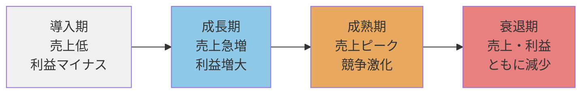

<Eyebrow>第４部</Eyebrow>

# 普及・市場ダイナミクス

---

### 製品ライフサイクル

| フェーズ | 戦略上の焦点 |
|---------|-----------|
| 導入期 | 市場教育・認知形成 |
| 成長期 | シェア拡大・差別化 |
| 成熟期 | コスト競争・顧客維持 |
| 衰退期 | 撤退 or 再活性化 |

---
layout: two-cols
class: text-sm
---

### 普及率曲線

::right::
| セグメント | 累積比率 | 特徴 | 求めるもの |
|-----------|---------|------|-----------|
| イノベーター | 2.5% | 新しければ試す | 目新しさ・先行者の優越感 |
| アーリー・アダプター | 16% | 目利きのオピニオンリーダー | 品質の実証・口コミ波及 |
| アーリー・マジョリティ | 50% | リスク回避の追随者 | アーリー・アダプターの評価 |
| レイト・マジョリティ | 84% | 懐疑的・「みんながやるから」 | コストパフォーマンス |
| ラガード | 100% | 消極的・最後まで抵抗 | ネットワーク効果による強制 |

---

### キャズム

**キャズム（Chasm）** とは、初期少数採用者（アーリーアダプター）と前期多数採用者（アーリーマジョリティ）の間に存在する**深い隔たり**のこと。両者のニーズは根本的に異なるため、多くの新技術がここで普及を止める。

---
layout: two-cols
---

### キャズム（隔たり）を超える

**市場を開拓するため**

*革新的採用者と初期少数採用者のマーケットの獲得のため*

**イノベーションが中心**

<v-clicks>

- 最高の製品
- 魅了するアーキテクチャ
- ユニークな機能

</v-clicks>

::right::

**キャズムを超えるため**

*前期・後期多数採用者の獲得のため*

**マーケットが中心**

<v-clicks>

- 最大セグメントの顧客の選好を重視
- イノベーションが標準規格と認識される
- 質の高いカスタマーサービス

</v-clicks>
