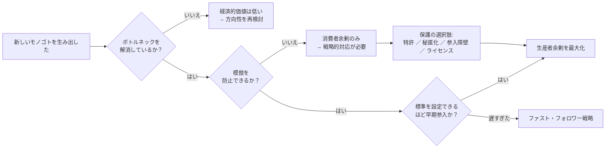
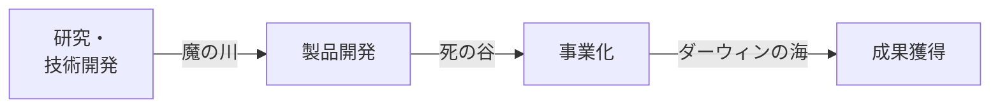
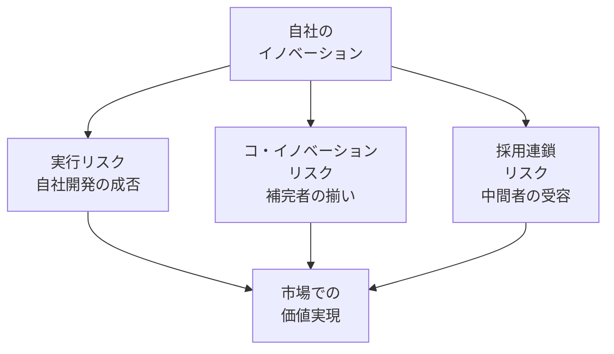
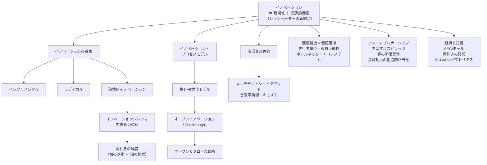

<Eyebrow>第５部</Eyebrow>

# 価値獲得の戦略

---
layout: two-cols
---

### 先行者優位と専有可能性（Appropriability）

**先行者優位の7要素：**

1. 独占的利潤（一時的）
2. 標準規格の設定
3. 特許・法的保護
4. 経験曲線（コスト低下）
5. 希少資源の先買い
6. スイッチング・コスト
7. ネットワーク外部性

::right::
**専有可能性の確保手段：**

| 手段 | 仕組み | 限界 |
|------|-------|------|
| **リードタイム** | 先行優位による市場地位確立 | 追随者の逆転リスク |
| **特許保護** | 法的排除権（一定期間） | 開示義務・設計回避 |
| **秘匿化** | ノウハウ・企業秘密 | リバースエンジニアリング |
| **補完的資産** | 流通・ブランド・製造規模 | 構築に時間がかかる |

**教訓：** 発明者よりも補完的資産を持つ者が価値を獲得するケースも多い

---
layout: two-cols
class: text-sm
---

### ボトルネックを制する者が価値を得る

> システムの生産性は最も弱いリンクで決まる。制約の理論

<v-clicks>

- 非ボトルネックへの改善は経済的価値を生まない（「過剰スペック」）
- 例：高画質カメラも通信速度がボトルネックなら画質向上の価値は低い

</v-clicks>

**インテルのPCIバス戦略（1990年代）：**
<v-clicks>

- CPU性能が向上しても旧バスがボトルネック → PC全体の速度が改善しない
- インテルが本来PCメーカーの領分であるバスを**自ら開発・無償公開**
- ボトルネック解消 → 「CPU性能向上＝顧客価値向上」の構図を確立

</v-clicks>

**薄型テレビのコモディティ化（2000年代）：**
<v-clicks>

- ボトルネックは「受像器」ではなく「送信側（放送規格）」にあった
- テレビ性能の向上が顧客価値に結びつかない → 価格競争へ

</v-clicks>

::right::

---

### 価値獲得フレームワーク：商業化前に問うべき3つの問い

> 「新しさを生み出す者は多くの場合、消費者を喜ばせる。新しさを**守る**者が株主を喜ばせる。」

---

### イノベーション・プロセスの難関：「魔の川」「死の谷」「ダーウィンの海」

---

### 難関の内訳

<v-clicks>

- **「魔の川」**：研究・技術開発段階から製品開発段階までの間の難関・障壁
  - 資源を投入したが、必要な技術を生み出せなかった。
  - 優れた技術を手に入れたが、新製品開発に結び付けられなかった。

- **「死の谷」**：製品開発段階から事業化段階までの間の難関・障壁
  - 新製品を開発することができなかった
  - 新製品が開発できても、市場に受け入れられなかった

- **「ダーウィンの海」**：事業化段階から、成果獲得までの間の難関・障壁
  - 市場に受け入れられたが、その後に参入してくる競合他社との競争に勝ったのか
  - 安定的に収益を確保するビジネスモデル又は経営戦略を持っているのか

</v-clicks>

---

### イノベーション・プロセスのモデル

**「テクノロジー・プッシュ」対「ディマンド・プル」：**

<v-clicks>

- **テクノロジープッシュ：**
  技術進歩が新しい製品の開発を刺激することによって、イノベーションが生じる。

  **研究・技術開発　→　生産　→　マーケティング　→　顧客**

- **ディマンド・プル：**
  ある市場のニーズが研究開発を刺激することによって、イノベーションが生じる。

</v-clicks>

  **マーケティング　→　研究・技術開発　→　生産　→　顧客**

---

### 「テクノロジー・プッシュ」と「ディマンド・プル」のバランス

<v-clicks>

- エンジニアは技術領域において、一方でMBAマネージャーは競争優位を確保するために市場関連で努力します。
- これに対して、**MOT**のスペシャリストは、テクノロジーとデマンドのバランスを取りながら、課題に取り組んでいます。

</v-clicks>

---

---

---

---

---

### イノベーションの源泉（世代別）

| 世代 | 時代 | 名称 | イノベーションの源泉 |
|------|------|------|-------------------|
| 第１世代 | 50〜60年代 | テックプッシュ | 研究開発部門より |
| 第２世代 | 60〜70年代 | デマンドプル | 市場から |
| 第３世代 | 70〜80年代 | インタラクティブ・双方向 | どの部門からでも可能になる |
| 第４世代 | 80〜90年代 | 統合（並列開発） | プロセス改革より |
| 第５世代 | 90年代〜 | ネットワーク | 外部の情報・エコシステム |

---

### A-Uモデル（Abernathy-Utterback Model）

「**ドミナント・デザイン**」が現れる時点で、製品が持つべき主要な機能や要素技術、そして全体としてのデザインが明確になる。

| フェーズ | 特徴 |
|---------|------|
| 流動期 | 探索・不確実性・柔軟性。プロダクトイノベーション主体。 |
| 移行期 | **ドミナント・デザインの登場**。市場が一つの設計仕様に収束。 |
| 固定期 | 標準化・統合。**プロセスイノベーション**が主体となる。 |

---
layout: two-cols
class: text-sm
---

### シェイクアウト現象：ドミナント・デザインが勝者を決める

#### 企業数の推移

<v-clicks>

- **支配的デザイン確立の直前**に企業数がピーク
- デザイン確立後 → 急激な企業数減少（シェイクアウト）
- 実証例：タイプライター・自動車・TV・半導体・タイヤ

</v-clicks>

::right::
#### 退出の速さが利益を決める

<v-clicks>

- 撤退障壁が高い → 退出が遅れ、同質競争が長期化
- **残存者利益は成熟・衰退期に最大化する**
- 「生き残ること」が最大の戦略の一つ

</v-clicks>

---

### ドミナント・デザインの例

| 産業 | 確立年 | ドミナントデザインの中身 | 業界への影響 |
|------|-------|----------------------|-----------|
| **パソコン**（IBM PC） | 1981年 | オープンアーキテクチャ + Intel CPU + MS-DOS | 互換機市場が爆発的に拡大。IBM自身は後に市場を失う |
| **スマートフォン**（iPhone） | 2007年 | タッチスクリーン UI + App Store エコシステム | Nokia・BlackBerryが衰退。Android も同構造を踏襲 |

**教訓：** ドミナントデザインを確立した企業が必ずしも最大の勝者になるとは限らない。標準化後の**補完資産（流通・ブランド・ソフトウェア）**の支配が利益を決める

---
layout: two-cols
class: text-sm
---

### 製品の３層構造：新製品開発の基本フレームワーク

**図：製品の３層構造（青島・楠木，2008）**

<v-clicks>

- **価値層**：顧客にとっての「よさ」。潜在的には無限の広がり
- **機能層**：特定の価値を達成するためにその製品がなしうる「こと」
- **物理層**：意図する機能を実現するために必要な「もの」（部品・材料）

</v-clicks>

**新製品開発 ＝ ３つの層の間に新たな結合パターンを生み出すこと**

**ウォークマンの教訓**：部品は全て既存。「歩きながら音楽を聴く」という**価値への新結合**が革新だった

*シュンペーターの「既存の生産要素の新結合」をこの3層構造で具体化している*

::right::

---
layout: two-cols
class: text-sm
---

### SECIモデル：組織の知識創造（野中・竹内，1996）

**４つの知識変換モード：**

<v-clicks>

- **共同化（Socialization）**：暗黙知→暗黙知。共通体験による共有（師弟関係・OJT）
- **表出化（Externalization）**：暗黙知→形式知。対話を通じてコンセプトへ。**SECIの核心**
- **連結化（Combination）**：形式知→形式知。データベース・機械学習的な結合
- **内面化（Internalization）**：形式知→暗黙知。身体化・「わかった」体験

</v-clicks>

**現代AIとSECIの対応：**
<v-clicks>

- 深層学習・ChatGPT ＝ **連結化**（Combination）の飛躍的強化
- **表出化**（暗黙知→形式知）はAIが最も苦手な領域。**人間固有の知識創造プロセス**

</v-clicks>

*イノベーションの源泉は「表出化」。暗黙知を言語・図・コンセプトに変換できる組織が強い*

::right::

---

### オープンイノベーションの概念

Henry Chesbrough（2006）によると、オープンイノベーションは、

1. **（インバウンド）** 企業が自らのビジネスにおいて外部のアイデアや技術をより多く活用し、

2. **（アウトバウンド）** 自らの未利用のアイデアは他社に活用させるべきであることを意味する。

**吸収能力（Absorptive Capacity）の重要性（Cohen & Levinthal, 1990）：**
<v-clicks>

- 外部の技術・知識を評価・取り込む能力。**内部R&Dなしに外部技術は活用できない**
- **NIH症候群**（Not Invented Here）：自社外の技術を過小評価する組織的慣性
- **NSH症候群**（Not Sold Here）：自社技術を外部に提供することへの抵抗

</v-clicks>

> 「オープンイノベーションを機能させるには、まず自社の内部能力を高めなければならない」という逆説

---
layout: two-cols
class: text-sm
---

### オープンイノベーションのメリットとデメリット

**メリット：**

| # | 項目 |
|---|------|
| 1 | **外部の知識・技術へのアクセス拡大** |
| 2 | **開発コスト・リスクの外部分散** |
| 3 | **市場投入時間の短縮** |
| 4 | **新市場・顧客層への進出機会** |

::right::
**デメリット：**

| # | 項目 |
|---|------|
| 1 | **知的財産の漏洩・権利主張リスク** |
| 2 | **文化・組織の摩擦によるプロジェクト遅延** |
| 3 | **外部依存によるコアコンピタンスの空洞化** |
| 4 | **成果・利益のパートナーとの分配** |

---

### オープン＆クローズ戦略

<v-clicks>

- **クローズの部分：** 自社のコア技術は特許やノウハウで守り、コア領域には踏み込ませない。
- **オープンの部分：**
  1. 自社にリソースがない技術や材料については、オープンな環境、つまり世界中から探し出し自社に導入を図る。

</v-clicks>
  2. 自社がビジネスを行わない領域については、オープンにすることで自社技術を活用してもらい、世界中に商品化を働きかける。

**オープンの方法：**
1. 情報を公開して産業で共有する。
2. 特許を無料で使用許諾する。

**目的：** 製品普及のために他社を刺激して参入やイノベーションを誘発し、市場を拡大すること

---

### エコシステムの３つのリスク（Adner, 2012）

**「自社が実行できる」だけでは不十分。エコシステム全体の成否が鍵：**

<v-clicks>

- **実行リスク（Execution Risk）**：自社の技術開発が成功するか
- **コ・イノベーションリスク**：補完的なイノベーターが揃うか
- **採用連鎖リスク**：中間の採用者（修理店・流通・企業顧客）全員が受け入れるか

</v-clicks>

**ミシュランPAXシステムの失敗：**
<v-clicks>

- パンクしても走れる革新的ランフラットタイヤを開発 → 技術的には優秀
- しかし**修理工場が対応工具を持っていない**（採用連鎖リスク）
- リム設計変更に自動車メーカーの協力も必要（コ・イノベーションリスク）
- エコシステムが整わず普及失敗

</v-clicks>

---

### エコシステムの３つのリスク（Adner, 2012）

---
layout: two-cols
class: text-sm
---

### VHS対ベータ：提携戦略がイノベーションの勝敗を決める

**ソニー（ベータ）：技術先行・囲い込み戦略**
<v-clicks>

- いち早い製品発売を優先
- 他社へのOEM供給に消極的
- ファミリー（連合）づくりに失敗

</v-clicks>

**日本ビクター（VHS）：提携・開放戦略**
<v-clicks>

- 松下の協力を得てファミリーへの参加を積極的に勧誘
- 製品改良の意見聴取・OEM供給に同意
- 結果：企業連合数で圧倒的差

</v-clicks>

**教訓：**
ネットワーク外部性のある分野では、「イノベーションの囲い込み」より**「よい競争相手をつくる」**ことが勝者の戦略になりうる

*1977年時点でベータが2年先行。技術的優位より提携戦略がエコシステム標準を決定した*

::right::

---

### オープン＆クローズ戦略

**一方の要素をオープンにし、他方をクローズすることで、普及と利益獲得を同時に実現する**

| 企業 | オープン領域 | クローズ領域 | 狙い |
|------|-----------|-----------|------|
| **Apple** | アプリ開発（App Store）・製造工程 | 製品デザイン・iOS・UI | エコシステム拡大 + コアの独占 |
| **Intel** | PC周辺機器の製造技術 | マイクロプロセッサ設計 | PC普及 → CPU需要最大化 |
| **Google (Android)** | Android OSのソースコード | Google Play・主要サービス | シェア拡大 → 広告・サービス収益 |
| **任天堂** | サードパーティ製ゲームソフト開発 | ハード・OS・品質管理 | タイトル充実 + ハード独占販売 |

---

### まとめ：イノベーションマネジメントの全体像

---

### 本日の主なメッセージ

**１. イノベーション ＝ 発明 ＋ 経済的価値**
　技術を生み出すだけでは不十分。市場での受容・普及があって初めてイノベーションと呼べる

**２. 価値を「創る」だけでなく「守る・獲得する」仕組みが不可欠**
　補完資産・特許・先行者優位・エコシステム設計が、誰が利益を得るかを決定づける

**３. 組織・市場・技術の三者が絡み合うシステムとして捉えよ**
　イノベーションジレンマ・両利きの経営・オープンイノベーションは、いずれも「システムとして設計する」発想から生まれた処方箋

> **第２回** で技術ライセンス・補完資産・市場参入タイミングの戦略をさらに深掘りします
