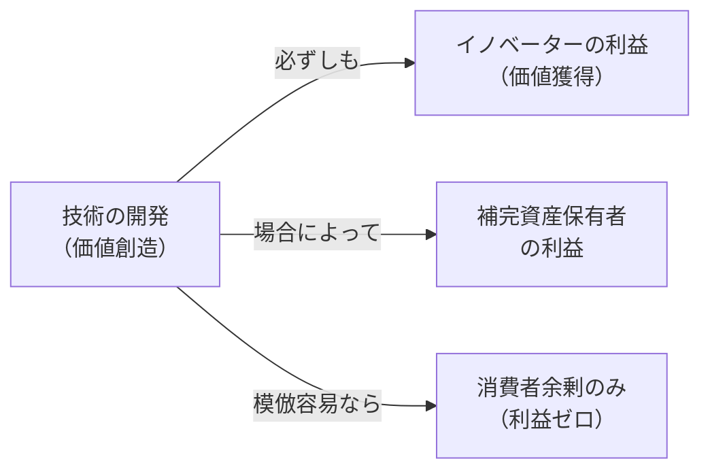

<Eyebrow>第１部</Eyebrow>

# 価値創造と利益獲得のギャップ

---

### はじめに：価値創造 ≠ 利益獲得

**技術的に優れた製品を開発しても、持続的な利益につながらない企業が多数存在する**

**利益がイノベーターに帰するかどうかを決める２つの条件：**

1. **IP保護の強度** — 特許・秘匿化・リードタイムによる模倣コストの高さ
2. **補完資産の所有** — 製造・流通・ブランド・サービスを誰が持っているか

> 第２回の問いかけ：自社のイノベーションは、誰の利益になっているか？

---

### 価値創造 ≠ 利益獲得

---

### 技術集約的産業の特性：模倣までのタイムラグ短縮

**新しい知識から模倣・追随までの時間は急速に短縮されている**

| 技術 | 知識基盤の確立 | 特許出願 | 製品化 | 模倣製品登場 | リードタイム |
|------|------------|---------|-------|-----------|-----------|
| ジェットエンジン | 17世紀（ニュートン力学） | 1930年 | 1957年 | 1959年 | **2年** |
| コピー機 | 19-20世紀 | 1940年 | 1958年 | 1974年 | **16年** |
| ファジーロジックコントローラ | 1960年代 | 1981年 | 1987年 | 1988年 | **1年** |
| カーナビ（GPS） | 1950年代後半 | 1960年代前半 | 1998年 | 2002年 | **4年** |
| MP3プレイヤー | 1990年代前半 | 1994年 | 1997年 | 1999年 | **2年** |
| SMSショートメッセージ | 1980年代後半 | 2002年 | 2008年 | 2009年 | **1年** |

**含意：**
<v-clicks>

- 先行者の「模倣されるまでの猶予」が急速に縮小している
- **IP保護と補完資産の確保を、製品化と同時に設計する**必要がある
- リードタイムだけに頼る戦略は通用しなくなっている

</v-clicks>
