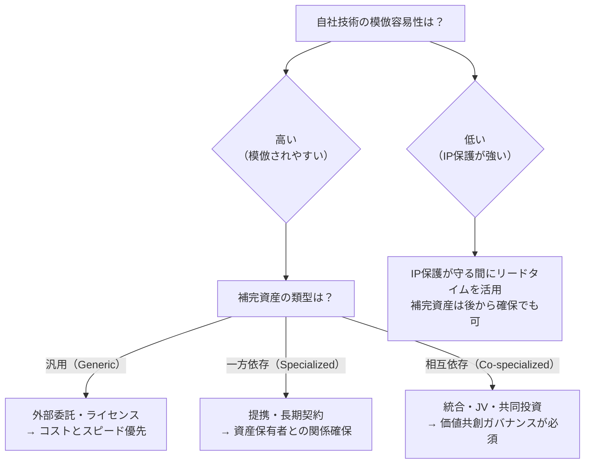

<Eyebrow>第３部</Eyebrow>

# 補完資産理論（Teece, 1986）

---
layout: two-cols
class: text-sm
---

### 補完的資源とは何か

**新しく開発された技術を事業として成功させるには、技術以外の多くの資源が必要**

**イノベーションのコア技術を支える7つの補完的資源：**

<v-clicks>

- **流通** — 製品・サービスの販売チャネル
- **サービス** — 導入後のサポート・保守体制
- **補完的技術** — 連携する周辺技術
- **サプライヤー/顧客との関係** — 長期的な取引関係
- **マーケティング** — 市場への訴求・ブランド構築
- **財務** — 資金調達・リスク管理能力
- **競争優位的生産** — 規模・コスト・品質の製造能力

</v-clicks>

::right::
**利益配分の決定原理：**

> イノベーターと補完資産の供給者が**異なる場合**、利益は両者の**相対的な交渉力**に依存する

この交渉力を決めるのが補完資産の**専門化の度合い（汎用・一方依存・相互依存）**

---
layout: two-cols
class: text-sm
---

### 補完資産の戦略的確保：統合か提携か

::right::
**補完資産の類型と模倣容易性の組み合わせ**が最適なガバナンスを決める

**日本企業の失敗パターン：** 技術は強いが補完資産の確保を後回しにし、IP保護が切れた後に模倣者に利益を奪われる
