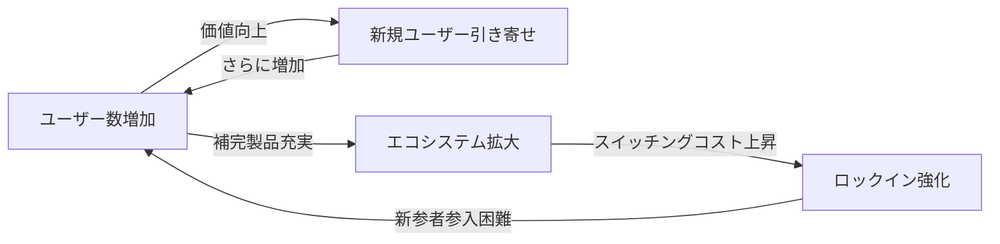
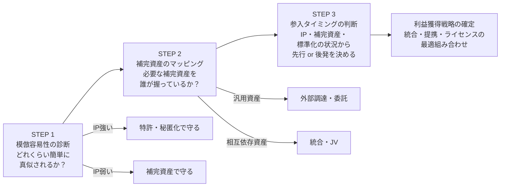

<Eyebrow>第５部</Eyebrow>

# ネットワーク・標準化戦略

---

### 標準化とネットワーク外部性：勝者総取りの論理

**ネットワーク外部性が強い市場では、規格競争に勝つことが最大の競争優位**

**勝者総取り（Winner-takes-all）の条件：**
<v-clicks>

- 需要側のスケールメリットが大きい（ネットワーク外部性）
- 補完製品・サービスが特定プラットフォームに集積
- スイッチングコストが高い

</v-clicks>

**教訓：** 規格戦争では「技術の優劣」より「いかに早く臨界質量（Critical Mass）を超えるか」が勝敗を決める

---

### 標準化とネットワーク外部性：勝者総取りの論理

---

### 標準化戦略の3つのアプローチ

| アプローチ | 説明 | メリット | リスク | 事例 |
|----------|------|---------|-------|------|
| **デファクト標準** | 市場競争で自然発生的に勝者の規格が標準に | 市場が選ぶため普及が速い | 規格戦争で敗北すると市場から退出 | VHS vs Beta, iOS vs Android |
| **デジュール標準** | ISO・IEC・IEEE等の公的機関が定める規格 | 業界全体での採用が保証される | 策定に時間がかかる。委員会政治が必要 | USB, Wi-Fi, NFC (FeliCa/ISO 18092) |
| **コンソーシアム標準** | 複数の主要企業が協力して策定 | スピードと業界採用のバランス | 参加企業間の利益調整が複雑 | Bluetooth, DVD Forum |

**戦略的含意：**
<v-clicks>

- デファクト狙い → 先行者優位とネットワーク外部性の活用が鍵
- デジュール狙い → 標準化委員会への早期参加と特許プール形成
- 自社技術を「公共財」化する覚悟で市場拡大を優先し、補完資産で収益化（QR・Android戦略）

</v-clicks>

---

### 第２回 まとめ：価値獲得戦略の設計フレームワーク

---

### 第２回 まとめ：価値獲得戦略の設計フレームワーク

**3ステップで「誰が利益を取るか」を設計する**

**価値獲得の方程式：**
> 技術力　×　IP保護　×　補完資産の確保　×　参入タイミング　＝　利益配分

---

### 本日の主なメッセージ（第２回）

**１. イノベーターが常に利益を得るわけではない**
　技術の模倣容易性とIP保護の強度が、利益の帰属を決める第一条件。「発明したから稼げる」は成立しない

**２. 補完資産を「誰が持つか」が利潤配分の核心**
　汎用なら外部調達、相互依存なら統合・共同投資。補完資産の類型ごとに最適なガバナンスが変わる

**３. 先行者優位は条件付き。後発者も勝てる**
　IP保護・ネットワーク外部性・補完インフラの整備状況が、先行 or 後発どちらが有利かを決める。事前の診断が重要

> **日本企業へのメッセージ：**
> 「技術で勝ってビジネスで負ける」パターンを断ち切るには、技術開発と価値獲得設計を**同時に**行う経営が必要
