# イノベーションマネジメント

## 第１回

 

准教授：　グエン　フー　フック
山口大学大学院技術経営研究科

---

## 授業の予定

|  | 担当者 | 連絡先 |
|---|--------|-------|
| 第一回 & 第二回 | グエン | phuc@yamaguchi-u.ac.jp |
| 第三回 | 髙橋先生 | masakazu@yamaguchi-u.ac.jp |
| 第四回 | 石野先生 | ishino.y@yamaguchi-u.ac.jp |
| 第五回（広島教室） | 石野先生 | |
| 第五回（福岡教室） | 髙橋先生 | |

---

## 本日の全体像

| ブロック | テーマ | 中心的問い |
|--------|-------|----------|
| **第１部** | イノベーションとは何か | 「発明」と何が違うか？ |
| **第２部** | イノベーションの種類と特質 | どう分類し、戦略に活かすか？ |
| **第３部** | イノベーションを起こす力 | 誰が・なぜ・どう起こすか？ |
| **第４部** | 普及・市場ダイナミクス | 技術はどう市場に受け入れられるか？ |
| **第５部** | 価値獲得の戦略 | 生み出した価値をどう自社の利益にするか？ |

> 技術を生み出す（価値創造）だけでは不十分。それを利益に変える仕組み（価値獲得）が経営の本質課題

---

## 「イノベーション」　対　「発明」

  

発熱電球 💡 は、　　　**イノベーション**？　　それとも　**発明**？

---

### 「イノベーション」　対　「発明」

**イノベーション　＝　新規性（例：発明）　＋　経済的価値（例：商業化・普及）**

<v-clicks>

- 電球 💡 は素晴らしい発明です。しかし、それが大量に生産され、顧客に提供した後に初めて、**イノベーション**と言える。

- イノベーションとは、大小を問わず、何か**新しい**ものを取り入れて、それを**経済的な価値**に変えること。

- イノベーションは製品や技術だけに**とどまらない**。マーケティングイノベーション、組織イノベーションなどもある。

</v-clicks>

---
layout: two-cols
class: text-sm
---

### 経済的価値の中身：社会的余剰とは

> 経済的な価値の中身は、**社会的余剰**

<v-clicks>

- **消費者余剰：** 消費者の支払意志額と実際の価格の差
  → 「もっと高くても買ったのに」という得
- **生産者余剰：** 実際の価格と生産コストの差
  → 企業の利益の源泉
- イノベーションとは、この**両方を増やす**新しいモノゴト

</v-clicks>

| 余剰の種類 | 定義 | 誰が得をするか |
|-----------|------|-------------|
| **消費者余剰** | 支払意志額 − 価格 | 顧客・社会 |
| **生産者余剰** | 価格 − 生産コスト | 企業・イノベーター |

::right::

---
layout: two-cols
class: text-sm
---

### イノベーション = 新しさ × 経済的価値

**イノベーションの２つのルート（清水, 2022）：**

<v-clicks>

- **製品イノベーション**：需要曲線を上方シフト（D → D'）→ 消費者余剰↑
- **プロセスイノベーション**：供給曲線を下方シフト（S → S'）→ 生産者余剰↑

</v-clicks>

::right::

---

**よくある誤解：**

| 誤解 | 正しい理解 |
|------|-----------|
| 特許取得 ＝ イノベーション | 経済的価値を生まなければ「タネ」にすぎない |
| 科学的発見 ＝ イノベーション | 価値に転換されるまではイノベーションではない |
| 新製品発売 ＝ イノベーション | 社会的受容と普及が問われる |

---

### 競争とイノベーション：赤の女王のレース

*「同じ場所にとどまるためだけに全力で走り続けなければならない」— ルイス・キャロル*

**競争状況とイノベーション・インセンティブの３経路：**

<v-clicks>

- **経路①**　競争が激化 → イノベーション圧力が高まる
  *ただし：同質競争が激しすぎると生産者余剰がゼロに近づき、インセンティブが消滅*

- **経路②**　自社イノベーションで独占的利潤が期待できる → 積極投資
  *参入障壁を高く設定できる見込みがあれば、競争下でも挑戦する価値がある*

- **経路③**　独占を獲得した後 → イノベーション・インセンティブが低下

</v-clicks>
「現状維持が最適」になる。変化は競合からの脅威があって初めて起きる

---

### 赤の女王のレース：何を意味するか

**比喩の意味：** ルイス・キャロル『鏡の国のアリス』に由来。競合他社が絶えずイノベーションを続ける市場では、自社も同じペースで革新しないと**相対的に後退**してしまう。現状維持のために全力を尽くさなければならない状態

| 状況 | 動き | 経営への含意 |
|------|------|------------|
| **経路①** 競争が激しい | イノベーション圧力は上がる | 激しすぎると利益ゼロ → インセンティブが消える |
| **経路②** 独占利潤が見込める | 競争下でも積極投資する動機が生まれる | 挑戦が報われる市場構造を設計することが重要 |
| **経路③** 独占を獲得した後 | 変化の必要がなくなる | イノベーションへの意欲が低下する罠 |

---

**自組織への診断問い：**

> なぜウチの会社はイノベーションを生み出していないのか？

<v-clicks>

- 「頑張っているのに儲からない」→ 経路①の過剰競争状態
- 「別に今は問題ない」→ 経路③の独占的安定状態
- 「挑戦しても模倣される」→ 生産者余剰の見込みがない

</v-clicks>

---

## イノベーションマネジメント

現在、技術的に優れた製品を開発しても、持続的な経済価値に結びつかない企業が多数存在する中、イノベーションマネジメントは以下の目標を追求するものとなります。

 

1. イノベーションの**価値創造**

2. イノベーションの**価値獲得**

---

### 価値創造と価値獲得：イノベーション戦略の２大目標

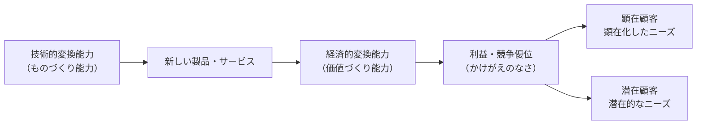

**図の読み方（左から右へ）：**

<v-clicks>

- **技術的変換能力** — 技術・R&Dで新製品を生み出す力（ものづくり）
- **経済的変換能力** — それを利益に変える戦略・仕組み（価値づくり）
- 矢印が示すのは「**作る能力**」と「**稼ぐ能力**」は**別物**だということ

</v-clicks>

---

**顕在顧客 vs. 潜在顧客：**

| | 定義 | 例 |
|--|------|-----|
| **顕在化したニーズ** | 顧客がすでに「欲しい」と自覚している需要 | 「バッテリーをもっと長持ちさせたい」 |
| **潜在的なニーズ** | 顧客自身もまだ気づいていない、言語化されていない需要 | iPhoneが登場する前、誰もタッチスクリーン式スマートフォンを求めていなかった |

> 「もし顧客に何が欲しいか聞いていたら、『もっと速い馬』と答えただろう」— Henry Ford

顕在ニーズに応えると**改良**になり、潜在ニーズを掘り起こすと**破壊的イノベーション**になる

---

### 価値創造と価値獲得：なぜ両方が必要か

**ホテルのマットレス事例：**

<v-clicks>

- 高品質マットレスを導入 → 顧客満足度↑（**消費者余剰↑**）
- 翌年、競合が全員真似をする → 差別化消滅
- コストだけ増えて利益は出ない（**生産者余剰ゼロ**）
- 「価値を**創った**」のに「価値を**獲得**できなかった」状態

</v-clicks>

| 思考パターン | 結果 |
|------------|------|
| 「他がやっているから、うちも」 | 赤の女王のレース。消耗するだけ |
| 「他がやっているなら、うちは……」 | 差別化・模倣されない仕組みを設計する |

> 価値創造（技術）と価値獲得（戦略）の**両方を同時に設計する**ことがイノベーションマネジメントの本質

---

## 第１部
### イノベーションとは何か

---

### シュンペーターの定義

1. 新しい製品やサービス

2. 新しい生産方法（例：トヨタ自動車の「カンバン方式」と「JIT」）

3. 新しい販路の開拓・拡大（例：店舗から自動販売機やインタネットに）

4. 原料の新しい供給源の獲得（例：包装紙からプラスチックに）

5. 新しい組織の実現（例：フランチャイズシステム、シェアリングエコノミー）

6. **（新結合）** 従来にはない上記の組み合わせが価値を創造し、その組み合わせ自体がイノベーション。

→ イノベーションは、生産技術の変化に限定されるものではなく、新市場や新製品の開発、新たな資源の獲得、組織の改革、あるいは新制度の導入なども含んでいます。

---

### イノベーションの対象による分類

| 種類 | 定義 | 例 |
|------|------|-----|
| **プロダクト・イノベーション** | 新しい製品・サービスの開発、または既存製品の大幅改良 | iPhone、電気自動車 |
| **プロセス・イノベーション** | 生産・業務プロセスの改良によるコスト削減・品質向上 | レジへのバーコードスキャナー導入、トヨタ生産方式 |
| **ビジネスモデルイノベーション** | 収益を生み出す仕組み自体の変革（戦略・価格設定・価値提供方法） | Adobe CC（一括販売→サブスク）、Airbnb（所有なし宿泊） |

**重要な含意：** イノベーションは技術だけにとどまらない。収益モデル・チャネル・プロセスの変革も競争優位の源泉になる

---

### イノベーションの種類に関する様々な分類

**なぜ複数の分類が必要か？** — 直面する戦略課題によって「どの軸で考えるか」が変わる

| 分類軸 | 中心的戦略問い |
|-------|-------------|
| **インクリメンタル vs. ラディカル** | 改良で勝てるか、それとも再定義が必要か？ |
| **能力増加型 vs. 能力破壊型** | 自社の蓄積が強みになるか、足枷になるか？ |
| **モジューラ vs. アーキテクチャル** | 部品を変えるか、繋ぎ方を変えるか？ |
| **持続的 vs. 破壊的** | 既存市場を深掘りするか、新市場を生み出すか？ |

*これらを順番に見ていきます*

---

### シュンペーターの２つの仮説：誰がイノベーションを起こすか

|  | **Mark I（1934）** | **Mark II（1942）** |
|---|---|---|
| **主体** | アントレプレナー・新規参入企業 | 大企業の内部R&D部門 |
| **動因** | 創造的破壊の連鎖 | R&Dへの規模経済・累積知識 |
| **産業段階** | 流動期・新興産業 | 固定期・成熟産業 |
| **例** | シリコンバレー型スタートアップ | 製薬・素材・半導体大手 |

**どちらが正しいか？**

---

**どちらが正しいか？。両方。イノベーションのタイプと産業段階によって使い分ける**

<v-clicks>

- Mark I的な産業（ソフトウェア・バイオ）：新規参入者が優位
- Mark II的な産業（化学・素材）：R&D蓄積のある大企業が優位
- **A-Uモデルが示すように**、同じ産業でも時間とともに Mark I → Mark II へ移行する

</v-clicks>

---

## 第２部
### イノベーションの種類と特質

---

## インクリメンタル **VS.** ラディカルイノベーション
### イノベーションの影響の度合いによる分類

**インクリメンタル・イノベーション（漸進的イノベーション）：**

<v-clicks>

- 既存の製品・サービスに細かな改良を積み重ねていく。マイナーチェンジ。（例：iPhone XからiPhone 13に）
- 目的は顧客サービスの最適化、コスト削減、新しい市場への対応、または新しい法律や規格などへの適応。
- 目立たないが、競合他社との競争により市場シェアや収益性が失われていくのを防ぐために、非常に有用・不可欠なイノベーション。

</v-clicks>

**ラディカル・イノベーション（急進的イノベーション）：**
<v-clicks>

- 新しい製品・サービスを新しい方法で提供する。（例：第3世代移動通信システム3Gの誕生とその影響）
- 従来と全く異なる価値観を市場にもたらして、業界における競争のルールが根本から覆される。
- 影響が大きい。結果として新しい市場を生み出すことになることがある。

</v-clicks>

---
layout: two-cols
class: text-sm
---

### 生産性のジレンマ：ラディカルとインクリメンタルはトレードオフ

**Abernathy（1978）の発見：**
ラディカルとインクリメンタル・イノベーションは**構造的トレードオフ**の関係にある

<v-clicks>

- 既存製品の効率的生産に最適化した組織は、新しい設計を追求できなくなる
- **自動車産業の証拠**：T型フォードのライン最適化がラディカル転換を阻害
- どちらが「優れている」かではなく、**自組織の状況に合わせて選択する**

</v-clicks>

> 「いかに巧みに帆船を改良しても、蒸気船は得られない」

::right::
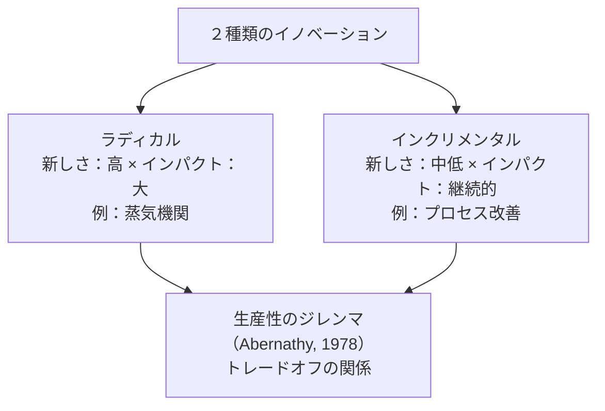

---
layout: two-cols
class: text-sm
---

### 電気自動車（EV）はラディカルイノベーション

**EVがラディカルである4つの理由：**

<v-clicks>

- **技術基盤の変化** — 内燃機関・燃料供給・排気系を根本から不要化
- **エネルギー供給の変革** — 石油インフラから電力インフラへの転換を要求
- **CO₂排出の削減** — 排気ゼロで社会・規制環境を変える
- **新市場の創出** — 充電インフラ・バッテリー・電力管理システムが新産業に

</v-clicks>

::right::
> EVの普及は単なる製品改善ではなく、技術・市場・社会構造の**根本的な再設計**

**インパクトの波及：**

<v-clicks>

- 自動車部品メーカー（エンジン系）→ 能力破壊型
- エネルギー産業（石油 → 電力）→ 市場破壊型
- 金融・保険・サービス → ビジネスモデル変革

</v-clicks>

---
layout: two-cols
class: text-sm
---

### 能力増加型イノベーション・能力破壊型イノベーション

**能力増加型イノベーション**
過去に蓄積した能力・知識が活用できる

::right::
**能力破壊型イノベーション**
過去の能力・知識が全く役に立たなくなってしまう

---

### 変革力の4類型（Abernathy & Clark）

*横軸：技術知識（温存←→破壊）　縦軸：市場知識（温存←→破壊）*

|  | **技術知識：温存** | **技術知識：破壊** |
|---|---|---|
| **市場知識：温存** | **漸進改善型** 既存企業が最強（知識を最大活用） | **革新型** 既存技術知識が陳腐化 → 新参者有利 |
| **市場知識：破壊** | **ニッチ創造型** 既存企業の技術を新市場へ → 選択次第 | **アーキテクチュラル型** 技術・市場ともに破壊 → 新参者に最も有利 |

---

### 変革力の4類型：各類型の意味

<v-clicks>

- **① 漸進改善型**（技術：温存 × 市場：温存）

</v-clicks>
技術も顧客も変わらない。今の強みをそのまま活かせる。例：T型フォードの生産ラインのコスト削減
<v-clicks>

- → **既存企業が最も有利**。新参者が入り込む余地がない

- **② 革新型**（技術：破壊 × 市場：温存）

</v-clicks>
技術は大きく変わるが、顧客・市場は同じ。例：木製ボディから密閉型鋼板ボディへの転換
<v-clicks>

- → 技術的知識は陳腐化するが**顧客関係は生き残る**。既存企業が素早く対応できれば踏みとどまれる

- **③ ニッチ創造型**（技術：温存 × 市場：破壊）

</v-clicks>
技術はそのままで、今まで関わっていなかった新市場へ持ち込む。例：フォード モデルA（スポーツ市場）
<v-clicks>

- → 既存企業が自社技術を新しい文脈に**転用**できるかどうかが勝敗を分ける

- **④ アーキテクチュラル型**（技術：破壊 × 市場：破壊）

</v-clicks>
技術も市場も根本から変わる。既存企業の知識資産がすべて陳腐化する。例：T型フォードが大衆市場を創造
<v-clicks>

- → **新参者が最も有利**。既存企業は過去の成功が重荷になる

</v-clicks>

---

### なぜT型フォードは「大衆市場を創造した」のか

T型フォード（1908年）登場以前、自動車は富裕層向けの手工芸品だった。フォードは「より良い車」を作っただけでなく、**2つの次元を同時に根本から変えた**。

---

### 技術の破壊
<v-clicks>

- **流れ作業（移動式組み立てライン**を導入し、熟練職人による手作業を標準化・反復可能な工程に置き換えた
- 部品の徹底的な規格化により、すべての部品が互換性を持つようになった
- 革新の核心は「単一部品の改良」ではなく、**生産システム全体の再設計**にある

</v-clicks>

### 市場の破壊
<v-clicks>

- 価格が約850ドル（1908年）から約260ドル（1925年）まで下落し、工場労働者にも手が届くようになった
- フォードが労働者に日給5ドルを払ったのは、**自分たちが作った車を自分たちが買えるようにする**ためでもあった
- ターゲット顧客が富裕層から働く中産階級へと移行した
- 「個人による大衆的な移動手段」という、それまで存在しなかった新しい市場カテゴリーが生まれた

</v-clicks>

---

### なぜ既存企業の知識資産が陳腐化したのか

ここが「アーキテクチュラル型」と呼ばれる所以だ。既存の自動車メーカーが持っていた強みは：

<v-clicks>

- 熟練した馬車・車体製造の職人技
- 富裕層顧客との関係性やオーダーメイドのサービス
- 少量・高利益率のビジネスモデル

</v-clicks>

これらが**すべて一気に無価値になった**。新たな競争優位の源泉は、工業的なプロセス設計・サプライチェーンの規模・コスト管理能力であり、まったく異なる種類の知識だ。

---

フォードは、既存の自動車市場に参入して勝ったのではない。**旧来の競争ルールそのものを無意味にするような生産の仕組みを作り上げることで、新しい市場を定義した**のだ。

---

### 変革力の4類型：戦略的含意

**競合のイノベーションがどの類型かを診断する：**

| 競合のイノベーションが... | 自社への脅威度 | 戦略的示唆 |
|------|------------|---------|
| **漸進改善型** | 低 | 自社の強みで対抗できる。慌てなくてよい |
| **革新型** | 中 | 技術投資が必要。顧客は失わずに済む可能性がある |
| **ニッチ創造型** | 中 | 自社も同じ技術で別市場を狙えないか検討する |
| **アーキテクチュラル型** | 最高 | 最も危険。既存の強みが逆に変化を妨げる罠になる |

> **核心的な洞察：** 怖いのは「技術も市場も両方変わる」④のケース。インクリメンタルな改善を積み重ねてきた組織ほど、アーキテクチュラルな変化に無防備になりやすい

---

### アーキテクチャル・イノベーション

<v-clicks>

- **モジュール**（車輪・ペダル・ハンドル）は変わっていない
- **アーキテクチャ**（部品の繋ぎ方・全体構成）が根本から変わった
- → これが**アーキテクチャル・イノベーション**

</v-clicks>

---

### モジューラ・イノベーション　vs.　アーキテクチャル・イノベーション

**モジューラ（部品レベル）：** システムの構成を変えずに部品を変えること

**アーキテクチャ（システム全体）：** 製品を構成する部品間の繋ぎ方・全体構成を変えること

<v-clicks>

- アーキテクチャル・イノベーションは起こりにくいが、起こった時にはより大きなインパクトを与える
- **既存企業が最も気づきにくい**：部品レベルでは変化がなくても、「繋ぎ方」の変化が競争優位を無効化する

</v-clicks>

---

### アーキテクチャル・イノベーションの事例

| 種別 | 事例 | 変わったこと（アーキテクチャ） |
|------|------|--------------------------|
| **プロダクト** | LEGO Mindstorms | おもちゃ → 教育ツール。ブロックはそのまま、用途の構成が変わった |
| **プロダクト** | スマートフォン | 通話端末 → 統合情報端末。同じ部品群の「繋ぎ方」が根本から変わった |
| **サービス** | Amazon Web Services (AWS) | 単一サーバー → 分散クラウドインフラ。スケールオンデマンドを実現 |
| **サービス** | Spotify | アルバム販売/DL → 定額ストリーミング。音楽の消費構造を再設計 |

**共通パターン：** 個々の部品・要素は既存のまま、それらの**組み合わせ方・提供構造**を変えることで全く新しい価値を生み出した

---

### 技術基準と顧客の要求水準

<v-clicks>

- **技術基準**（最上線）：市場のあらゆるセグメントより急速に進歩する
- ハイエンド市場の水準 / ミドルレンジ市場の水準 / ローエンド市場の水準（下3線）
- 技術はいずれ顧客の要求を大きく超過する → **破壊的イノベーションの機会を生む**

</v-clicks>

---

### 新しいローエンド技術の向上による破壊的イノベーション

<v-clicks>

- **ハイエンド技術**（上線）が従来の主流技術
- **ローエンド技術**（2番目の線）が時間とともに向上し、各市場の水準を次々と超える
- 最終的にハイエンド市場に侵入し、従来技術を**破壊**する

</v-clicks>

---

### 持続的イノベーション・破壊的イノベーション

**持続的イノベーション：**
<v-clicks>

- **従来の技術進歩の軌道上**を速やかに進むイノベーション。
- **既存市場で求められている価値**を製品ライフサイクルの中で、更なる付加価値をつけることで、他社製品・サービスと差別化を可能とする。
- これまでになかった製品・サービスを高いレベルで顧客の要求に応える日本のメーカーが得意としてきたイノベーション。

</v-clicks>

**破壊的イノベーション：**
<v-clicks>

- 従来の技術進歩の軌道に沿ったイノベーションにとどまらず、**新たな軌道へ転換**することで、従来の市場秩序を破壊するイノベーションとなります。
- 新しい技術が最初に**既存技術に劣る**場合がありますが、**使い勝手が高く、しかも価格が安くなる**ことで、**既存顧客を奪う**ことができます。その後、**新しい技術の進歩**により品質が改善され、従来技術の**主要な顧客を奪い取る**ようになります。
- 破壊的イノベーションは、既存企業が**今まで関わりの少なかった顧客層をターゲットにする**。このタイプのイノベーションは、見過ごされやすいため、既存企業にとって予期せぬものとなる。

</v-clicks>

---

### 破壊的イノベーション　→　イノベーションジレンマ

<v-clicks>

- 他社の破壊的イノベーションが進展し、既存企業が顧客を奪われ、競合他社との価格競争に陥ると、業績の悪化を招きかねない。
- 一方で、画期的な新技術を開発・採用することで他社に対抗でき、将来の成功につながる可能性があるが、新技術を展開することで現在成功している製品、プロセス、またはサービスを破壊することになる。

</v-clicks>

→ **イノベーションジレンマ**に陥る。

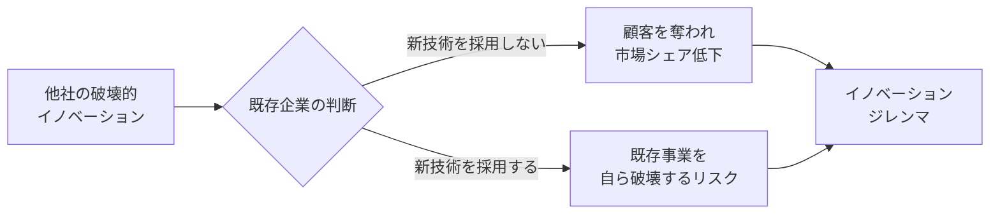

---

### イノベーションジレンマの例

| 企業 | 既存強み | 破壊的脅威 | なぜ対応できなかったか |
|------|---------|----------|-------------------|
| **Kodak** | フィルムカメラ市場の独占 | デジタルカメラ | デジタル技術を自社開発済み。フィルム事業への影響を懸念し本格参入を先送り |
| **IBM** | メインフレームの市場支配 | パーソナルコンピュータ | PC事業参入も、メインフレームへの資源配分が優先されPCへの投資が不十分 |
| **Nokia** | 携帯電話の世界シェア1位 | スマートフォン（iOS/Android） | スマートフォン開発に着手も、既存携帯事業保護が優先され参入が遅延 |

**3社に共通するパターン：**
1. 破壊的技術を**認識**していた
2. しかし既存事業への影響を**合理的に**懸念した
3. 結果として「正しい判断の積み重ね」が敗北を招いた

> 克服のカギ：既存事業と新事業を**別軸**で評価し、長期的視点で資源配分を行う

---

## 中核能力の罠

> **「中核能力」は「中核硬直性」に転じる**
> レオナード＝バートン（1992）

<v-clicks>

- コダック・ノキア・IBMの敗北は「無能」ではなく、**成功の論理の帰結**
- 組織文化・評価基準が新しいアイデアを「**合理的に**」否定する逆説
- 「既存のルールや行動規範は、新たな機会を過小評価するための合理的な根拠として利用されるかもしれない」

</v-clicks>

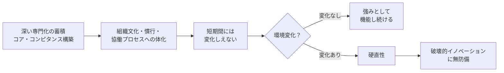

---

### なぜ既存企業は対応できないのか

**組織的慣性の3つの源泉：**

| 源泉 | メカニズム |
|------|-----------|
| **経済的** | 新技術が既存事業を侵食 → 既存企業の期待収益がスタートアップより**構造的に低くなる** |
| **政治的** | 既存事業部門の幹部が地位・予算を失う → 組織内抵抗が生じる |
| **文化的** | 既存ルーティン・規範・評価基準が組織に埋め込まれ、見えない制約になる |

**逆説：** 既存企業の「合理的な判断」の積み重ねが敗北を招く（クリステンセン）

---

### 組織的慣性の経済的源泉：なぜ既存企業は投資できないのか

**スタートアップと既存企業の期待収益の非対称性：**

| | スタートアップ | 既存企業 |
|--|-------------|---------|
| 新技術で**得るもの** | 新市場の売上 | 新市場の売上 |
| 新技術で**失うもの** | なし | **既存事業の売上（自己侵食）** |
| 純粋な期待収益 | 高い | **低い（場合によってはマイナス）** |

**具体例：デジタルカメラとKodak**
<v-clicks>

- Kodakがデジタルカメラを本格展開すれば、自分でフィルム事業（年数千億円）を殺すことになる
- スタートアップにはその制約がない → 同じ技術でもKodakより高い期待収益で投資できる
- だからKodakは「**合理的に**」投資できなかった

</v-clicks>

<v-clicks>

**「構造的」の意味：**
これは経営者の判断ミスや怠慢ではなく、ビジネス構造から**必然的に生まれる**利益計算の歪み

> 成功している企業ほど、自分を破壊するイノベーションに投資できない。これがイノベーションジレンマの経済的根拠

</v-clicks>

---

### 破壊的イノベーションの発生の背景

<v-clicks>

1. **企業が主要顧客に過度に依存している。**
   既存顧客や短期的な利益を求める株主の意向が優先される。

2. **小規模な市場では、企業の成長ニーズを満たすことができない。**
   イノベーションの初期では、市場規模が小さく、企業にとっては参入の価値がないように見える。

3. **存在しない市場は分析できない。**
   初期段階では、不確実性も高く、現存する市場と比較すると、参入の価値がないように見える。

4. **組織の既存能力は新しい事業に対抗勢力になってしまう。**
   既存事業を営むための能力が高まることで、異なる事業が行えなくなる。

5. **既存技術の供給の増加分が、既存市場の需要の増加分と一致するとは限らない。**
   既存技術を改善しても新たな需要がうまれる限らない。

</v-clicks>

---

### 破壊的イノベーションへの対応

<v-clicks>

1. 破壊的技術を開発するプロジェクトは、**小規模で前向きな組織**に任せます。小さな機会や成功にも積極的に取り組んでもらうためです。

2. 破壊的技術の市場を探る過程では、**早い段階で失敗を最小限に抑える**ための計画を立てる必要があります。市場は試行錯誤の中で形成されていくものであるため、失敗から学ぶことが重要です。

3. 破壊的技術に取り組む際には、**既存組織の一部のリソースを活用**しながらも、**既存のプロセスや価値基準には囚われず**、新しい技術に適したコスト構造や価値基準を持つ方法を創出する必要があります。

4. 破壊的技術を商品化する際には、既存市場の持続のために破壊的製品を売り出すのではなく、**破壊的製品の特徴が評価される新しい市場を開拓する**ことが重要です。

</v-clicks>

---

## 第３部
### イノベーションを起こす力

---

### アニマルスピリッツ：起業家を動かす非合理な力

**なぜ人は「合理的に不可能」な挑戦をするのか？（ケインズ、アカロフ＆シラー）**

<v-clicks>

- **楽観主義**：成功確率を過大評価し、あえてリスクを取る
  **平均リターンは低いのに起業する理由。楽観バイアスが行動を生む**
- **物語（ナラティブ）**：説得力あるストーリーが投資家と顧客を引きつける
  **Appleの「Think Different」物語が組織を動かす**
- **信頼**：法制度と市場の将来への信頼感
  **制度が信頼できない国では起業が生まれない（シリコンバレーの前提条件）**
- **市場の非合理性**：非効率があるところに機会が生まれる

</v-clicks>

<v-clicks>

  *「なぜあれを誰もやっていないのか？」がビジネス機会の核心*

> 「最も重要な投資決定をする際、私たちは根拠があまりにも不確かで、いかなる科学的な計算も可能でない状況に直面する。そのような状況では、私たちは本能的な欲求、勇気、または楽観主義によって動かされる」— ケインズ

</v-clicks>

---

### 「真の」不確実性とイノベーション

**フランク・ナイト（1921）：リスクと不確実性の根本的な違い**

| | **リスク（Risk）** | **真の不確実性（Uncertainty）** |
|---|---|---|
| **定義** | 確率が計算できる未知 | 確率すら定量化できない未知 |
| **例** | 保険数理・金融リスク管理 | 新製品の市場受容・技術ブレイクスルー |
| **対処法** | 保険・分散投資・ヘッジ | アントレプレナーシップ・実験・楽観主義 |
| **担い手** | リスク管理者 | アントレプレナー |

**なぜイノベーションには「真の不確実性」が伴うのか：**
<v-clicks>

- 新規市場には過去データがない。「存在しない市場は分析できない」
- 技術の成否は事前に分からない。成功したあとで初めて「あれがそうだった」とわかる
- ロジックだけでは前進できない → **アニマルスピリッツが必要**

</v-clicks>

---

### 両利きの経営
#### 業界変化に対応し、成熟事業と新規事業を同時に成功させる組織能力

| | **知の深化（Exploitation）** | **知の探索（Exploration）** |
|--|----------------------------|--------------------------|
| **焦点** | 既存事業の強化・効率化 | 新事業・新技術の開拓 |
| **成功確率** | 高（予測可能） | 低（不確実） |
| **罠** | 偏りすぎると**サクセストラップ**に陥る | 偏りすぎると資源を無駄消費 |

<v-clicks>

**サクセストラップ：**

- 既存事業で成功 → 深化に資源を集中 → 探索が止まる → 破壊的変化に無防備

> 両方を**同時に**推進する組織設計こそが、イノベーションマネジメントの核心課題

</v-clicks>

---

### 知の探索と知の深化とサクセストラップ

*出所：イノベーション白書*

---

### イノベーションの源泉　＝　知の新しい組み合わせ

<v-clicks>

- 新しいアイデアの大多数は **「既存の知」の新しい組み合わせ**から生まれる（シュンペーターの新結合）

- 既存の知だけでは、やがて組み合わせの限界に達する → **自分の知らない「離れた知」** が必要

- 離れた知は **「知の探索」** を通じて獲得される（異業種・異分野・異文化との接触）

- 自分が持つ知 × 離れた知 の**新しい組み合わせ** ＝ イノベーションの源泉

</v-clicks>

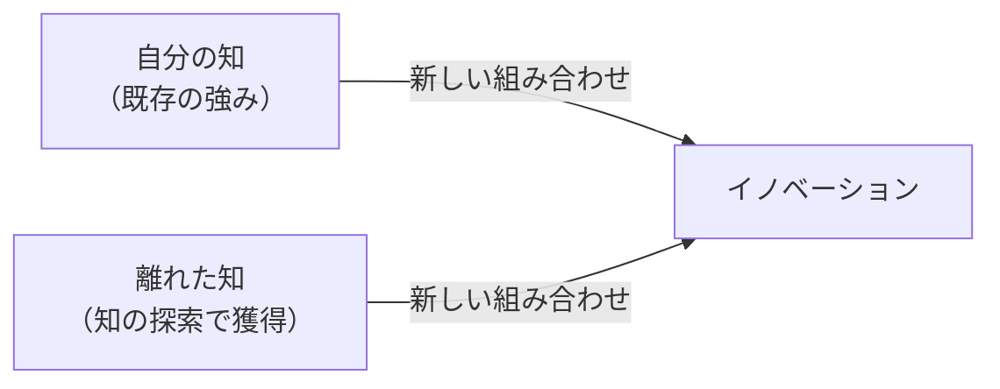

---
layout: two-cols
class: text-sm
---

### BCGマトリクスとイノベーション戦

::right::
<v-clicks>

- **問題児（スター候補）：** ラディカル・イノベーション → 破壊的変革を起こせ
- **花形：** 競争優位を磨く・差別化を強化
- **金のなる木：** インクリメンタル・効率改善型のみ・キャッシュを最大化
- **負け犬：** 早期撤退・資本を再配分

</v-clicks>

> 「全部門でイノベーション！」は**悪いマネジメント**
> ポジションによって必要なイノベーションの種類が根本的に異なる

*「花形」の評価基準（ROI・効率）を 「問題児」 に当てはめると、その芽を摘む*

---
layout: two-cols
class: text-sm
---

### アンゾフ・マトリクスとイノベーション戦略

::right::
| 戦略 | 必要なイノベーション |
|------|-----------------|
| **市場浸透** | 大きなイノベーション不要 |
| **新製品開発** | 中程度のイノベーション |
| **新市場開拓** | 新規顧客インサイトが必要 |
| **多角化** | 最大限のラディカル・イノベーション |

*必要なイノベーションの種類はポジションによって根本的に異なる*

**組織設計への含意：**
<v-clicks>

- 多角化部門 → ラディカル用：小チーム・失敗許容・既存事業から隔離
- 市場浸透部門 → インクリメンタル用：深い専門知識・効率性指標

</v-clicks>

---

### イノベーションの本質：エミュレーション × ディフュージョン

> **イノベーション ＝ エミュレーション（模倣・改良）× ディフュージョン（普及・スケール）**

**「0→1」は稀。成功企業の実像：**

| 企業 | 真の姿 |
|------|-------|
| **Google** | 検索エンジン最後発（ヤフーより2年遅く創業）。スケール能力で勝利 |
| **AMD** | インテルのコピー品からスタートし市場を拡大 |

*

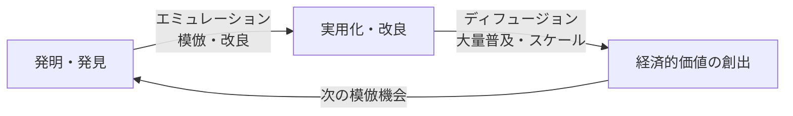

---
layout: two-cols
---

### 技術進歩のS字曲線

<v-clicks>

- 技術には「限界」（技術的天井）が存在する
- 成熟期に達する**前に**次のS字曲線への移行投資を開始することが重要
- リーダー企業のジレンマ：新技術登場時点では「破壊的曲線」と「早期失敗曲線」は区別できない

</v-clicks>

::right::

---

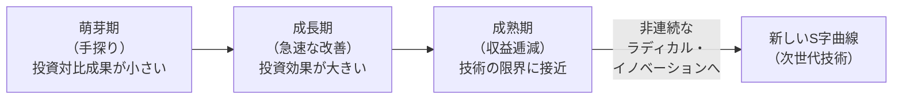

---
layout: two-cols
class: text-sm
---

### 長尾分布：成功は予測できない

<v-clicks>

- 新しさの高いアイデアは稀。分布の右テールに位置する
- **事前に何が成功するかは誰にも判断できない**
- 必要な戦略：試行錯誤の「量」を増やす
- 失敗から学ぶ：原因を組織全体で分析・共有する
- **「意図的な失敗」**。何が機能しないかを検証することも学習

</v-clicks>

> 「失敗を許容するだけでは不十分。失敗を**意図的かつ学習的**なものにする。」

::right::

---

### 誘発された技術進歩：要素価格がイノベーションの方向を決める

#### 高価な生産要素を節約する方向に研究開発が誘発される

**農業イノベーションの日米比較。同一産業・反対方向：**

| | 日本（土地稀少） | アメリカ（土地豊富） |
|---|---|---|
| **目標** | 単位面積当たり収穫量向上 | 農家1人当たり耕作面積拡大 |
| **革新** | 品種改良・肥料・農薬 | 機械化・大型農業機器 |
| **希少要素** | 土地（高コスト） | 労働力（高コスト） |

---

**現代への応用：今、何が高騰しているか？**

| 高騰する要素 | 生まれやすいイノベーション |
|------------|----------------------|
| 人件費（少子高齢化） | 労働節約型技術・AI・自動化 |
| エネルギー価格 | 省エネ・再生可能エネルギー |
| 注意力・時間の希少化 | 認知負荷を下げる技術 |

---

## 第４部
### 普及・市場ダイナミクス

---

### 製品ライフサイクル

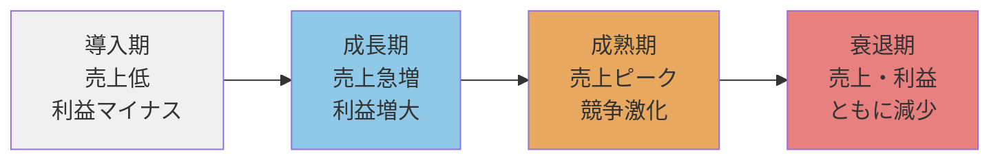

| フェーズ | 戦略上の焦点 |
|---------|-----------|
| 導入期 | 市場教育・認知形成 |
| 成長期 | シェア拡大・差別化 |
| 成熟期 | コスト競争・顧客維持 |
| 衰退期 | 撤退 or 再活性化 |

---
layout: two-cols
class: text-sm
---

### 普及率曲線

::right::
| セグメント | 累積比率 | 特徴 | 求めるもの |
|-----------|---------|------|-----------|
| イノベーター | 2.5% | 新しければ試す | 目新しさ・先行者の優越感 |
| アーリー・アダプター | 16% | 目利きのオピニオンリーダー | 品質の実証・口コミ波及 |
| アーリー・マジョリティ | 50% | リスク回避の追随者 | アーリー・アダプターの評価 |
| レイト・マジョリティ | 84% | 懐疑的・「みんながやるから」 | コストパフォーマンス |
| ラガード | 100% | 消極的・最後まで抵抗 | ネットワーク効果による強制 |

---

### キャズム

**キャズム（Chasm）** とは、初期少数採用者（アーリーアダプター）と前期多数採用者（アーリーマジョリティ）の間に存在する**深い隔たり**のこと。両者のニーズは根本的に異なるため、多くの新技術がここで普及を止める。

---
layout: two-cols
---

### キャズム（隔たり）を超える

**市場を開拓するため**

*革新的採用者と初期少数採用者のマーケットの獲得のため*

**イノベーションが中心**

<v-clicks>

- 最高の製品
- 魅了するアーキテクチャ
- ユニークな機能

</v-clicks>

::right::

**キャズムを超えるため**

*前期・後期多数採用者の獲得のため*

**マーケットが中心**

<v-clicks>

- 最大セグメントの顧客の選好を重視
- イノベーションが標準規格と認識される
- 質の高いカスタマーサービス

</v-clicks>

---

## 第５部
### 価値獲得の戦略

---
layout: two-cols
---

### 先行者優位と専有可能性（Appropriability）

**先行者優位の7要素：**

1. 独占的利潤（一時的）
2. 標準規格の設定
3. 特許・法的保護
4. 経験曲線（コスト低下）
5. 希少資源の先買い
6. スイッチング・コスト
7. ネットワーク外部性

::right::
**専有可能性の確保手段：**

| 手段 | 仕組み | 限界 |
|------|-------|------|
| **リードタイム** | 先行優位による市場地位確立 | 追随者の逆転リスク |
| **特許保護** | 法的排除権（一定期間） | 開示義務・設計回避 |
| **秘匿化** | ノウハウ・企業秘密 | リバースエンジニアリング |
| **補完的資産** | 流通・ブランド・製造規模 | 構築に時間がかかる |

**教訓：** 発明者よりも補完的資産を持つ者が価値を獲得するケースも多い

---
layout: two-cols
class: text-sm
---

### ボトルネックを制する者が価値を得る

> システムの生産性は最も弱いリンクで決まる。制約の理論

<v-clicks>

- 非ボトルネックへの改善は経済的価値を生まない（「過剰スペック」）
- 例：高画質カメラも通信速度がボトルネックなら画質向上の価値は低い

</v-clicks>

**インテルのPCIバス戦略（1990年代）：**
<v-clicks>

- CPU性能が向上しても旧バスがボトルネック → PC全体の速度が改善しない
- インテルが本来PCメーカーの領分であるバスを**自ら開発・無償公開**
- ボトルネック解消 → 「CPU性能向上＝顧客価値向上」の構図を確立

</v-clicks>

**薄型テレビのコモディティ化（2000年代）：**
<v-clicks>

- ボトルネックは「受像器」ではなく「送信側（放送規格）」にあった
- テレビ性能の向上が顧客価値に結びつかない → 価格競争へ

</v-clicks>

::right::

---

### 価値獲得フレームワーク：商業化前に問うべき3つの問い

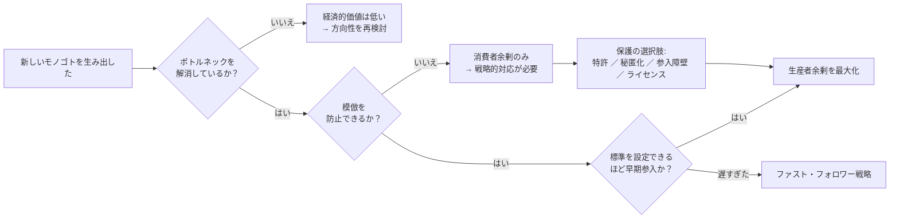

> 「新しさを生み出す者は多くの場合、消費者を喜ばせる。新しさを**守る**者が株主を喜ばせる。」

---

### イノベーション・プロセスの難関：「魔の川」「死の谷」「ダーウィンの海」

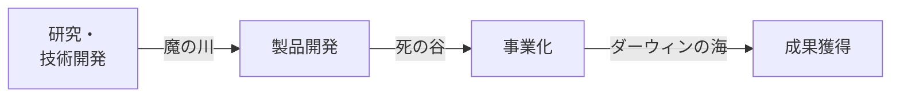

---

### 難関の内訳

<v-clicks>

- **「魔の川」**：研究・技術開発段階から製品開発段階までの間の難関・障壁
  - 資源を投入したが、必要な技術を生み出せなかった。
  - 優れた技術を手に入れたが、新製品開発に結び付けられなかった。

- **「死の谷」**：製品開発段階から事業化段階までの間の難関・障壁
  - 新製品を開発することができなかった
  - 新製品が開発できても、市場に受け入れられなかった

- **「ダーウィンの海」**：事業化段階から、成果獲得までの間の難関・障壁
  - 市場に受け入れられたが、その後に参入してくる競合他社との競争に勝ったのか
  - 安定的に収益を確保するビジネスモデル又は経営戦略を持っているのか

</v-clicks>

---

### イノベーション・プロセスのモデル

**「テクノロジー・プッシュ」対「ディマンド・プル」：**

<v-clicks>

- **テクノロジープッシュ：**
  技術進歩が新しい製品の開発を刺激することによって、イノベーションが生じる。

  **研究・技術開発　→　生産　→　マーケティング　→　顧客**

- **ディマンド・プル：**
  ある市場のニーズが研究開発を刺激することによって、イノベーションが生じる。

</v-clicks>

  **マーケティング　→　研究・技術開発　→　生産　→　顧客**

---

### 「テクノロジー・プッシュ」と「ディマンド・プル」のバランス

<v-clicks>

- エンジニアは技術領域において、一方でMBAマネージャーは競争優位を確保するために市場関連で努力します。
- これに対して、**MOT**のスペシャリストは、テクノロジーとデマンドのバランスを取りながら、課題に取り組んでいます。

</v-clicks>

---

---

---

---

---

### イノベーションの源泉（世代別）

| 世代 | 時代 | 名称 | イノベーションの源泉 |
|------|------|------|-------------------|
| 第１世代 | 50〜60年代 | テックプッシュ | 研究開発部門より |
| 第２世代 | 60〜70年代 | デマンドプル | 市場から |
| 第３世代 | 70〜80年代 | インタラクティブ・双方向 | どの部門からでも可能になる |
| 第４世代 | 80〜90年代 | 統合（並列開発） | プロセス改革より |
| 第５世代 | 90年代〜 | ネットワーク | 外部の情報・エコシステム |

---

### A-Uモデル（Abernathy-Utterback Model）

「**ドミナント・デザイン**」が現れる時点で、製品が持つべき主要な機能や要素技術、そして全体としてのデザインが明確になる。

| フェーズ | 特徴 |
|---------|------|
| 流動期 | 探索・不確実性・柔軟性。プロダクトイノベーション主体。 |
| 移行期 | **ドミナント・デザインの登場**。市場が一つの設計仕様に収束。 |
| 固定期 | 標準化・統合。**プロセスイノベーション**が主体となる。 |

---
layout: two-cols
class: text-sm
---

### シェイクアウト現象：ドミナント・デザインが勝者を決める

#### 企業数の推移

<v-clicks>

- **支配的デザイン確立の直前**に企業数がピーク
- デザイン確立後 → 急激な企業数減少（シェイクアウト）
- 実証例：タイプライター・自動車・TV・半導体・タイヤ

</v-clicks>

::right::
#### 退出の速さが利益を決める

<v-clicks>

- 撤退障壁が高い → 退出が遅れ、同質競争が長期化
- **残存者利益は成熟・衰退期に最大化する**
- 「生き残ること」が最大の戦略の一つ

</v-clicks>

---

### ドミナント・デザインの例

| 産業 | 確立年 | ドミナントデザインの中身 | 業界への影響 |
|------|-------|----------------------|-----------|
| **パソコン**（IBM PC） | 1981年 | オープンアーキテクチャ + Intel CPU + MS-DOS | 互換機市場が爆発的に拡大。IBM自身は後に市場を失う |
| **スマートフォン**（iPhone） | 2007年 | タッチスクリーン UI + App Store エコシステム | Nokia・BlackBerryが衰退。Android も同構造を踏襲 |

**教訓：** ドミナントデザインを確立した企業が必ずしも最大の勝者になるとは限らない。標準化後の**補完資産（流通・ブランド・ソフトウェア）**の支配が利益を決める

---
layout: two-cols
class: text-sm
---

### 製品の３層構造：新製品開発の基本フレームワーク

**図：製品の３層構造（青島・楠木，2008）**

<v-clicks>

- **価値層**：顧客にとっての「よさ」。潜在的には無限の広がり
- **機能層**：特定の価値を達成するためにその製品がなしうる「こと」
- **物理層**：意図する機能を実現するために必要な「もの」（部品・材料）

</v-clicks>

**新製品開発 ＝ ３つの層の間に新たな結合パターンを生み出すこと**

**ウォークマンの教訓**：部品は全て既存。「歩きながら音楽を聴く」という**価値への新結合**が革新だった

*シュンペーターの「既存の生産要素の新結合」をこの3層構造で具体化している*

::right::

---
layout: two-cols
class: text-sm
---

### SECIモデル：組織の知識創造（野中・竹内，1996）

**４つの知識変換モード：**

<v-clicks>

- **共同化（Socialization）**：暗黙知→暗黙知。共通体験による共有（師弟関係・OJT）
- **表出化（Externalization）**：暗黙知→形式知。対話を通じてコンセプトへ。**SECIの核心**
- **連結化（Combination）**：形式知→形式知。データベース・機械学習的な結合
- **内面化（Internalization）**：形式知→暗黙知。身体化・「わかった」体験

</v-clicks>

**現代AIとSECIの対応：**
<v-clicks>

- 深層学習・ChatGPT ＝ **連結化**（Combination）の飛躍的強化
- **表出化**（暗黙知→形式知）はAIが最も苦手な領域。**人間固有の知識創造プロセス**

</v-clicks>

*イノベーションの源泉は「表出化」。暗黙知を言語・図・コンセプトに変換できる組織が強い*

::right::

---

### オープンイノベーションの概念

Henry Chesbrough（2006）によると、オープンイノベーションは、

1. **（インバウンド）** 企業が自らのビジネスにおいて外部のアイデアや技術をより多く活用し、

2. **（アウトバウンド）** 自らの未利用のアイデアは他社に活用させるべきであることを意味する。

**吸収能力（Absorptive Capacity）の重要性（Cohen & Levinthal, 1990）：**
<v-clicks>

- 外部の技術・知識を評価・取り込む能力。**内部R&Dなしに外部技術は活用できない**
- **NIH症候群**（Not Invented Here）：自社外の技術を過小評価する組織的慣性
- **NSH症候群**（Not Sold Here）：自社技術を外部に提供することへの抵抗

</v-clicks>

> 「オープンイノベーションを機能させるには、まず自社の内部能力を高めなければならない」という逆説

---
layout: two-cols
class: text-sm
---

### オープンイノベーションのメリットとデメリット

**メリット：**

| # | 項目 |
|---|------|
| 1 | **外部の知識・技術へのアクセス拡大** |
| 2 | **開発コスト・リスクの外部分散** |
| 3 | **市場投入時間の短縮** |
| 4 | **新市場・顧客層への進出機会** |

::right::
**デメリット：**

| # | 項目 |
|---|------|
| 1 | **知的財産の漏洩・権利主張リスク** |
| 2 | **文化・組織の摩擦によるプロジェクト遅延** |
| 3 | **外部依存によるコアコンピタンスの空洞化** |
| 4 | **成果・利益のパートナーとの分配** |

---

### オープン＆クローズ戦略

<v-clicks>

- **クローズの部分：** 自社のコア技術は特許やノウハウで守り、コア領域には踏み込ませない。
- **オープンの部分：**
  1. 自社にリソースがない技術や材料については、オープンな環境、つまり世界中から探し出し自社に導入を図る。

</v-clicks>
  2. 自社がビジネスを行わない領域については、オープンにすることで自社技術を活用してもらい、世界中に商品化を働きかける。

**オープンの方法：**
1. 情報を公開して産業で共有する。
2. 特許を無料で使用許諾する。

**目的：** 製品普及のために他社を刺激して参入やイノベーションを誘発し、市場を拡大すること

---

### エコシステムの３つのリスク（Adner, 2012）

**「自社が実行できる」だけでは不十分。エコシステム全体の成否が鍵：**

<v-clicks>

- **実行リスク（Execution Risk）**：自社の技術開発が成功するか
- **コ・イノベーションリスク**：補完的なイノベーターが揃うか
- **採用連鎖リスク**：中間の採用者（修理店・流通・企業顧客）全員が受け入れるか

</v-clicks>

**ミシュランPAXシステムの失敗：**
<v-clicks>

- パンクしても走れる革新的ランフラットタイヤを開発 → 技術的には優秀
- しかし**修理工場が対応工具を持っていない**（採用連鎖リスク）
- リム設計変更に自動車メーカーの協力も必要（コ・イノベーションリスク）
- エコシステムが整わず普及失敗

</v-clicks>

---

### エコシステムの３つのリスク（Adner, 2012）

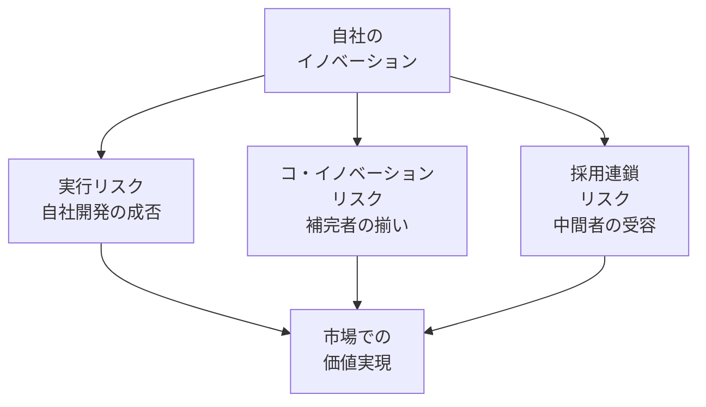

---
layout: two-cols
class: text-sm
---

### VHS対ベータ：提携戦略がイノベーションの勝敗を決める

**ソニー（ベータ）：技術先行・囲い込み戦略**
<v-clicks>

- いち早い製品発売を優先
- 他社へのOEM供給に消極的
- ファミリー（連合）づくりに失敗

</v-clicks>

**日本ビクター（VHS）：提携・開放戦略**
<v-clicks>

- 松下の協力を得てファミリーへの参加を積極的に勧誘
- 製品改良の意見聴取・OEM供給に同意
- 結果：企業連合数で圧倒的差

</v-clicks>

**教訓：**
ネットワーク外部性のある分野では、「イノベーションの囲い込み」より**「よい競争相手をつくる」**ことが勝者の戦略になりうる

*1977年時点でベータが2年先行。技術的優位より提携戦略がエコシステム標準を決定した*

::right::

---

### オープン＆クローズ戦略

**一方の要素をオープンにし、他方をクローズすることで、普及と利益獲得を同時に実現する**

| 企業 | オープン領域 | クローズ領域 | 狙い |
|------|-----------|-----------|------|
| **Apple** | アプリ開発（App Store）・製造工程 | 製品デザイン・iOS・UI | エコシステム拡大 + コアの独占 |
| **Intel** | PC周辺機器の製造技術 | マイクロプロセッサ設計 | PC普及 → CPU需要最大化 |
| **Google (Android)** | Android OSのソースコード | Google Play・主要サービス | シェア拡大 → 広告・サービス収益 |
| **任天堂** | サードパーティ製ゲームソフト開発 | ハード・OS・品質管理 | タイトル充実 + ハード独占販売 |

---

### まとめ：イノベーションマネジメントの全体像

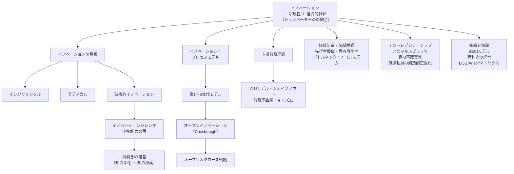

---

### 本日の主なメッセージ

**１. イノベーション ＝ 発明 ＋ 経済的価値**
　技術を生み出すだけでは不十分。市場での受容・普及があって初めてイノベーションと呼べる

**２. 価値を「創る」だけでなく「守る・獲得する」仕組みが不可欠**
　補完資産・特許・先行者優位・エコシステム設計が、誰が利益を得るかを決定づける

**３. 組織・市場・技術の三者が絡み合うシステムとして捉えよ**
　イノベーションジレンマ・両利きの経営・オープンイノベーションは、いずれも「システムとして設計する」発想から生まれた処方箋

> **第２回** で技術ライセンス・補完資産・市場参入タイミングの戦略をさらに深掘りします

---

## 第２回
### イノベーションマネジメント

---

### 本日の全体像（第２回）

| ブロック | テーマ | 中心的問い |
|--------|-------|----------|
| **第１部** | 価値創造と利益獲得のギャップ | なぜ優れた技術が利益を生まないのか？ |
| **第２部** | 知的財産権と防御戦略 | 技術をどう守り、いくら稼げるか？ |
| **第３部** | 補完資産理論（Teece） | 誰が最終的に利益を取るか？ |
| **第４部** | 市場参入タイミング戦略 | 先行者か後発者か、どう決めるか？ |
| **第５部** | ネットワーク・標準化戦略 | 規格争いに勝つには何が必要か？ |

> **第２回の中心テーゼ：** 「技術 × IP保護 × 補完資産 × タイミング」の組み合わせが利益の配分を決める

---

## 第１部
### 価値創造と利益獲得のギャップ

---

### はじめに：価値創造 ≠ 利益獲得

**技術的に優れた製品を開発しても、持続的な利益につながらない企業が多数存在する**

**利益がイノベーターに帰するかどうかを決める２つの条件：**

1. **IP保護の強度** — 特許・秘匿化・リードタイムによる模倣コストの高さ
2. **補完資産の所有** — 製造・流通・ブランド・サービスを誰が持っているか

> 第２回の問いかけ：自社のイノベーションは、誰の利益になっているか？

---

### 価値創造 ≠ 利益獲得

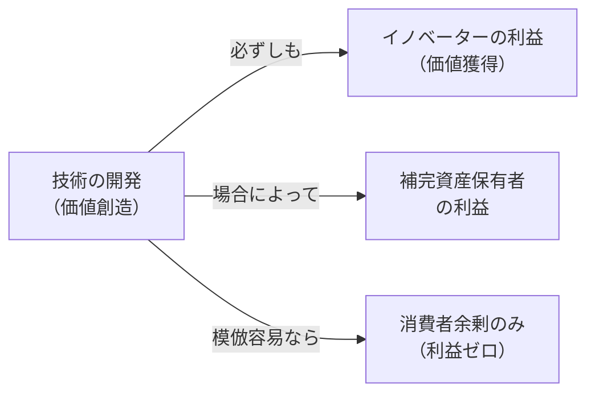

---

### 技術集約的産業の特性：模倣までのタイムラグ短縮

**新しい知識から模倣・追随までの時間は急速に短縮されている**

| 技術 | 知識基盤の確立 | 特許出願 | 製品化 | 模倣製品登場 | リードタイム |
|------|------------|---------|-------|-----------|-----------|
| ジェットエンジン | 17世紀（ニュートン力学） | 1930年 | 1957年 | 1959年 | **2年** |
| コピー機 | 19-20世紀 | 1940年 | 1958年 | 1974年 | **16年** |
| ファジーロジックコントローラ | 1960年代 | 1981年 | 1987年 | 1988年 | **1年** |
| カーナビ（GPS） | 1950年代後半 | 1960年代前半 | 1998年 | 2002年 | **4年** |
| MP3プレイヤー | 1990年代前半 | 1994年 | 1997年 | 1999年 | **2年** |
| SMSショートメッセージ | 1980年代後半 | 2002年 | 2008年 | 2009年 | **1年** |

**含意：**
<v-clicks>

- 先行者の「模倣されるまでの猶予」が急速に縮小している
- **IP保護と補完資産の確保を、製品化と同時に設計する**必要がある
- リードタイムだけに頼る戦略は通用しなくなっている

</v-clicks>

---

## 第２部
### 知的財産権と防御戦略

---

### 知的財産権の種類と活用

**技術から利益を守るための4つの法的ツール**

| 種類 | 保護対象 | 保護期間 | 戦略的活用 |
|------|---------|---------|----------|
| **特許（Patent）** | 新規性ある発明・技術 | 出願から20年 | ブロッキング・クロスライセンス・交渉力確保 |
| **著作権（Copyright）** | ソフトウェア・文書・設計図 | 創作から70年 | コード・コンテンツの複製防止 |
| **登録商標（Trademark）** | ブランド名・ロゴ | 登録から10年（更新可） | ブランド価値の保護・顧客の信頼確保 |
| **企業秘密（Trade Secret）** | 製造ノウハウ・レシピ・顧客リスト | 秘密を保持する限り無期限 | 製法・アルゴリズムの非開示（コカ・コーラ、Googleアルゴリズム） |

**補足：労働契約とNDA（秘密保持契約）**
<v-clicks>

- 従業員が退職後に技術情報を持ち出すリスクへの対策
- 競業避止義務・情報管理規定を契約に組み込む

</v-clicks>

**選択の原則：** 模倣しにくい技術 → 特許より秘匿化が有効な場合も。開示義務のある特許は競合に設計回避の地図を渡す側面がある

---

## 第３部
### 補完資産理論（Teece, 1986）

---
layout: two-cols
class: text-sm
---

### 補完的資源とは何か

**新しく開発された技術を事業として成功させるには、技術以外の多くの資源が必要**

**イノベーションのコア技術を支える7つの補完的資源：**

<v-clicks>

- **流通** — 製品・サービスの販売チャネル
- **サービス** — 導入後のサポート・保守体制
- **補完的技術** — 連携する周辺技術
- **サプライヤー/顧客との関係** — 長期的な取引関係
- **マーケティング** — 市場への訴求・ブランド構築
- **財務** — 資金調達・リスク管理能力
- **競争優位的生産** — 規模・コスト・品質の製造能力

</v-clicks>

::right::
**利益配分の決定原理：**

> イノベーターと補完資産の供給者が**異なる場合**、利益は両者の**相対的な交渉力**に依存する

この交渉力を決めるのが補完資産の**専門化の度合い（汎用・一方依存・相互依存）**

---
layout: two-cols
class: text-sm
---

### 補完資産の戦略的確保：統合か提携か

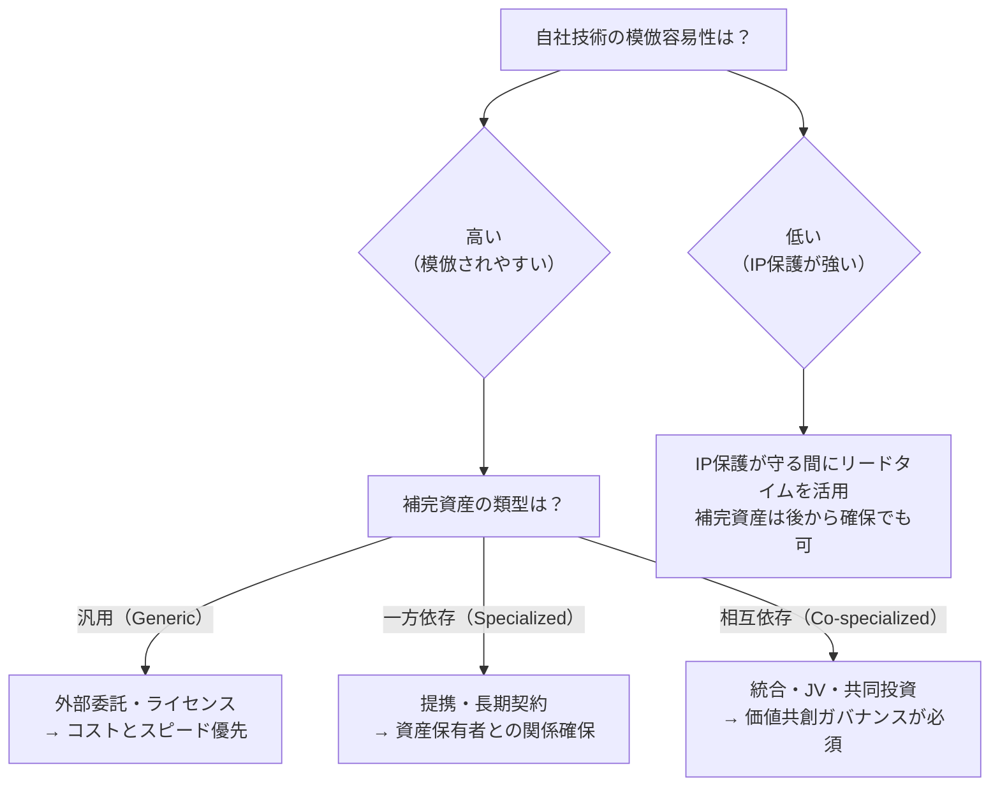

::right::
**補完資産の類型と模倣容易性の組み合わせ**が最適なガバナンスを決める

**日本企業の失敗パターン：** 技術は強いが補完資産の確保を後回しにし、IP保護が切れた後に模倣者に利益を奪われる

---

## 第４部
### 市場参入タイミング戦略

---
layout: two-cols
class: text-sm
---

### 参入タイミングの戦略的影響

**同じ技術でも「いつ参入するか」が最終的な利益配分を大きく左右する**

**先行者優位が持続する条件：**
1. 強力なIP保護（特許・秘匿化）
2. スイッチングコストの高さ
3. ネットワーク外部性の存在
4. 希少資源の先買いが可能
5. 標準規格設定の主導権

::right::
**後発者優位が生まれる条件：**
1. 先行者の試行錯誤コストを回避できる
2. 補完インフラが後発者入場時に整備済み
3. 先行者の技術が「埋没費用」化して変化に硬直
4. 市場の嗜好が確立され、的確なターゲットが可能
5. 先行者の特許が公開情報として設計回避可能

---

### 参入タイミング：先行か後発か — 統合意思決定表

| 条件 | 先行者優位 | 後発者優位 |
|------|----------|----------|
| IP保護の強度 | 強い → **先行者** | 弱い → 後発者 |
| 補完資産の整備状況 | 未整備 → 先行者が構築 | 整備済み → **後発者がただ乗り** |
| 標準規格の可能性 | 規格設定余地あり → **先行者** | 規格が既に確立 → 後発者 |
| ネットワーク外部性 | 強い → **先行者（ユーザー先取り）** | 弱い → どちらでも可 |
| 市場の不確実性 | 高い → 後発者リスク低 | 低い → **先行者**が機会を逃さず取れる |
| 技術変化の速度 | 速い → 後発者が改良版で参入 | 遅い → **先行者優位持続** |

**含意：** 「先行者 vs 後発者」は一般論では答えられない。**自社の IP強度・補完資産・市場特性**の組み合わせで決まる

---

## 第５部
### ネットワーク・標準化戦略

---

### 標準化とネットワーク外部性：勝者総取りの論理

**ネットワーク外部性が強い市場では、規格競争に勝つことが最大の競争優位**

**勝者総取り（Winner-takes-all）の条件：**
<v-clicks>

- 需要側のスケールメリットが大きい（ネットワーク外部性）
- 補完製品・サービスが特定プラットフォームに集積
- スイッチングコストが高い

</v-clicks>

**教訓：** 規格戦争では「技術の優劣」より「いかに早く臨界質量（Critical Mass）を超えるか」が勝敗を決める

---

### 標準化とネットワーク外部性：勝者総取りの論理

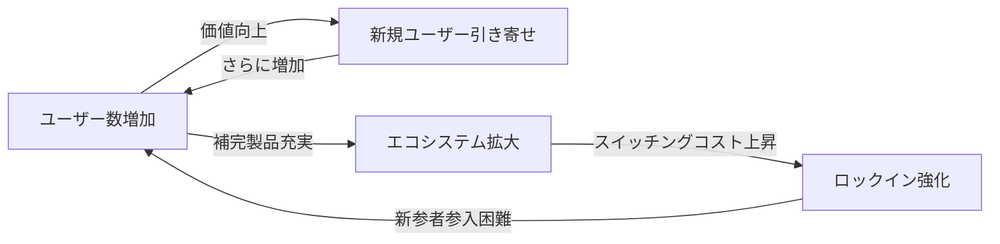

---

### 標準化戦略の3つのアプローチ

| アプローチ | 説明 | メリット | リスク | 事例 |
|----------|------|---------|-------|------|
| **デファクト標準** | 市場競争で自然発生的に勝者の規格が標準に | 市場が選ぶため普及が速い | 規格戦争で敗北すると市場から退出 | VHS vs Beta, iOS vs Android |
| **デジュール標準** | ISO・IEC・IEEE等の公的機関が定める規格 | 業界全体での採用が保証される | 策定に時間がかかる。委員会政治が必要 | USB, Wi-Fi, NFC (FeliCa/ISO 18092) |
| **コンソーシアム標準** | 複数の主要企業が協力して策定 | スピードと業界採用のバランス | 参加企業間の利益調整が複雑 | Bluetooth, DVD Forum |

**戦略的含意：**
<v-clicks>

- デファクト狙い → 先行者優位とネットワーク外部性の活用が鍵
- デジュール狙い → 標準化委員会への早期参加と特許プール形成
- 自社技術を「公共財」化する覚悟で市場拡大を優先し、補完資産で収益化（QR・Android戦略）

</v-clicks>

---

### 第２回 まとめ：価値獲得戦略の設計フレームワーク

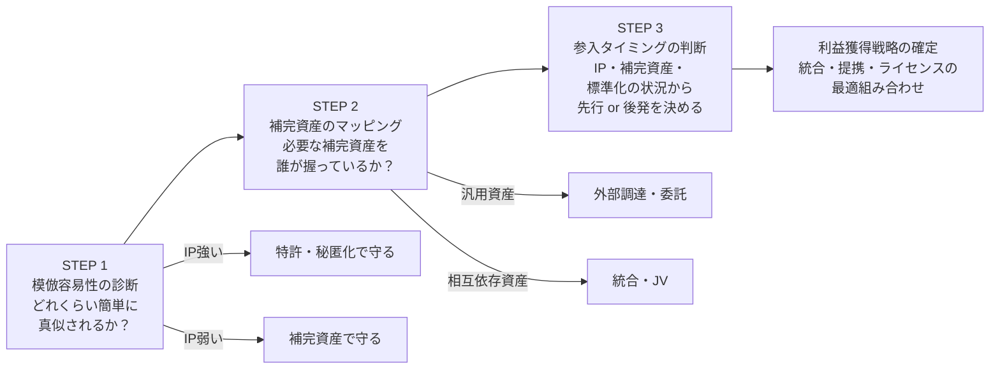

---

### 第２回 まとめ：価値獲得戦略の設計フレームワーク

**3ステップで「誰が利益を取るか」を設計する**

**価値獲得の方程式：**
> 技術力　×　IP保護　×　補完資産の確保　×　参入タイミング　＝　利益配分

---

### 本日の主なメッセージ（第２回）

**１. イノベーターが常に利益を得るわけではない**
　技術の模倣容易性とIP保護の強度が、利益の帰属を決める第一条件。「発明したから稼げる」は成立しない

**２. 補完資産を「誰が持つか」が利潤配分の核心**
　汎用なら外部調達、相互依存なら統合・共同投資。補完資産の類型ごとに最適なガバナンスが変わる

**３. 先行者優位は条件付き。後発者も勝てる**
　IP保護・ネットワーク外部性・補完インフラの整備状況が、先行 or 後発どちらが有利かを決める。事前の診断が重要

> **日本企業へのメッセージ：**
> 「技術で勝ってビジネスで負ける」パターンを断ち切るには、技術開発と価値獲得設計を**同時に**行う経営が必要
