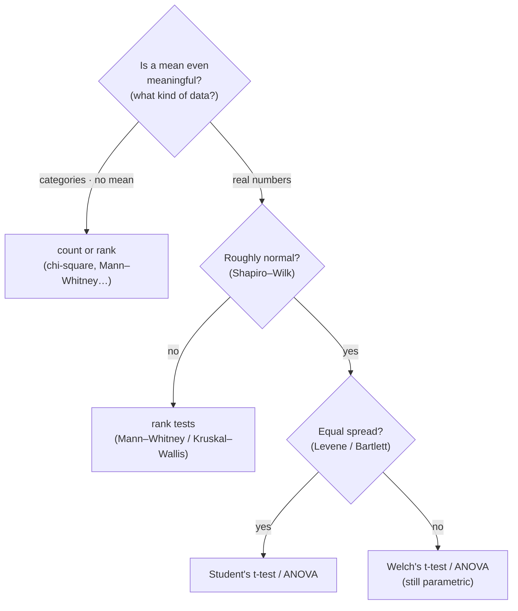
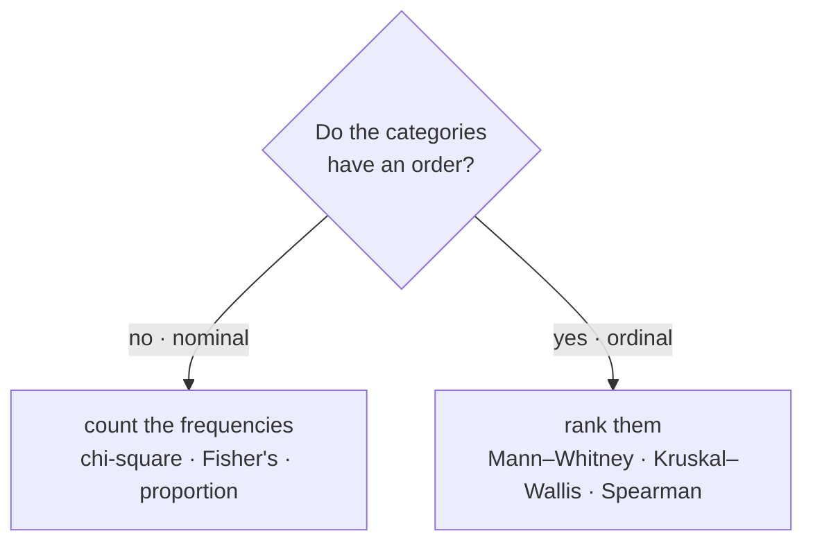
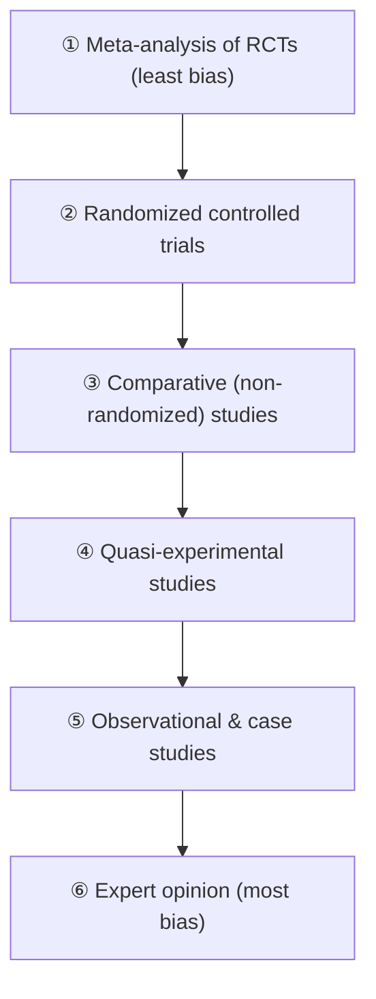

# 📊 The Statistics Story: The Test Mai Could Defend

*A companion story to the "Essential Statistics for Researchers" deck. The same eleven parts, told as one continuous tale. Meet Mai, a graduate researcher with her first real dataset, and watch every test earn its place, until she can choose the one she runs and defend it.*

---

## The question she couldn't answer

Mai is a graduate researcher, and for the first time she has something she has wanted since her very first stats class: **real data**. Fifty patients on a new treatment (Drug A), fifty on the standard one (Drug B), and for each of them a folder of measurements, everything from grip strength and whether they improved to how many flare-ups they had and how strongly they'd recommend the treatment. Months of careful work, finally collected.

But at her lab meeting she puts up a slide ("Drug A worked, p < 0.05") and her advisor asks four quiet words she has no answer to: **"Why that test?"** Then the follow-ups. Did she check that her data were normal? Was a mean even the right thing to average? Mai freezes. She knows how to *run* a test. A whole menu of them sits one click away in her software. What she cannot yet do is say *why this one and not another*, and that, she realizes, is the actual job. So she goes to earn it.

So she starts where the deck starts, not with a test but with what statistics is even *for*.

**Statistics is a quantitative understanding of a phenomenon.** You cannot watch the whole world, so you measure a slice of it and reason back to the whole. And here is the thing that surprises her: the entire field only exists because **data vary**. If every patient responded identically, she wouldn't need statistics at all. She'd just look. Statistics is the discipline built to draw a defensible conclusion *despite* the spread. Variability isn't something to hide. It's the whole reason for the tools.

Everything she's about to learn serves one of **two jobs**:

- **Estimation and inference**: use the few patients she *could* measure (her **sample**) to make a statement about all the patients she *couldn't* (the **population**).
- **Hypothesis testing**: reach a verdict on whether the data give her enough reason to reject a stated claim, or not.

That's the whole map. Every stop from here is really just "which of those two am I doing, and with what kind of data?"

## What the numbers are standing for

Before any test, Mai learns the words the rest of her career will keep using, because half of statistics is just knowing what each word means.

Her fifty-plus-fifty patients are a **sample**. The target she actually cares about, *all* patients with the condition, is the **population**. A true value out in that population (the real response rate, say) is a **parameter**. She can never see it directly, only estimate it. That leap from sample to population is exactly where **uncertainty** enters, and it's why she needs every remaining tool in the deck.

She meets the rest of the vocabulary in passing and files it away for when she will need it: a **hypothesis** (a claim the data can support or reject), the **p-value** (the chance of a result this strong *or stronger* by luck alone, if nothing were really going on), **α** (the line she draws in advance for calling something significant), **degrees of freedom** (how many values are still free to vary once a summary like the mean is fixed), **effect size** (how *big* the difference is, not just that it exists), and the **confidence interval** (a plausible range, not a single guess). None of it means much yet. Each one will earn its place when a real decision needs it.

## The first question: what kind of number is this?

Her advisor's second question (*was a mean even the right thing to average?*) turns out to be the most important one in the whole deck, and it comes **before** she touches any software.

Every variable she measured sits on one of **four scales**, a ladder of "how much math is even allowed":

- **Nominal**: plain name tags, no order. Blood type, treatment group, sex coded 1/2. The numbers are just stickers, so "the average blood type is 2.4" is nonsense. She can count them, name the most common one (the **mode**), and test whether two labels are linked (**chi-square**), and that's it.
- **Ordinal**: a podium. First, second, third. She knows the order, but *not by how much*. Pain rated mild/moderate/severe, a 1–5 Likert. The gaps aren't equal, so a mean still lies, and she uses the **median** and **rank-based tests** instead.
- **Interval**: a thermometer. Equal, meaningful steps, but a **fake zero**. 0 °C isn't "no heat," so 40° isn't "twice as hot" as 20°. Now that the steps are equal, though, a mean is finally valid, so **t-tests** and **ANOVA** become usable.
- **Ratio**: a ruler. Equal steps *and* a real zero, so even ratios make sense: 20 kg really is twice 10 kg. Weight, blood pressure, grip strength. The full toolkit applies.

For picking a test, interval vs ratio barely matters, because both are continuous and both support means. The line that *does* matter, the one Mai underlines, is the great divide the whole deck depends on:

> **Categorical data → non-parametric tests. Continuous data → parametric tests (means, ANOVA), if the assumptions hold.**

Naming the scale of each variable tells her, before she opens a single tool, which half of the statistics world she's standing in. (Her simple rule, scribbled in the margin: *if "zero" means "none of it," you're on a ratio scale.*)

## Look at the shape of your data first

Mai's instinct is to run the test immediately. The deck stops her: **explore first, test later.** Modern reviewers don't want a plain mean with an error bar. They want to *see the shape*, because the shape decides whether a mean is even honest and which test is valid.

The cheapest first move costs nothing: a **frequency table** (sort the values into bins, count each), which she turns into a **histogram**. But here's a trap that catches almost everyone: the *same data* tells different stories depending on the **bin width**. Too narrow, and random variation looks like real structure. Too wide, and the real trend is flattened into nothing. Bin width is a choice that shapes the story, so she tries a few and picks the one that shows the trend honestly, not the prettiest one.

The shape that emerges tells her a lot. A symmetric **bell** (mean ≈ median) means the parametric tests are safe to use. **Two peaks** (bimodal) usually means two subgroups got mixed together. A long tail (**skew**) drags the mean toward it. And a lone stray value (an **outlier**) can distort the mean all by itself.

That last pair is why she meets the **median**, the middle value, with half the data above and half below. Its great strength is that it *ignores how far away* an extreme value is: a billionaire walking into a room barely moves the median income, though he pulls the mean sharply. For skewed data and outliers, the median is the honest centre, which is exactly why it is paired with the non-parametric tests.

To show spread, she draws a **box-and-whisker plot** from the quartiles. The box is the middle 50% (the **interquartile range**), and the whiskers reach out to the extremes (or, in the common **Tukey** version, to 1.5× the IQR, with anything past that drawn as an outlier dot). But the box has a **blind spot**: it knows only five numbers, so two completely different distributions can produce the *identical* box. That's why the **violin plot** exists: same five numbers, but it also draws the crowd's actual shape, so a hidden second peak cannot be missed.

And when she wants to relate *two* variables, she plots one against the other in a **scatterplot** and measures the link with **Pearson's r** (from −1 to +1, the strength and direction of a *straight-line* relationship), reads off **R²** (the share of variation the line explains), and can fit a **regression** line to predict one from the other. One warning deserves special emphasis, because it is the most misused idea in science: **correlation is not causation.** Two things moving together does not mean one causes the other.

## Which test, and why

Now the question that froze her at the lab meeting. Her advisor was right to ask, because a **t-test and ANOVA quietly assume** two things, and using one without checking is a beginner's mistake:

- **Normality**: is the distribution roughly symmetric, mean sitting on median? She tests it (**Shapiro–Wilk**) instead of guessing by eye.
- **Equal spread** across groups (**homoscedasticity**): do the groups vary by the same amount? She tests that too (**Levene's** or **Bartlett's**). A *significant* result here is a warning sign: it means the spreads really do differ.

With those two answers, the path becomes clear:

The part that confuses almost everyone is the second row. "Continuous → parametric" is only a *starting candidate*, not a verdict. The decision really happens in **two stages**. Stage 1 asks a **data-type** question: *is a mean even meaningful?* If the answer is "no" (categories), the branch ends here in counts and ranks. Stage 2, only for continuous data, asks a **distribution** question: *do the assumptions hold?* So a perfectly continuous variable can still land on a non-parametric test if it's badly skewed. Failing an assumption is never a dead end: non-normal sends her to the matching rank-based test, while normal-but-unequal-spread just needs **Welch's** correction, which is still parametric.

Why do the non-parametric tests survive on data that breaks the rules? Because they throw away the exact numbers and keep only the **ranks** (the order), which makes them robust to skew and outliers, at the cost of being slightly less powerful when the parametric assumptions actually *do* hold. Every question has a matched pair:

| Her question | Parametric (*assumes a distribution*) | Non-parametric (*distribution-free*) |
| --- | --- | --- |
| Compare **2 groups** | independent t-test | Wilcoxon–Mann–Whitney |
| Compare **3+ groups** | one-way ANOVA | Kruskal–Wallis |
| Measure a **relationship** | Pearson's r / regression | Spearman's ρ |
| A **categorical association** | logistic regression | chi-square |
| Model a **count** | Poisson / negative-binomial | (none) |

One last habit she has to unlearn. When she has *three* groups, her reflex is to run three separate t-tests: A vs B, A vs C, B vs C. That **inflates the false-positive rate**: every extra test is another chance to flag a difference that isn't really there. The fix is to ask **one overall question first** (one-way **ANOVA**, or **Kruskal–Wallis** for ranks): *is at least one group different?* If yes, a **post-hoc** test then pinpoints *which* pair while keeping the false alarms under control: **Tukey** after ANOVA, **Dunn** after Kruskal–Wallis, or a **Bonferroni** correction (split α across the comparisons) when she does run several by hand.

## When there's nothing to average

Then Mai reaches the outcome that has no mean at all: **did the patient improve, yes or no?** There's no number to average, so she does the only sensible thing. She **counts**, laying the tallies in a **contingency table**. In her trial, 68% improved on Drug A versus 44% on Drug B. The whole question becomes: *is that gap real, or luck?*

Categorical data forks one more time, and the fork decides everything that follows:

"Improved / not improved" has no order, so she's on the **count** branch. (One thing she keeps clear: *parametric vs non-parametric* is a **separate axis** from data type. Every data type carries tools of both kinds. "Non-parametric" just means *no particular distribution is assumed*.)

Her main tool for the count branch is the **chi-square test of independence**. The idea is beautifully plain: work out what the counts *would* look like if the drug made no difference at all (the **expected** counts), then measure how far the numbers she actually **observed** stray from that. A big enough gap, judged against a cutoff that depends on the table's **degrees of freedom**, means she can reject "they're unrelated." (It has conditions she respects: the observations must be independent, and the **expected count in each cell should be at least 5**, or the approximation becomes unreliable.) Chi-square only tells her *that* there's an association, though, never how strong or which way, so she follows up with **Cramér's V** to size it and residuals to locate it.

When a trial is tiny and the cells get sparse (that "≥ 5" rule broken), the chi-square approximation quietly stops being valid. There she uses **Fisher's exact test**, which computes the exact probability of the table directly instead of relying on an approximation, and is the safe default whenever cells are very small. And if she only has *one* group to check against a fixed benchmark (is Drug A's 68% really different from a known 50%?), she uses a **one-proportion test** for a yes/no outcome, or a **chi-square goodness-of-fit** test when the outcome has three or more categories.

Here the deck teaches her a distinction many papers get wrong: **risk vs odds vs rate**, three different ways to say "how often."

- **Risk** is the everyday chance: improvers ÷ *everyone*. On Drug A, 68%.
- **Odds** is the gambler's version: improvers ÷ *non-improvers*, the "winners per loser" ratio, with no upper limit.
- **Rate** is a different kind of measure: events ÷ *person-time*, for things that can happen more than once, like flare-ups over months of follow-up.

Compare two groups and each gives a ratio (a **risk ratio**, an **odds ratio**, a **rate ratio**), and a ratio of **1 always means "no difference."** But the odds ratio has a trap: when the outcome is **common**, it grows far larger than the risk ratio. In her trial the two drugs differ by a **risk ratio near 1.5** (A's patients are about 1.5× as *likely* to improve) yet an **odds ratio near 2.7**. Those are not the same claim, and reading 2.7 as "2.7× more likely" is simply wrong. It's the odds that grew large, only because improving was common here. (When the outcome is rare, the two become almost equal again.)

And then the deck shows her the real benefit, the thing a single test can never do. A chi-square ends at one verdict. The ratios are fixed summaries of the table. **Regression models the outcome against predictors**, and that changes what she can ask. For a yes/no outcome she fits a **logistic regression**, which models the *log-odds* (a clever move, because a plain straight line could predict an impossible probability below 0 or above 1). With the drug as the only input, it just reproduces the odds ratio she already had. But feed it the *other* columns and it proves its worth:

- **Adjust for a confounder.** It turns out Drug B was given to sicker patients, and sicker patients improve less, so part of A's apparent advantage was really that easier starting point. Add severity to the model and the drug's effect shrinks from that crude 2.7 to something nearer 1.5, an *honest* effect holding severity fixed.
- **Take a continuous predictor.** A 2×2 table can only hold categories. Logistic takes **dose as a number** and summarizes the whole dose–response in a single slope, where every extra 10 mg multiplies the odds of improving by some factor.
- **Predict one patient.** Run the fitted equation *forward*, feed in one person's age, severity, and drug, and it returns *their* probability of improving. That's the risk-calculator power a contingency table can never give.

For the **count** outcome (how many flare-ups per patient), she uses **Poisson regression**, which models a **log-rate**. Its real power is an **offset** for time: patients were followed for different lengths, and a raw "30 flares vs 60 flares" is only fair if everyone was watched equally long. The offset credits each patient for their own follow-up, so the model compares *events per unit time*. Poisson makes one strong promise, though: that the variance equals the mean. Real flare counts break it, because a few patients flare constantly while most never do. When the counts **cluster** like that (**overdispersion**), she switches to a **negative-binomial** model, which keeps the same rate ratio but widens the confidence interval so she doesn't over-claim. That dispersion check is nothing but *testing your assumptions before trusting the result*, in the count-model world.

## When the answers have an order

Her last outcome is the patient-reported one: *"How strongly would you recommend this treatment?"* on a 1-to-5 scale, gathered across her three clinic sites. This is **ordinal**, order without spacing. And it's the trap she almost fell into: averaging it. "Mean recommendation = 3.4" treats the codes 1–5 as real numbers, but the step from *Disagree* to *Neutral* isn't the same distance as *Agree* to *Strongly agree*. The order is real. The spacing is invented. So the mean is a lie, and she needs a different engine.

That engine is shared by every rank test: **pool every response, sort them, and replace each value with its rank** (ties share the average of the ranks they'd occupy). Ranks need only an *order*, not real distances, which is why they're distribution-free and robust: one extreme answer moves a rank by a single step, not by its raw size.

For **two** groups, she uses the **Mann–Whitney U** test, and the deck gives her the loveliest mental picture yet: a **tournament of duels.** Every member of one group is paired against every member of the other, and you simply **count the wins** (a tie pays each side a half). The winner's tally is *U*. Ranking is just a shortcut that counts those wins without listing every duel by hand. And *U* answers two *separate* questions people constantly confuse:

- **How big is the lead?** Turn the win-count into the **probability of superiority**: pick one patient from each group at random, how often does the better group win? In one of her comparisons it's about **8 times out of 10**: a large, plain-language effect that stays the same whether she has 6 patients or 600.
- **How sure can she be?** That's significance, and it's a *different* question. She imagines the world where the groups are truly identical, so the group labels are just stickers dropped at random, and asks how often pure chance would produce a lead as one-sided as hers. If that's rare enough (under the 5% line), it's real.

And here the deck teaches a lesson that changes everything: in a *small* sample, an **81% lead can still miss significance.** A big effect and too few people is called being **underpowered**: the lead looks real, but chance could still have produced it, so the study just can't prove it yet. Size and certainty are not the same thing.

For her **three** clinic sites there's no single win-count, so she steps up to **Kruskal–Wallis**, which asks a related question: *how far does each group's average rank sit from the middle of the line?* If the sites were really the same, high and low ranks would mix evenly and every group's mean rank would sit near the middle. A real difference makes one group take most of the top ranks and another the bottom. It combines that whole spread into a **single statistic**, reports an **effect size** (the rank version of R², how much of the variation the grouping explains), and (because it's an *omnibus* test, telling her only that *some* group differs) then uses **Dunn's test** to find *which* pairs, again keeping the false-positive rate under control. (Run Kruskal–Wallis on exactly two groups and it simply *becomes* Mann–Whitney. They're the same idea.)

To measure whether two *ordered* things move together (say, prior experience versus satisfaction), she uses **Spearman's ρ**, which is nothing more complicated than **Pearson's correlation computed on the ranks**. The point she keeps in mind: Spearman asks only whether *y* keeps *rising* as *x* rises. It cares about **monotonic**, not **linear**. A curved-but-always-climbing relationship can score a perfect ρ where Pearson's straight-line r would dip. (Its robust alternative **Kendall's τ**, built from agreeing-versus-disagreeing pairs, is the one to use when there are many ties.)

And just as the count branch moved from chi-square to logistic, the rank branch has its own model for when a p-value isn't enough, when she needs to *adjust* or *predict*. It's **proportional-odds (ordinal) logistic regression**. Instead of modelling five categories separately, it models the **cumulative** odds of landing in a higher category, and lets **one** odds ratio describe the predictor at *every* threshold at once: a patient at her best-rated site has, say, about five times the odds of a higher rating than one elsewhere, and by that same factor at each cut-point. That single number is exactly the effect size Mann–Whitney couldn't give her, and, like logistic, she can **adjust** it for a confounder or **predict** one patient's *whole* distribution across the five levels.

It rests on one promise, the **parallel-lines (proportional-odds) assumption**: that the predictor shifts every threshold by the same amount. She learns to *check* it (a **Brant** or score test), and if it fails (if a predictor lifts "Strongly agree" but not "Disagree"), she frees that one slope (**partial proportional odds**). A related model, **ordered probit**, tells the same story in a different way: imagine a hidden, normally-distributed "true satisfaction" sliced into five bands, and read the effect as a shift of about one standard deviation on that latent scale. Same verdict, different link.

## The verdict, and the two ways it lies

One machine sits underneath every test she has met, and now she looks straight at it. Each test sets two statements against each other. The **null hypothesis (H₀)** is the boring one: *no effect, no difference, the drugs are equal.* The **alternative (H₁)** is the interesting one. By convention she *starts* from the null, and only strong evidence lets her reject it. She also has to state the hypothesis **before** she analyses, not after seeing the data. (Whether she's trying to show the new treatment is *better*, merely *as good as*, or *not worse than* the standard is a real choice too: **superiority**, **equivalence**, and **inferiority** designs.)

**α** is the line she draws *in advance*, the false-positive rate she's willing to accept, conventionally 5 in 100. Choosing it after seeing the results is changing the rules unfairly. She also decides *where* to look for the effect: a **one-tailed** test decides the direction ahead of time (only "is the new drug *better*?"), while a **two-tailed** test leaves room for a surprise either way, the safer default unless she has a genuine, pre-stated reason to expect one direction. Then comes the single most misunderstood number in science, so she writes its definition out in full:

> The **p-value** is the probability of seeing a result *at least this extreme* **if the null were true** (that is, if nothing were really going on).

Small p: a result this strong would be rare by luck, so it's evidence against the null. Large p: this happens easily by chance, so she has no reason to reject it. What the p-value is definitely **not**: it is *not* "the probability the null is true," and it says *nothing* about how big the effect is.

Because reality doesn't care about her verdict, there are exactly **two ways to be wrong**:

| | Drug really does nothing (H₀ true) | Drug really works (H₀ false) |
| --- | --- | --- |
| **She says "it works"** *(reject H₀)* | ✗ **Type I**, false alarm (α) | ✓ correct, a real find (**power**) |
| **She says "can't tell"** *(fail to reject)* | ✓ correct | ✗ **Type II**, missed it (β) |

A **Type I error** is a false alarm (backing a useless drug), and its probability is exactly α. A **Type II error** is missing a real effect (throwing away a helpful drug), and its probability is β. The good half of that table, **power = 1 − β**, is her chance of *catching* a real effect. Tightening one usually loosens the other, so good design balances them.

Which leads to the idea that finally answers her advisor, the one the deck calls the most misunderstood idea in applied statistics. *What is the opposite of "a significant difference"?* It is **not** "there is no difference." It is: **"we cannot say there is a difference."** Failing to reject the null never lets her *accept* it: maybe there's truly no effect, or maybe there is one and her study was just too small to see it. So she resolves never to **trust the p-value alone**: 0.05 is a convention, not a hard boundary, a p of 0.06 is not proof of nothing, and "not significant" is an *absence of evidence*, never *evidence of absence*.

## How big, and how sure

A p-value only ever answered *whether*. The deck's eighth part hands her the tools for *how much* and *how sure*, the difference between two whole ways of thinking. **Hypothesis testing** asks "does a difference occur?" and relies on p-values. **Parameter estimation** asks "how big is it, and how confident am I?" and relies on effect sizes and confidence intervals. Reviewers increasingly want the second.

**Effect size** is the main number. For comparing two means it's **Cohen's d**, the gap between the groups divided by their spread, that is, **signal ÷ noise**. It comes with rough benchmarks (about **0.2** small, **0.5** moderate, **0.8** large) and it has exactly the same structure as a *t*-statistic: every "is this real?" test divides an effect by the spread around it. The lesson becomes clear when she sees the same 5-point gap drawn twice: over a tight spread it *stands out* clearly, over a wide one it *disappears*. And the one thing she controls over that noise is **sample size**: more people lets a real signal rise above the noise.

Which is why **power and sample size** are a design decision, not something left for later. Power (1 − β) rises with a bigger sample, a larger true effect, less variance, or a less strict α. So she runs a **power analysis** (feed in the effect size she expects and her α, and it tells her *how many patients she needs*) **before** collecting a single one, not after.

Then the distinction that confuses almost everyone, the one hiding inside every error bar: **standard deviation is not standard error.** SD describes the **spread of the data** (for a bell curve, ±1 SD covers about 68% of individuals, ±2 SD about 95%). SE describes the **precision of the mean** (SE = SD ÷ √n). The **95% confidence interval** uses SE (roughly the mean ± 1.96 SE) and *narrows as she collects more data*, because more data locates the mean more precisely. The ±1.96-SD range around individuals does *not* shrink with n. Mislabel which one an error bar shows and she misleads every reader, so she labels them.

Two last thresholds keep her focused on what "matters." The **MCID** (Minimally Clinically Important Difference) is the smallest change a patient would actually *notice or value*. The **MDC** (Minimally Detectable Change) is the smallest change her *instrument* can reliably tell from noise. A tiny p-value with a tiny effect often just means a huge sample: statistically detectable, yet below the MCID and clinically pointless. Significant is not the same as important.

## The study you wish you'd designed

Here the deck delivers the hard truth: **the best statistics on earth cannot rescue a badly designed study.** The test is the last decision, not the first. She should have planned the analysis *into* the study from the very start. A **design checklist** she now runs before collecting anything: the **sampling** (expected sample size, randomization, blinding, inclusion/exclusion criteria), the **comparison** (a control group, the test she intends to use, the planned normality and variance checks), and the **hazards** (missing data, confounding, ethics, a data-management scheme).

To force a *complete* question, she uses **PICOT / PECOT**, five slots: **P**opulation, **I**ntervention (or **E**xposure), **C**omparison, **O**utcome, **T**ime. A question that fills all five ("does 12 months of remote aerobic exercise prevent memory loss in elderly people with MCI, *versus* memory training?") supports a clean analysis. One missing its **C**omparison or its **T**ime frame ("is cannabis use associated with later depression?") leaves her unable to say what caused the result or *when* she measured it. Even purely observational studies fit the framework. She just stratifies by exposure and tracks over time. The **T** is what makes it a study and not a snapshot.

She also separates two things people often mix up: **accuracy** (on target, well-calibrated) versus **precision** (repeatable, tightly clustered). A biased instrument can be beautifully precise and consistently *wrong*. She wants both, right in the centre. And design itself determines how much **bias** a result can carry, which brings her to the **hierarchy of evidence**:

At the top sits the meta-analysis of randomized trials, and at the bottom sits a single case report. To shrink bias she **randomizes** (breaking the link between treatment and hidden differences), **enlarges the sample**, sets **strict criteria**, and models the factors that could mislead her. The strongest design, where it's ethical and feasible, is a **randomized controlled trial**, or a meta-analysis of several.

## Make the result be seen

The analysis is done, but a result nobody can read is a result nobody remembers. A p-value hidden in text is forgettable. A clear **figure** is convincing. So she reports **figures** (scatter, box, violin, regression lines, the shape at a glance) and **tables** (the exact means, p-values, confidence intervals, sample sizes), and she treats data visualization as a serious skill, not something to leave until the last minute.

One small technical choice matters more than she'd have guessed: **vector versus raster.** A **vector** file (PDF, SVG, EPS) describes its lines and points *mathematically*, so it resizes and zooms with no loss and stays perfectly sharp in print, which is why journals prefer it for plots. A **raster** file (JPEG, PNG) is a fixed grid of pixels that blurs and shows jagged edges the moment someone zooms in: fine for a photograph, poor for a chart. A simple rule: if she made it from data, she exports it as a vector.

## Mai's whole method, on one sticky note

If she had to pin everything above her desk on a single card, it would be the lookup table she once found so confusing, driven by just two questions: *how many groups*, and *is the data normal (or ordinal)?*

| Her question | Numbers, roughly normal | Ranks / categories |
| --- | --- | --- |
| Compare **2 groups** | independent **t-test** | **Mann–Whitney** |
| Compare **3+ groups** | **one-way ANOVA** → Tukey | **Kruskal–Wallis** → Dunn |
| A **relationship** | **Pearson's r** / regression | **Spearman's ρ** |
| **Counts / categories** | (none) | **chi-square** *(→ logistic to adjust)* |

And underneath it, the whole workflow in four moves, with the last one done first:

1. **Explore**: name each variable's scale, draw the histogram and a box/violin plot, use the median when it's skewed.
2. **Check & choose**: test normality (Shapiro–Wilk) and equal variance (Levene). If it's not normal, go non-parametric. If only the variance is unequal, use Welch. Then pick by number of groups.
3. **Test & report**: state H₀/H₁, set α, report the p-value *and* the effect size *and* the 95% CI, with sample size and power.
4. **Design (do this first!)**: a clean PICOT/PECOT question, a control group and a time frame, randomize, and a power analysis to fix the sample size before any data are collected.

Four habits cover the rest: **significant ≠ important** (a tiny p with a tiny effect is often just a big sample, so always read the effect size and CI). **Absence of evidence is not evidence of absence** ("not significant" means *we can't say*, never *there is none*). **Pre-specify everything** (α, hypotheses, analysis plan) *before* seeing the data, because post-hoc choices create false positives. And forever: **correlation is not causation.**

## Defense day

Months later, Mai stands up to defend her study.

A professor leans in: *"You used a t-test here. What if the data weren't normal, what would you have done instead?"* It is the very question she had no answer for at that lab meeting. This time she smiles. She names the assumption she checked, the test she'd have switched to if it had failed, the effect size that says the result actually *matters*, and the confidence interval around it. When another asks why the odds ratio looked so large, she explains that the outcome was common, points to the risk ratio, and shows the confounder she adjusted for. She doesn't have every number memorized. She has something better: she can say, for every choice, *why*.

Statistics didn't just hand her a p-value. It turned a pile of measurements into a claim she can defend, because she knows exactly what each number is allowed to say and what it isn't. By the time she walks out, Mai realizes she doesn't just *report* her data anymore.

She can **read** it, and defend the test she chose.
